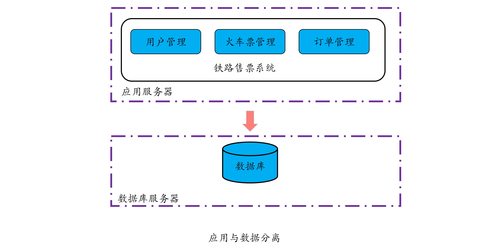
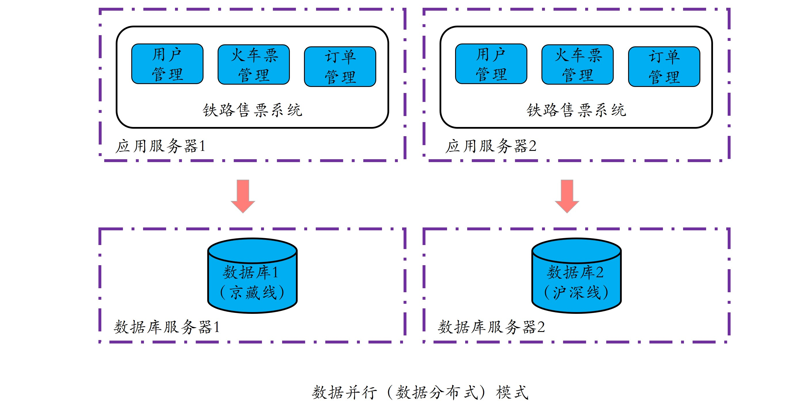
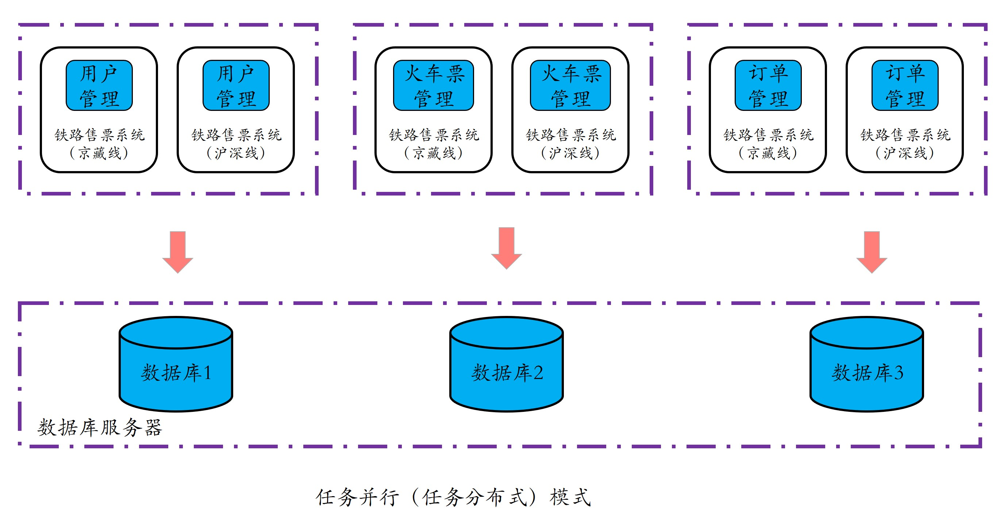

[TOC]

## 01 | 分布式缘何而起：从单兵，到游击队，到集团军

### 分布式起源

#### 单兵模式：单机模式

-   所谓**单机模式**是指，所有应用程序和数据均部署在一台电脑或服务器上，由一台计算机完成所有处理。

-   示意图：
    -   
-   单机模式主要问题：
    -   **性能受限**
    -   **存在单点失效问题**

#### 游击队模式：数据并行或数据分布式

-   **并行计算**采用消息共享模式使用多台计算机并行运行或执行多项任务，核心原理是**每台计算机执行相同的程序，将数据进行拆分放到不同的计算机上进行计算**。
-   并行计算强调的是**对数据进行拆分**，任务程序在每台机器上运行。要达到这个目的，我们首先对单机模式中的**应用和数据分离**，才可能实现对数据的拆分。

-   核心步骤：

    1.  将应用与数据分离，分别部署到不同的服务器上：
        -   
    2.  对数据进行拆分，比如，把同一类型的数据拆分到两个甚至更多的数据库中，这样应用服务上的任务就可以针对不同的数据并行执行了。
        -   

-   相关思考：

    1.  如果比较均衡地转发到不同的应用服务器上呢？ -- 负载均衡

    2.  频繁读写操作。 -- 数据库读写分离
    3.  热点数据访问频繁，压力增大。 -- 缓存

-   主要问题：

    -   **对提升单个任务的执行性能及降低时延无效**。

#### 集团军模式：任务并行或任务分布式

-   提高单个任务的执行性能，或者缩短单个任务的执行时间。
-   **任务并行**指的是，将单个复杂的任务拆分为多个子任务，从而使得多个子任务可以在不同的计算机上并行执行。
    -   
-   核心步骤
    1.  将单个任务拆分成多个子任务。
    2.  让子任务并行执行。
-   主要问题：
    -   **集团军模式在提供了更好的性能、扩展性、可维护性的同时，也带来了设计上的复杂性的问题。**

### 分布式是什么？

-   **分布式其实就是将相同或相关的程序运行在多台计算机上，从而实现特定目标的一种计算方式。**
-   产生分布式最主要的驱动力量，是我们对于性能、可用性及可扩展性的不懈追求。

### 总结

-   分布式起源：
    -   单机模式
    -   数据并行（数据分布式）
    -   任务并行（任务分布式）
-   数据并行 VS 任务并行？
    -   **任务执行时间短，数据规模大、类型相同且无依赖，则可采用数据并行**。
    -   **任务复杂、执行时间长，且任务可拆分为多个子任务，则考虑任务并行**。