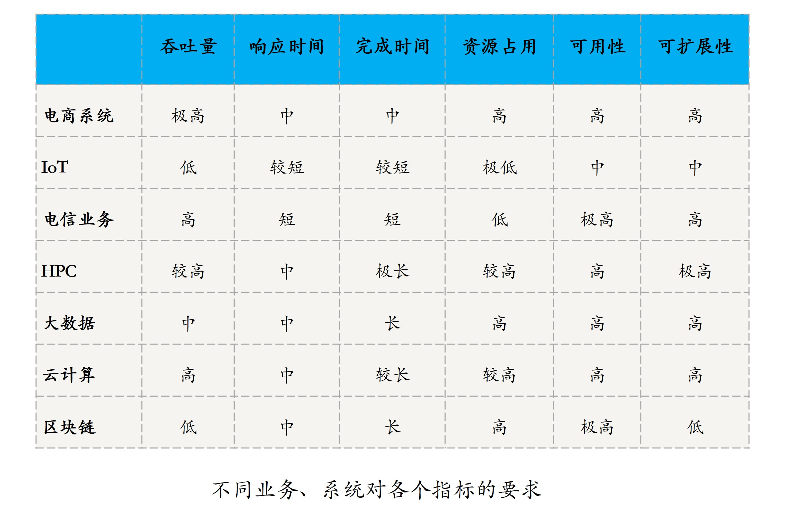

[toc]

## 02 | 分布式系统的指标：啥是分布式的三围

### 分布式系统的指标

-   目标：**用更多的机器，处理更多的数据和更复杂的任务**。

-   由此看出，**性能、资源、可用性和可扩展性**是分布式系统的重要指标。

#### 性能

-   主要用于衡量一个系统处理各种任务的能力。

-   常见的性能指标：

    -   **吞吐量**，系统在一定时间内可以处理的任务数。
        -   QPS (Queries Per Second)，查询数每秒
        -   TPS (Transactions Per Second)，事务数每秒
        -   BPS (Bits Per Second)， 比特数每秒

    -   **响应时间**，系统响应一个请求或输入需要花费的时间。
    -   **完成时间**，系统真正完成一个请求或处理需要花费的时间。

#### 资源占用

-   一个系统提供正常能力需要占用的硬件资源。
-   一个系统在没有任何负载时的资源占用，叫做**空载资源占用**。
-   一个系统在满额负载时的资源占用，叫做**满载资源占用**。

#### 可用性

-   系统在面对各种异常时可以正确提供服务的能力。
-   可用性是分布式系统的一项重要指标，衡量了系统的鲁棒性，是系统容错能力的体现。
-   系统可以用性可以用 **系统停止服务时间/总的时间**之比衡量。
-   可靠性 VS 可用性
    -   **可靠性**通常用来表示一个系统完全不出故障的概率，更多地用在硬件领域。
    -   **可用性**更多的是指在允许部分组件失效的情况下，一个系统对外仍能正常提供服务的概率。

#### 可扩展性

-   指的是分布式系统通过**扩展集群机器规模提高系统性能、存储容量、计算能力的特性**，是分布式系统的特有性质。
-   **当任务的需求随着具体业务不断提高时，除了升级系统的性能做垂直/纵向扩展外，另一个做法就是通过增加机器的方式去水平/横向扩展系统规模。**

### 不同场景下分布式系统的指标

-   

### 总结与思考

-   按不同维度，分布式系统的指标可以分为性能、资源占用、可用性、可扩展性这四大类。