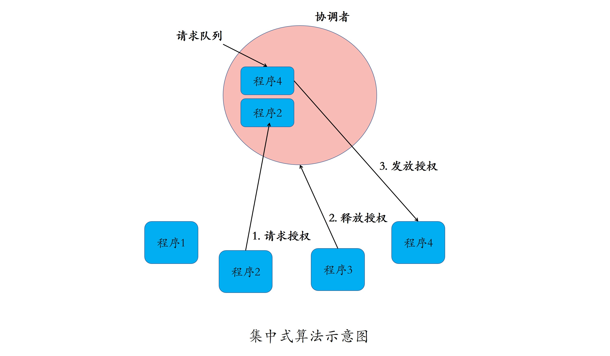
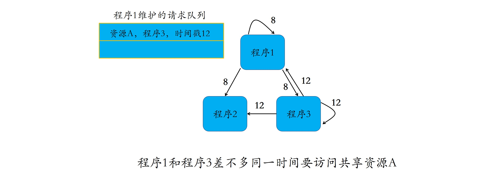
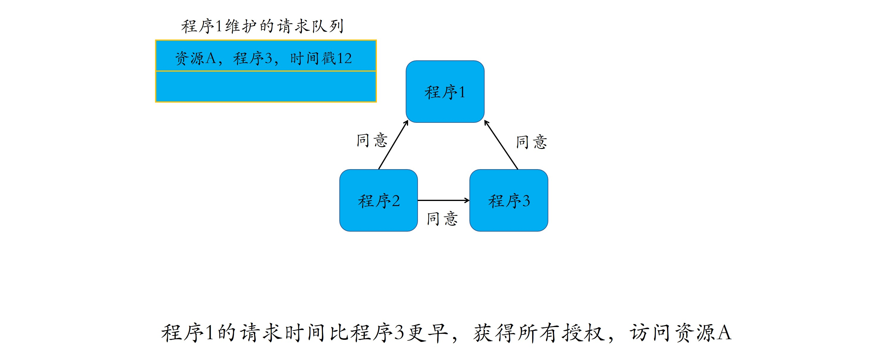
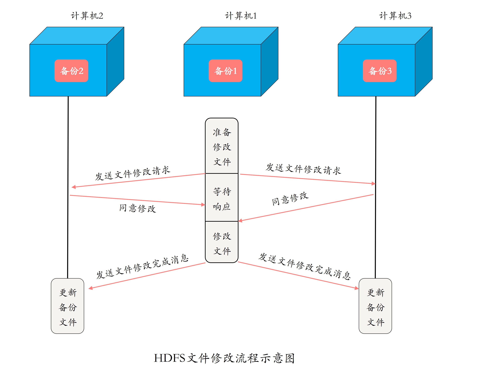
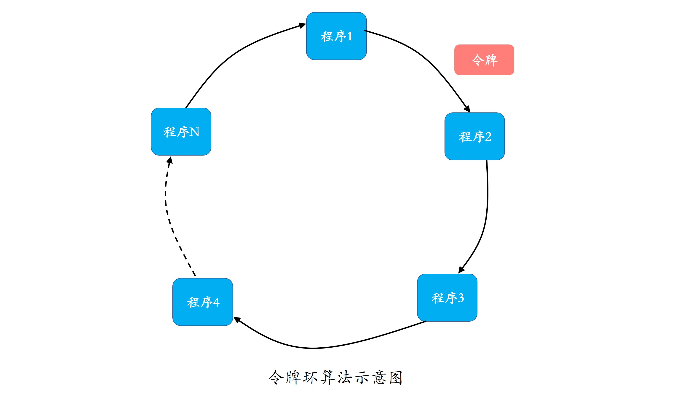

[toc]

## 03 | 分布式互斥

### 什么是分布式互斥

-   分布式系统里，这种排他性的资源访问方式，叫作**分布式互斥**，而这种被互斥访问的共享资源就叫作**临界资源**。

### 集中式算法

-   **集中式算法**（中央服务器算法）
    -   我们引入一个协调者程序。
    -   每个程序在需要访问临界资源时，先给协调发送一个请求。
        -   如果当前没有程序使用这个资源，协调者直接授权请求程序访问。
        -   否则，按照先来后到的顺序为请求程序“排一个号”.
    -   如果有程序使用完资源，则通知协调者，协调者从“排号”的队列里取出排在最前面的请求，并给他发送授权消息。
    -   拿到授权消息的程序，可以直接去访问临界资源。
-   示意图
    -   

-   一个程序完成一次临界资源访问，需要如下几个流程：
    1.  向协调者发送授权消息。
    2.  协调者向程序发放授权消息。
    3.  程序使用完临界资源后，向协调发送释放授权。
-   小结：
    -   算法特点：直观、简单、信息交互量少、易于实现。
    -   在可靠性和性能有一定保障的情况下，集中式算法可以适用于比较广泛的应用场景。

### 分布式算法

-   **分布式算法（或使用组播和逻辑时钟的算法）**
    -   当一个程序要访问临界资源时，先向系统中的其他程序发送一条请求消息，在接收到所有程序返回的同意消息后，才可以访问临界资源。其中，请求消息需要包含所请求资源、请求者 ID、发起请求时间。
-   流程示意图
    -   
    -   
    -   

-   时间复杂度：

    -   n 个程序需要成功访问临界资源，至少需要 `2n(n-1)`.

    -   **在大型系统中使用分布式算法，消息数量会随着需要访问临界资源的程序数量呈指数级增加，容易导致高昂的“沟通成本”。**

-   算法可用性很低，主要包括两个方面的原因：
    1.  “信令风暴”
    2.  单点故障，一旦一个程序发生故障，无法发送消息，那么其他程序均处于等待回复状态中，影响整个系统。
-   **针对可用性低的一种改进方法**：如果一个程序故障，则直接忽略这个程序，无需再等待它的同意消息。

-   使用场景：
    -   分布式算法适合节点数目少且变动不频繁的系统，且由于每个程序均需要通信交互，因此适合 P2P 结构的系统。
    -   如， Hadoop 中的分布式文件系统 HDFS 的文件修改。
    -   
-   小结：
    -   通信成本较高，可用性也比集中算法低。
    -   适用于临界资源使用频度低，且规模较小的场景。

### 令牌环算法

-   **令牌环算法（或基于环算法、CEO 算法）**
    -   所有程序构成一个环结构，令牌按照顺时针（或逆时针）方向在程序间传递，收到令牌的程序有权访问临界资源，访问完成后将令牌传送到下一个程序。若该程序不需要访问临界资源，则直接把令牌传送给下一个程序。
    -   
-   特点：
    -   通信效率高
    -   公平性好
-   场景
    -   **令牌环算法非常适合通信模式为令牌环方式的分布式系统**。

-   小结
    -   公平性高，在改进单点故障后，稳定性也很高。
    -   适用于规模较小，且系统中每个程序使用临界资源的频率高且使用时间比较短的场景。

### 扩展：有适合大规模系统中的分布式互斥算法吗？

-   **两层结构的分布式令牌环算法**。

### 总结

-   分布式互斥方法：
    -   集中式算法
    -   分布式算法
    -   令牌环算法
-   思维导图
    -   