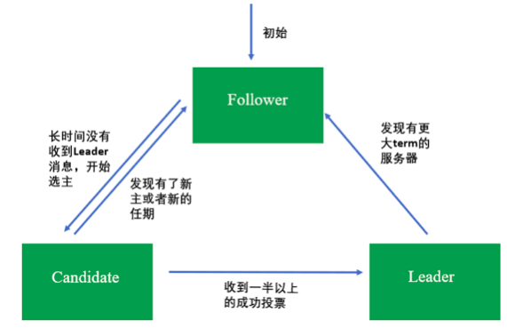

[toc]

## 04 | 分布式选举

### 为什么要有分布式选举

-   **集群不可一刻无主**。

### 分布式选举的算法

### 长者为大：Bully 算法

-   **选取 ID 最大的节点为主节点**。

-   节点角色：
    -   普通节点
    -   主节点
-   3 种消息
-   选举原则：
    -   “长者为大”。
-   选举过程
-   小结
    -   优点
    -   缺点

#### 民主算法：Raft 算法

-   核心思想：“少数服从多数”

-   3 种集群节点角色：
    -   Leader
    -   Candidate
    -   Follower
-   选举流程：
    1.  初始化时
    2.  开始选主
    3.  其他
    4.  若发起选举
    5.  当 Leader
-   节点状态迁移图（term，选举周期）
    -   
-   小结
    -   优点， 
    -   缺点

### 具有优先级的民主投票：ZAB 算法

-   3 种角色
-   4 种节点状态
-   ZAB 算法选主原则：