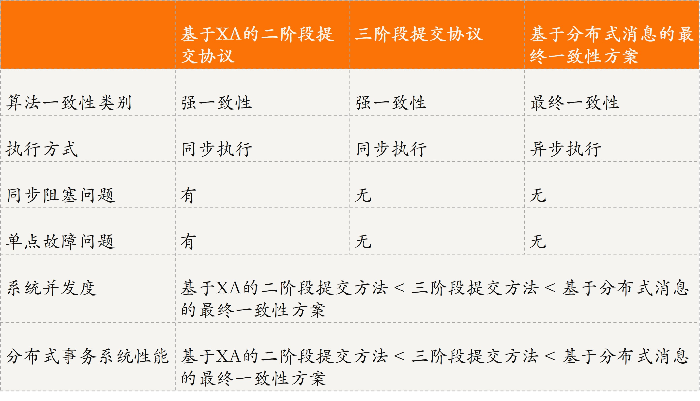
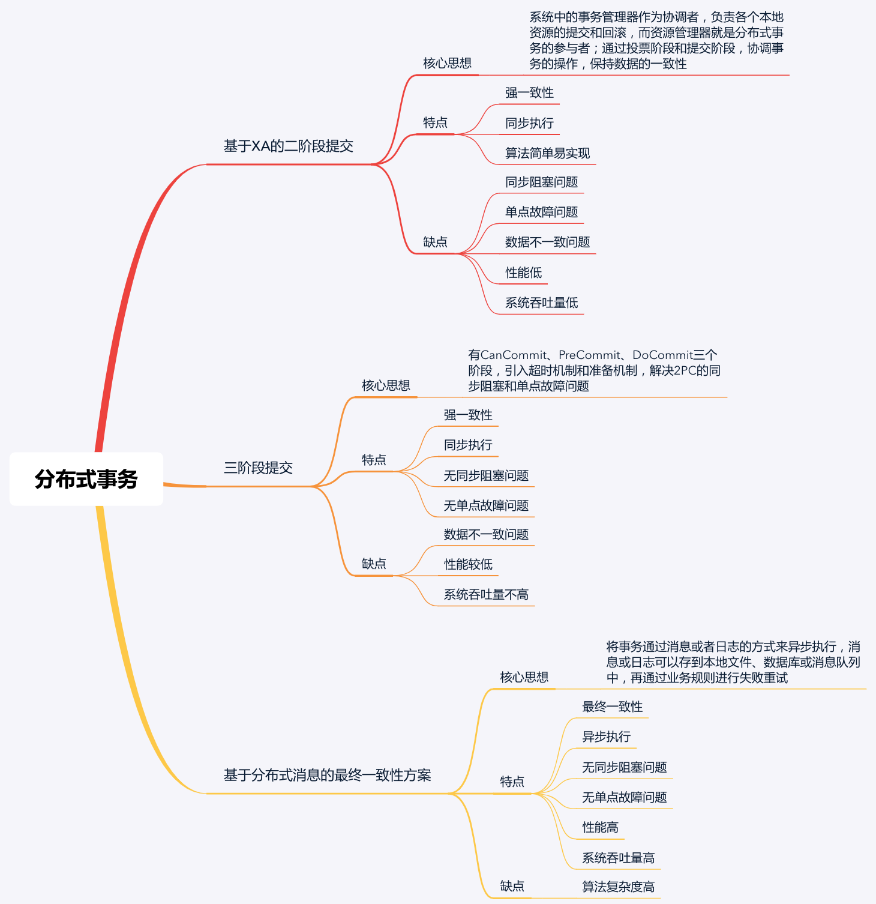

[toc]

## 06 | 分布式事务：All or nothing

### 什么是分布式事务？

-   **分布式事务**，就是在分布式系统中运行的事务，由多个本地事务组合而成。

-   事务的特征 ACID：
    -   **原子性（Atomicity）**
    -   **一致性（Consistency）**
    -   **隔离性（Isolation）**
    -   **持久性（Durability）**

### 如何实现分布式事务？

-   实现分布式事务有以下 3 种基本方法：
    -   **基于 XA 协议的二阶段提交协议方法。**
    -   **三阶段提交协议方法**。
    -   **基于消息的最终一致性方法**。

### 基于 XA 协议的二阶段提交方法

-   XA 协议可以分为两部分：
    -   事务管理器
    -   本地资源管理器

-   **XA 实现分布式事务的原理**（类似第 3 章中的集中式算法）：
    -   事务管理器作为协调者，负责各个本地资源的提交和回滚。
    -   而资源管理器就是分布式事务的参与者，常由数据库实现。
-   **如何保证分布式在不同节点上分布式事务的一致性呢？**
    -   为了保证它们的一致性，我们需要引入一个协调者来管理所有节点，并确保这些节点正确提交操作结果，若提交失败则放弃事务。
-   两阶段提交协议的执行过程，分为投票（voting）和提交（commit）两个阶段。

#### 第一个阶段：**投票**

-   协调者（Coordinator，即事务管理器）会向事务的参与者（Cohort，即本地资源管理器）发起执行操作的 CanCommit 请求，并等待参与者的响应。参与者接收到请求后，会执行请求中的事务操作，记录日志信息但不提交，待参与者执行成功，则向协调都发送“Yes” 消息，表示同意 操作。若不成功，则发送 “No” 消息，表示终止操作。

### 三阶段提交方法

#### 第一，CanCommit 阶段

#### 第二，PerCommit 阶段

#### DoCommit 阶段

### 基于分布式消息的最终一致性方案

### 三种实现方式对比

-   

### 扩展：刚性事务与柔性事务

-   区别
    -   刚性事务
    -   柔性事务
-   总结

-   BASE 理论

### 总结

-   二阶段和三阶段方法是维护强一致性的算法，它们针对刚性事务，实现的是事务的 ACID 特性。
-   而基于分布式消息的最终一致性文方案更适用于大规模分布式系统，它维护的是事务的最终一致性，遵循的是 BASE 理论，因此适用于柔性事务。
-   思维导图
    -   