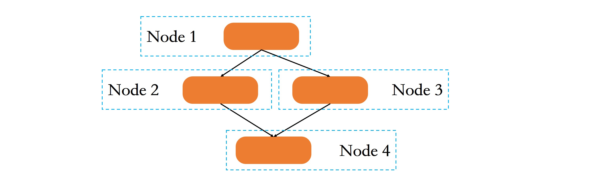
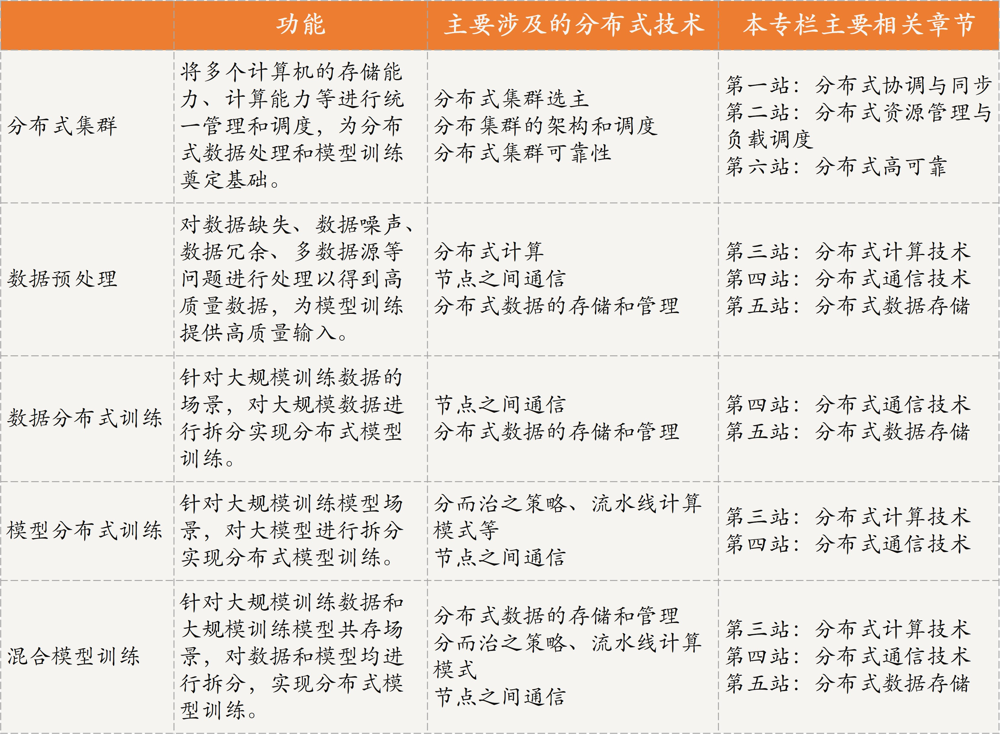

[toc]

## 08 | 分布式技术是如何引爆人工智能的？

-   今天，我将以人工智能为例，带你了解分布式技术的应用及其重要性。

### 什么是人工智能？

-   即机器**“像人一样思考”、“像人一样行动”、“理性地思考”、“理性地行动”**
-   人工智能要模拟人的智能也类似，需要通过大量的数据进行学习和分析获得规律（即建立一个模型），然后利用该规律或模型对未知数据进行预测，以判断是否与建模数据具有相同的特征。
-   从定义上可以看出，**数据、模型（也叫作算法）、算力**是人工智能的三大核心。
-   可以说，在一定程序上数据决定了机器学习的上限，而模型为逼近这个上限提供了方法，因此，**数据处理和模型训练是人工智能的关键技术，算力决定了数据处理和模型训练的实用性能，而分布式技术就是解决算力的不二妙招。**

### 数据处理

-   下面我们一起看看数据预处理的方法：
    -   数据统计（Data Statistics）
    -   数据集成（Data Integration）
    -   数据清理（Data Cleaning）
    -   数据规约（Data Reduction）
    -   数据变换（Data Conversion）

### 分布式模型训练

#### 什么是分布式模型训练？

-   **模型训练就是从已知数据中找到规律**。具体来说，不断通过已有数据进行验证增强，最终给出最适合的模型参数，以此来预测给定的未知数据。
-   单台机器上完成一次基于 ImageNet 数据集的训练要耗费多达一周的时间。
-   **一个包含 2048 个 GPU 的集群将 ImageNet 的训练降低到 4 分钟。**
-   **分布式模型训练**是利用分布式集群，将多个计算机的存储能力、计算能力等进行统一管理和调度，从而实现模型训练。
-   可以看到，分布式模型训练的前提是有一个**分布式集群**，因此一个高效、可靠的分布式集群是基础。而这个分布式集群的**架构、选主、调度、可靠性**等关键技术，便奠定了分布式模型训练的基础。

#### 数据分布式训练

-   数据分布式训练主要是针对**大规模训练数据的场景**。
-   
-   数据分布式的两个重要信息：
    1.  数据需求拆分存储到不同的节点进行训练，因此涉及了**数据的拆分方法、数据分布式存储和管理**。
    2.  **节点之间需要通信交互信息**。

#### 模型分布式训练

-   它针对的主要是**大模型训练场景**，在分布式领域中也被称为任务并行或任务分布式。
-   模型分布式训练是指将大模型进行拆分，然后将拆分后的子模型分配到不同的节点上进行训练。
-   
-   模型分布式训练的两个关键信息：
    1.  大模型拆分为多个小模型，其本质是将大任务拆分为多个子任务，这其实就是**分而治之策略**。而子任务之间的拆分，需要运用包括**流水线、MapReduce** 等在内的分布式计算模式。
    2.  不同节点上的子任务之间，需要通过通信交互中间计算结果，涉及分布式通信技术。

#### 混合模型训练

-   主要是针对**大规模训练数据和大模型训练共存的场景**。
-   混合模型训练，就是将数据分布式训练和模型分布式训练结合起来。
-   
-   从混合模型训练流程可以看出：
    1.  单节点或多节点实现模型并行或者模型分布式训练，涉及模型拆分、并行与分布式计算模式等。
    2.  多节点之间实现了数据分布式训练，涉及数据的拆分方法和数据的分布式存储和管理等技术。
    3.  单节点之间的模型分布式训练，需要单节点上多进程通信。多节点之间的分布式训练需要跨节点跨进程通信。

### 总结

-   

