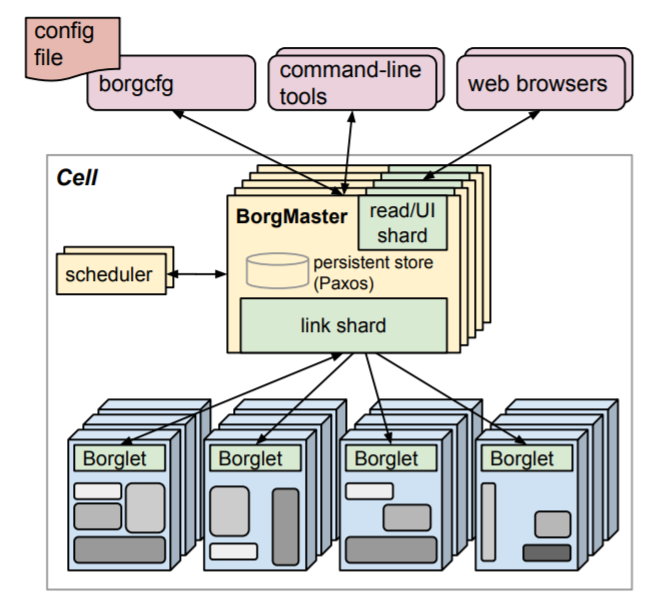
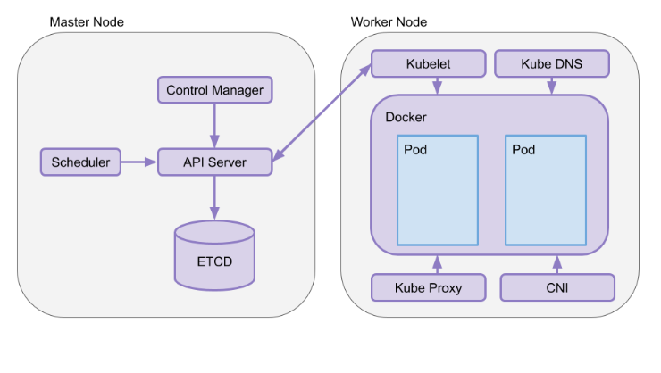
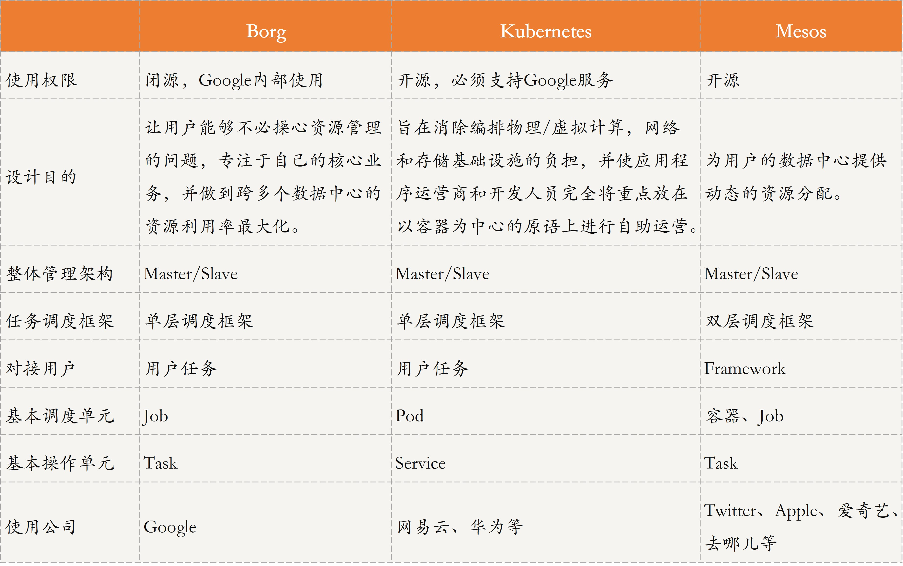

[toc]

## 09 | 分布式体系结构之集中式结构：一人在上，万人在下

-   这里的重点是，**把多个服务器管理起来，作为一个统一的资源提供服务**。

### 什么是集中式结构？

-   集中式结构就是，由一台或多台服务器组成中央服务器，系统内的所有数据都存储在中央服务器中，系统内所有的业务也均先由中央服务器处理。

-   

### 经典集中式结构

#### Google Borg

-   Borg 是 Google 内部使用的集群管理系统，采用了典型的集中式结构，负责提交、调度、开始、重启和管理 Google 运行在其上的所有应用。
-   **BorgMater**，它由两个进程组成，一个是 Borgmanster 主进程，一个是独立的 scheduler 进程。
    -   主进程处理客户端的 RPC 请求，比如任务的执行状态更新或查询等，同时，管理系统中所有实体状态，并负责和 Borglet 通信。
    -   scheduler 进程负责任务调度，通过任务对资源的需求以及当前 Borglet 所在服务器的资源情况进行匹配，为任务寻找一个合适的节点服务器执行。
-   **Borglet**，它是运行每个节点机器的一个 agent，负责任务的拉起、停止、重启等，并管理和搜集本服务器资源，将任务状态、服务器状态等信息上报给 BorgMaster。而 BorgMaster 会周期性地轮询每个 Borglet，以获取节点服务器的状态和资源信息。
-   Borg 整体架构示意图
    -   
-   Borg 的主要用户是 Google 的开发者及运行 Google 应用和服务的系统管理员（SRE）。用户以 Job 形式向 Borg 提交工作，每个 Job 由运行一个或多个运行相同程序的 Task 组成。每个 Job 运行在一个 Borg Cell 中，并将一组机器当做一个单元进行管理。
-   Borg 运行的任务主要分为两类：
    -   第一类是**长服务**，即长时间不停止的服务，并且要求能够处理短暂的，延迟敏感的请求（延迟要求在几微秒到几百毫秒之间）。这些服务主要用于面向终端用户的服务（Gmail、Google Docs、web 搜索），以及内部的一些基础设施服务（Big Table）。
    -   第二类是**批处理任务**，通常需要同秒到几天的时间来完成的批处理 Job，这些 Job 对短时间的性能波动并不是非常敏感。
-   Borg 三大优点：
    -   开发者只需要关注应用，不需要关注底层资源管理。
    -   高可靠性和可用性，支持多种应用。
    -   支持上千服务器的管理和运行。

#### Kubernetes

-   Kubernetes 也是典型的集中式结构，一个 Kubernetes 集群，主要由 Master 节点和 Worker 节点组成，以及客户端命令行工具 kubectl 和其他附加项。
-   **Master 节点**：
    -   API Server
    -   Scheduler
    -   Cluster State Store
    -   Control Manager
-   **Worker 节点**
    -   kubelet
    -   kube-proxy
-   架构图
    -   
-   优势：
    -   自动化容器的部署和复制
    -   将容器组织为组，弹性伸缩
    -   容器间负载均衡
    -   易于版本控制与滚动更新

#### Mesos

-   Mesos 是 Apache 旗下的开源分布式资源管理框架，它被称为分布式系统的内核。
-   **Mesos 与 Borg 不同之处**在于，
    -   Borg 和 Master 直接对接用户应用，也就是说用户可以向 Borg 的 Master 直接请求任务。
    -   Mesos 只负责底层资源管理和分配，并不涉及存储、任务调度等功能。因此，Mesos Master 对接的是 Spark、Hadoop、Marathon 等框架。因此，Mesos 的任务调度框架是双层结构。
-   角色：
    -   Mesos Master
        -   Mesos Master 负责收集和管理所有 Agent 所在服务器的资源和状态，并且对接 Spark、Hadoop 等框架，将集群中服务器的资源信息告知给这些框架，以便这些构架进行任务资源匹配和调度。
    -   Mesos Agent
        -   Mesos Agent 负责任务的拉起、停止、重启等，并负责收集所服务器的资源信息和状态，上报 Mesos Master。
-   Mesos Master 通常采用一主两备的方式，方便故障处理和恢复。而 Mesos Master 选主策略，采用的就是我们之间讲的“分布式选举”中的 ZAB 算法。
-   架构图
    -   
-   优势
    -   **效率**
    -   **可扩展性**
    -   **模块化**
-   参考：[Mesos 中文手册](https://mesos-cn.gitbooks.io/mesos-cn/content/Mesos-Introduction.html)

### 分析对比

-   

### 扩展：Mesos 是如何支持容器部署的？

-   Mesos 本身只负责资源管理，不负责任务调度。但，Mesos 可以对接不同的框架，**Mesos + Marathon 可以支持容器调度和部署**。
-   Marathon 支持容器的调度，将容器部署请求发给 Mesos Master，Mesos Master 再将请求转发给 Mesos Agent，Mesos Agent 的执行器会将容器拉起。

### 总结

-   今天，我主要与你分享了分布式系统中的集中架构，并以 Borg、Kubernetes、Mesos 这三款知名集群管理系统为例，与你描述了集中式架构的设计目的、框架结构，及各组件模块的功能等。
-   思维导图
    -   