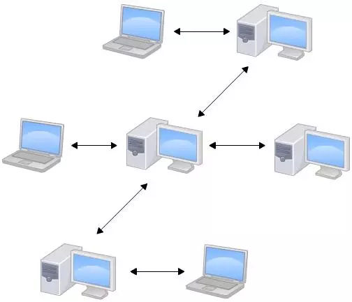
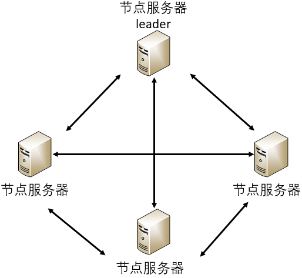
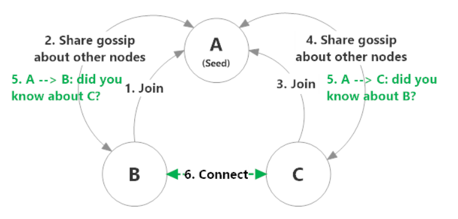
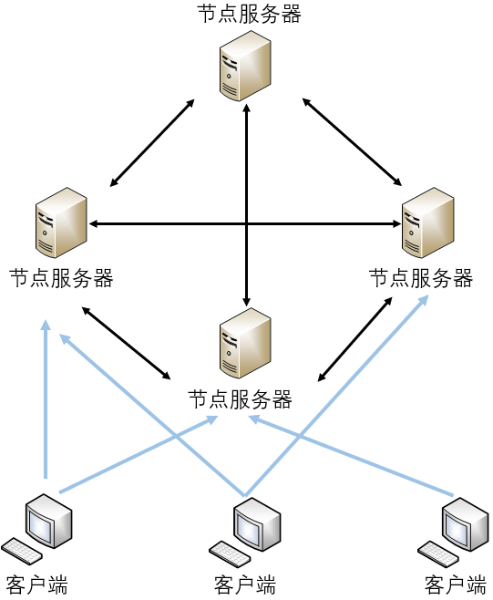
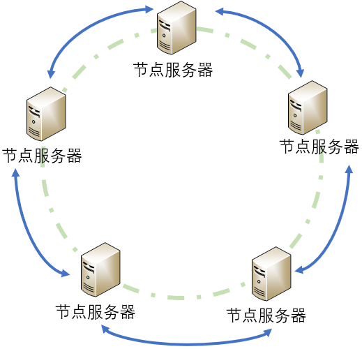
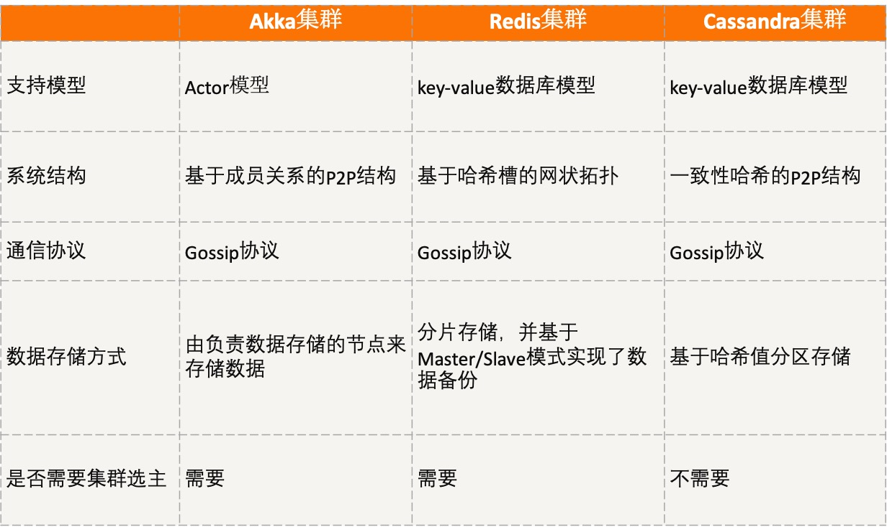

[toc]

## 10 | 分布式体系结构之非集中式结构：众生平等

-   今天，我们一起讨论下，什么是非集中式结构？它的原理是什么样的，又有哪些集群采用了这种结构呢？

### 什么是非集中式结构？

-   在非集中式结构中，服务的执行和数据的存储被分散到不同的服务器集群，服务器集群间通过消息传递进行通信和协调。
-   

### Akka 集群

-   Akka 框架基于 Actor 模型，提供了一个用于构建可扩展的、弹性的、快速响应的应用程序平台。
-   Actor 是一个封装了状态和行为的对象，它接收消息并基于该消息执行计算。Actor 之间互相隔离，不共享内存，但 Actor 之间可通过交换消息（mail）进行通信（每个 Actor 都有自己的 MailBox）。
-   
-   Akka 集群是一个完全去中心化的分布式集群管理系统，节点有 Leader 节点和非 Leader 节点之分。与非 Leader 节点相比，**Leader 节点只是增加了负责节点的加入和移除集群的功能**。
-   
-   Akka 集群的两个重点是数据传输和集群组建及管理。

#### 数据传输

-   **Akka 集群主要采用的是谁的时候戳最新（也就是数据最新），就以谁为准的原则**。
-   Akka 集群采用了 **Gossip 协议**，该协议是最终一致性协议。它的**原理**是每个节点周期性地从自己维护的集群节点列表中，随机选择 k 个节点，将自己存储的数据信息发送给这 k 个节点，接收到该信息的节点采用前面的共识原则，对收到的数据和本地数据进行合并，这样迭代几个周期后，集群中所有节点上的数据信息就一致了。

#### 集群组建及管理

-   下图展示了 Akka 集群的创建过程：
    -   
-   在创建集群时，节点被分为三种类型，即：
    -   种子节点
    -   首种子节点，
    -   普通节点，

#### 小结

-   Akka 集群是一个完全去中心化的集群管理系统，当集群组建完成后，每个节点均可执行 Actor 应用程序，因此支持并发操作。
-   但，并发操作引入的数据同步和一致性的问题，所以，Akka 集群采用了 Gossip 协议进行数据同步。

### Redis 集群

-   Redis 是一个开源的高性能分布式 key-valu 数据库。其特征主要表现为：
    -   支持数据持久化
    -   支持多种数据结构
    -   支持数据的备份
-   Redis 集群中不存在中央节点，是典型的去中心化结构，每个节点均可与其他节点通信。
-   Redis 集群架构图如下：
    -   
-   节点之间的数据传输仍是采用了 Gossip 协议，来保证集群中数据的一致性。
-   Redis 集群中的节点用于数据存储，所以在**设计时，需要考虑数据的可靠性和分片存储的问题**。

#### 小结

-   Redis 集群是一个非集中式集群管理系统，没有中心节点，不会因为某个节点造成性能瓶颈，每个节点均支持数据存储，且采用分片存储方式，提高了写的并发能力。同时，每个节点的设计采用主备设计，提高了数据可靠性。

### Cassandra 集群

-   Cassandra 也支持数据的分布式存储和操作。因此，Cassandra 的集群架构与数据分片存储方案，与 Redis 集群类似。
-   Cassandra 集群的系统架构是基于一致性哈希的完全 P2P 结构，没有 Master 的概念，所有节点都是同样的角色。
-   Cassandra 集群节点间的状态同步，也是通过 Gossip 协议来进行 P2P 通信的。
-   

-   **Cassadra 集群数据存储与 Redis 的不同之处是**，Redis 集群每个节点代表一部分哈希槽，一个哈希槽代表一个哈希值区间，而 Cassandra 集群中每个节点代表一个哈希值。

#### 小结

-   Cassandra 采用了去中心化的架构，解决了集中式结构的单点故障问题，同时因为数据基于哈希值分区存储，提高了读写数据的并发能力。
-   在 Cassandra 集群中，没有 Master 概念，每个节点代码一个哈希值，通过哈希映射的方式决定数据存储的位置。
-   集群间的状态同步通过 Gossip 协议来进行 P2P 的通信。

### 对比分析

-   

### 扩展：如何优化 Gossip 协议中的重复消息问题？

-   每个节点记录当前传输的消息且还未达收敛的时候，已经发送给了哪些节点，然后每次选择从没有发送的节点列表中随机选择 k 个节点，直到所有节点均被传输或集群收敛为止。
-   这样，一方面减少了重复消息量，另一方面加快了收敛速度。

### 总结

-   集中式结构虽然易于理解，但容易出现单点瓶颈和单点故障等问题，而**非集中结构才是超大规模分布式系统的首选结构**。
-   **Akka** 集群是一个完全去中心化的集群管理系统，节点之间都是 P2P 的连接，通过 Gossip 协议来进行通信，节点之间有角色划分，负责数据存储的节点会进行存储数据。
-   **Redis** 集群也是 P2P 的网状连接模式，但是，基于 key-value 的数据库模型，每个节点都可以执行数据的计算和存储。此外，Redis 集群引入了哈希槽的概念，来解决数据的分片存储问题。
-   **Cassandra** 集群的结构是一致性哈希的 P2P，节点会构成一个环结构，通过哈希映射来选择对应的节点。
-   思维导图：
    -   

