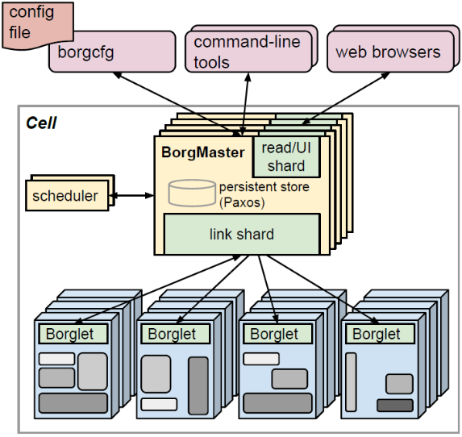

[TOC]

## 11 | 分布式调度架构之单体调度：物质文明、精神文明一手抓

-   为用户任务寻找合适的服务器的过程，在分布式领域中叫作**调度**。

### 什么是单体调度

-   **单体调度器拥有全局资源视图和全局任务，可以很容易地实现对任务的约束并实施全局性的调度策略**。
-   下图中展示一个典型的单体调度构架。
    -   

### 单体调度设计

-   在集群管理中，单体调度模块称为“Scheduler”或“单体调度器”。**单体调度器也叫作集中式调度器，指的是使用中心化的方式去管理资源和调度任务**。
-   集中式调度器的常见模型，如下图所示。这一模型中，资源的使用状态和任务执行状态都由调度器进行管理。
-   

### Borg 调度设计

-   调度的初衷是为作业或任务寻找合适的资源，也就是说**作业**或**任务**是调度的对象。
    -   作业，一个作业只在一个集群中运行。
    -   任务，对应的是一组 Linux 进程。
-   作业、任务关系？
    -   一个作业包含多个任务。作业类似于用户在一次事务处理或计算过程中要求计算机所做工作的总和，而任务就一项项具体的工作，二者属于**包含关系**。
-   多个任务可以在多台机器上同时执行，从而加快作业的写成速度，提高系统的并行程度。具体将哪个任务分配给哪个机器去完成，这就是调度的事儿了。
-   Borg 系统架构图
    -   
-   **调度以任务为单位的，而不是作业为单位**。

### Borg 调度算法

-   核心思想，“筛选可行，评分取优”，具体包括两个阶段：
    -   **可行性检查**，找到一组可以运行任务的机器。
    -   **评分**，从可行的机器中选择一个合适的机器。
-   常见的评分算法，包括“**最差匹配**”和“**最佳匹配**”两种。

### 扩展：多个集群/数据中心如何实现单体调度呢？

-   **集群联邦**

### 总结

-   单体调度是指一个集群中只有一个节点运行调度进程，该调度进程负责集群资源管理和任务调度，也就是说单体调度器拥有全局资源视图和全局任务。
-   特征：
    -   单体调度可以很容易实现对作业的约束并实施全局性的调度策略，因此适合批处理任务和吞吐量较大、运行时间较长的任务。
    -   单体调度系统状态同步比较容易且稳定。
    -   调度算法只能全部内置在核心调度器当中，因此调度框架灵活性和策略的可扩展性不高。
    -   单体调度存在单点故障的可能性。
-   思维导图
    -   