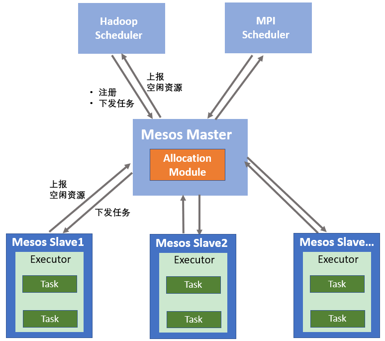

[TOC]

## 12 | 分布式调度架构之两层调度：物质文明、精神文明两手抓

### 什么是两层调度？

-   为了提升调度效率并支持多种类型的任务，把资源和任务分开调度，也就是说，一层调度器只负责资源管理和分配，另外一层调度器负责任务与资源和匹配，这种调度架构，就是**两层调度**。
-   两层调度结构对应的就是两层调度器，
    -   资源使用状态同时由中央调度器和第二层调度器管理，
    -   中央调度器从整体上进行资源的管理与分配，将资源分配到第二层调度器。
    -   再由第二层调度器负责将资源与具体和任务配对，因此，第二层调度可以有多个调度器，以支持不同的任务类型。

-   

### 两层调度设计

-   这里以 Apache Mesos 为例，一起学习两层调度的架构设计和对应的分配算法。
-   Mesos 只负责底层资源的管理和分配，并不涉及存储、任务调度等功能。
-   Mesos 本身实现调度器为第一层调度，负责资源管理，然后将第二层任务调度交给框架完成。

### 两层调度架构

-   Mesos 为基础的分布式资源管理与调度构架包括两部分。即 Mesos资源管理集群和框架。
    -   资源管理集群，由一个 Master 和多个 Slave 节点组成集中式系统。
    -   框架运行在 Mesos 上，是负责应用管理与调度的“组件”。
-   

### 资源分配算法

-   资源分配算法解决的问题是，**决策需要将当前可用资源分配给哪些框架以及分配多少**。
-   重点介绍两种资源分配算法：最大最小公平算法、主导资源公平算法。
-   **最大最小公平算法**：
    -   这个算法的3个主要原则：
        1.  按照用户对资源需求量递增的顺序进行空间资源分配。
        2.  不存在用户得到资源超过自己需求的情况。
        3.  对于分配的资源不满足需求的用户，所获得的资源是相等的。

-   执行流程
    -   
    -   本例中对于需求量为（10，25，35，45）的用户们来说，分配到资源是（10，25，32.5，32.5）。
    -   这个算法另外一个结束条件是，资源分配满足了所有用户的资源需求，即当没有用户有资源需求时，算法也会终止。

-   **主导资源公平算法**
-   两种调度算法对比：
    -   最大最小公平算法
        -   适用于单一类型的资源分配场景。
        -   从公平角度出发，为每个用户分配不多于需求量的资源。
    -   主导资源公平算法
        -   适用于多类型资源混合的场景。
        -   从任务出发，目的在于尽量充分利用资源使得能够执行的任务越多越好。

### 扩展：两层调度如何保证不同的业务不会互相干扰？

-   **容器**

### 总结

-   两层调度是一种资源和任务分开调度的设计，也就是说一层调度只负责资源管理和分配，另外一层调度负责任务和资源的匹配。
-   在 Mesos 中，第一层资源调度由 Mesos 提供，第二层任务调度由框架提供。
-   关于第一层的调度算法，通常有最大最小公平算法和主导资源公司算法等。
-   两层调度的一个问题是，由于第二层调度只能获得部分资源视图，因此无法实现全局最优调度。
-   思维导图
    -   