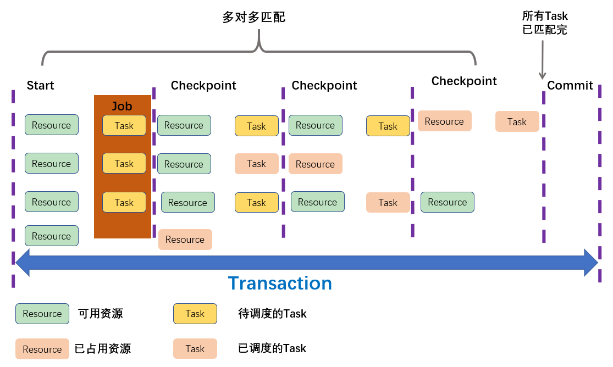
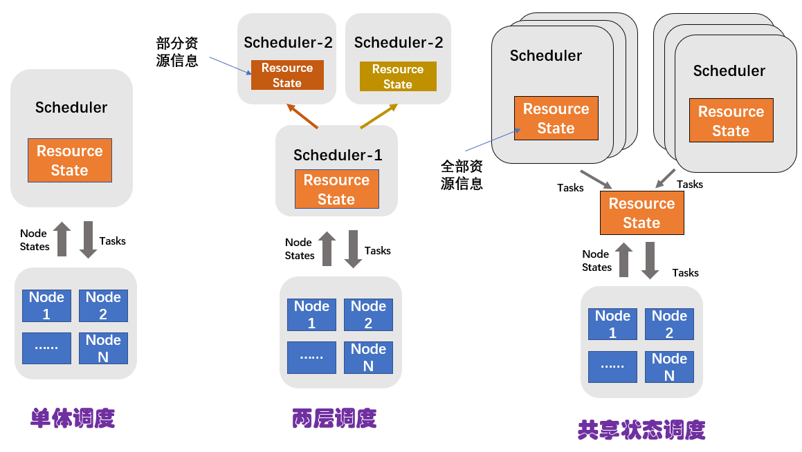

[TOC]

## 13 | 分布式调度架构之共享调度：物质文明、精神文明多手协商抓

### 什么是共享状态调度？

-   这种调度架构在支持多种任务类型的同时，还能拥有全局的资源状态信息。要做到这点，这种调度架构的的多个调度器需要共享集群状态，包括资源状态和任务状态等。这种调度架构，我们称之为**共享状态调度器**。
-   共享状态调度架构的示意图：
    -   
-   **共享状态调度架构为了提供高可用性和可扩展性，将集群状态之外的功能抽出来，作为独立的服务**。具体来说：
    -   State Storage 模块，负责存储和维护资源及任务状态，以便 Scheduler 查询资源状态和设计任务。
    -   ReSource Pool 即为多个节点集群，接收并执行Scheduler 调度任务。
    -   Scheduler 只包含任务调度操作，而不是单体调度器那样还需要管理集群资源等。

### 共享状态调度设计

-   共享状态调度的理念最早是 Google 针对两层调度器的不足，提出的一种调度架构。
-   这种调度结构的典型代表有 Google 的 Omega、微软的 Apollo，及 Hashicorp 的 Nomad 容器调度器。

### Omega 调度架构

-   Omega 中有一个 “Cell” 的概念，每个 Cell 管理着部分物理集群。
-   Omega 集群的调度架构示意图：
    -   

### Omega 共享调度工作原理

-   
-   **Omega 调度器将两层调度器中的集中式资源调度模块简化成了一些持久化的共享数据（状态）和针对这些数据的验证代码**。

### 扩展：单体调度、两层调度和共享调度的区别是什么？

-   
-   

### 总结

-   概括来说，共享状态调度是将单体调度器分解为多个服务，由多个服务共享集群状态，包括资源状态和任务状态等。
-   共享状态调度包含多个调度器，每个调度器都可以看到集群的全局资源信息，并根据这些信息进行任务调度。
-   共享状态调度是乐观并发调度，调度器将其调度的结果以**原子**的方式提交给资源维护模块，由其决定是否进行本次调度。
-   思维导图
    -   