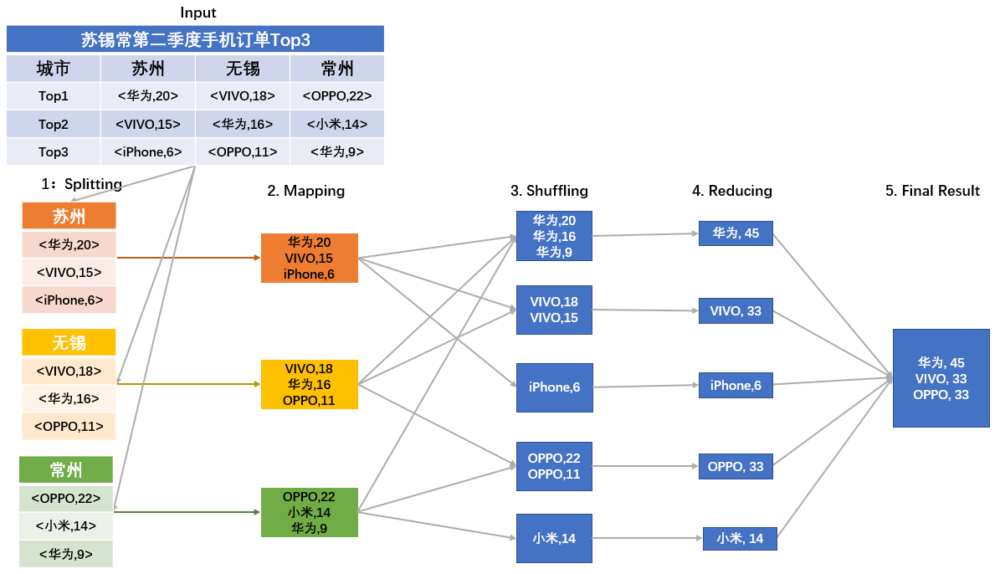

[TOC]

## 15 | 分布式计算模式之MR：一门同流合污的艺术

### 什么是分而治之？

-   **分而治之**，简称分治法。就是将一个复杂的、难以解决的大问题，分割成一些规模较小的、可以比较简单的或直接求解的子问题，这些子问题之间相互独立且与原问题形式相同，递归地求解这些子问题，然后将子问题合并得到原问题的解。
-   在分布式领域，**具体有哪些问题适合采用分治法呢**？我们先看下分治法的问题具有哪些特征？
    -   问题规模比较大或复杂，且问题可以分解为几个规模较小的、简单的同类型问题进行求解。
    -   子问题之间相互独立，不包含公共子问题。
    -   子问题的解可以合并得到原问题的解。
-   采用分治法解决问题的核心步骤是：
    1.  **分解原问题**。将原问题分为若干个规模较小，相互独立，且与原问题形式相同的子问题。
    2.  **求解子问题**。
    3.  **合并解**。

### 分治法的原理

-   分布式原本就是为了处理大规模应用而生的，所以基于分布式系统，如何分而治之地处理海量数据就是分布式领域中的一个核心问题。

### 抽象模型

-   
-   

### MapReduce 工作原理

-   在MapReduce 里，各个组件是如何分工完成一个复杂的任务的呢？
-   先来看一下 MapReduce 的组件结构：
    -   
-   MapReduce 主要包括以下三种组件：
    -   Master，负责分配、协调任务的运行，并为 Mapper 分配 map() 函数操作、为Reduce 分配 reduce() 函数操作。
    -   Mapper worker，负责 Map 函数功能，即负责执行子任务。
    -   Reduce worker，负责 Reduce 函数功能，即负责汇总各个子任务的结果。
-   基于这三种组件，MapReduce 的工作流程如下所示：
    -   
-   整个MapReduce 的工作流程主要可以概括为 5 个阶段：
    -   Input
    -   Spliting
    -   Mapping
    -   Reducing
    -   Final Result

### MapReduce 实践应用

-   假设，我们现在要统计苏锡常地区第二季度手机订单数量 Top3 的品牌。我们来看看具体统计步骤：
    1.  任务拆分
    2.  循环调用 map() 函数，统计每个品牌手机的订单数量。
    3.  Shuffling 操作。在映射之后，要对映射后的结果进行排序整合，然后再执行归并操作。
    4.  Reducing 阶段，归并同一品牌的购买次数。
    5.  得到最终结果。
-   

-   由上述流程可以看出，Map/Reduce 任务和 map()/reduce() 函数是有区别的。
    -   Map 阶段由一定数量的 Map 作业组成，这些 Map 作业是并发任务，可以同时运行，且操作重复。Map 阶段的功能主要由map() 函数实现。每个 Map 作业处理一个子任务，需要调用多个map() 函数来处理。
    -   Reduce 阶段执行的是汇总任务结果，遍历Map 阶段的结果从而返回一个综合结果。与Reduce 相关的是 reduce() 函数，它输入的是一个键（key）和与之对应的数据（value），其功能是将具有相同key 的数据进行合并。

### 扩展：Fork-Join 计算模式是什么意思呢？

-   Fork-Join 是 Java 语言或库提供的原生多线程并行处理框架，采用线程级的分而治之计算模式。
-   与 MapReduce 核心思想一致。
-   Fork-Join VS MapReduce 本质**区别**:
    1.  Fork-Join 不能大规模扩展，只适用单个 Java 虚拟机运行。
    2.  MapReduce 可以大规模扩展，适用于大型计算机集群。

### 总结

-   所谓分而治之，就是将一个复杂的、难以直接解决的大问题，分割成一些规模较小的可以直接求解的子问题，这些问题互相独立且与原问题形式相同，递归地解这些子问题，然后将子问题的解合并以后就是原问题的解。
-   分布式计算模型 MapReduce 就是运用了分而治之的思想，通过 Map 操作将大任务分成多个较小的任务去执行，得到的多个结果通过 Reduce 操作整合成一个完整的结果。
-   思维导图
    -   

