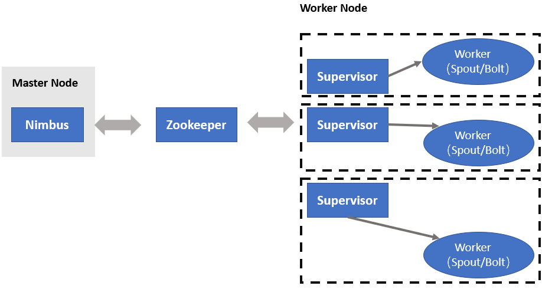
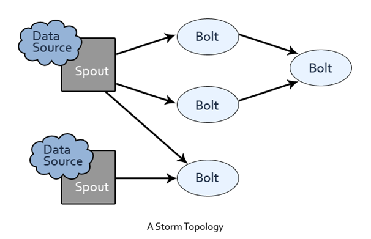
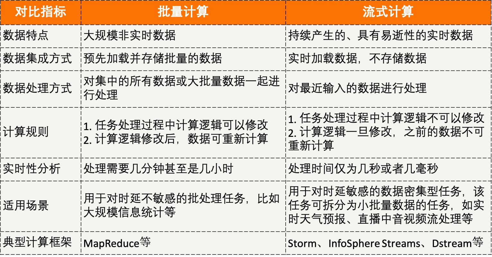

[TOC]

## 16 | 分布式计算模式之Stream：一门背锅的艺术

-   实时性任务主要是针对流数据的处理，对处理时延要求很高，通常需要常驻服务进程，等待数据的随时到来随时处理，以保证低时延。处理流数据任务的计算模式，分布式领域中叫作 Stream。

### 什么是 Stream?

-   如流水般持续涌现，且需要实时处理的数据，我们称为**流数据**。
-   流数据的4个主要特征：
    -   数据如流水般持续、快速地到达。
    -   海量数据规模。
    -   对实时要求高。
    -   数据顺序无法保证。
-   在分布式领域中，处理流数据的计算模式，就是流计算，也叫Stream。
-   类比于水流的持续不断且变幻莫测，流数据也是以大量、快速、时变的流形式持续在应用中产生，因此**流计算一般用于处理数据密集型应用**。

### Stream 工作原理

-   流计算强调的是实时性，数据一旦产生就会被立即处理，当一条数据被处理完成后，会序列化存储到缓存中，然后立刻通过网络传输到下一个节点，由下一个节点继续处理。为了保证实时性，在流计算中，不会存储任何数据，就像水流一样滚滚向前。
-   所以说，流计算属于持续性、低时延、事件驱动型的计算作业。
-   使用流计算进行数据处理，一般包括3个步骤：
    -   
    -   第一，**提交流式计算作业**。
    -   第二，**加载流式数据进行计算**。
    -   第三，**持续输出计算结果**。
-   目前流计算相关的框架和平台也有很多，主流的划分为如下3类：
    -   商业级的流计算平台
    -   开源流计算框架，典型代表 Apache Storm 和 S4。
    -   各大公司自身业务特点而开发的流计算框架。如 Facebook 的 Puma、百度的 Dstream、淘宝的银河数据处理平台。

### Storm 的工作原理

-   MapReduce VS Storm
    -   MapReduce 作业在得到结果后总会结束。
    -   而 Storm 拓扑描述的是计算逻辑，该计算逻辑永远在集群中运行地。
-   
-   Storm 集群上有两种节点，
    -   Master Node，主节点上运行着一个名为 Nimbus 的守护进程。Nimbus 负责为集群分发代码，为工作节点分配任务以及进行故障监控。一个 Storm 集群在工作过程中，只有一个 Nimbus 进程工作。
    -   Worker Nodes，每个工作节点上都运行着一个名为 Supervisor 的守护进程。Supervisor 负责监听分配给它所在机器上的工作，负责接收 Nimbus 分配的任务，并根据需要启动和停止工作进程，其中每个工作进程都执行一个子任务。因此，一个正在运行的拓扑任务，是由分布在许多计算机上的许多工作进程组成的。
-   在介绍完 Worker 组件前，我们介绍一下 Storm 的核心抽象：数据流。数据流是一个无界序列，是在分布式环境中并行创建、处理的一组元组（tuple）。数据流可以由一种能够表述数据流中元组的域的模式来定义。
-   Storm 为进行数据流转换提供了基本组件 Spout 和 Bolt。
-   
    -   Spout 用于接收源数据。
    -   Bolt 负责处理输入的数据流。

### 扩展：流计算和批量计算的区别是什么？

-   

### 总结

-   流计算框架必须是低延迟、可扩展、高可靠的。
-   流计算的3个步骤：
    -   提交流式计算作业
    -   加载流式数据进行流计算
    -   扶持输出计算结果
-   思维导图
    -   