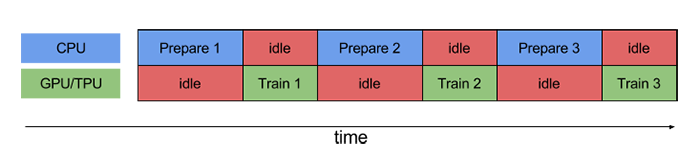

[TOC]

## 18 | 分布式计算模式之流水线

-   在分布式领域中解决类似具有依赖关系的流水线作业的计算模式，叫作流水线计算模式。

### 什么是流水线模式？

-   分布式领域的流水线计算模式，就是参考了工业生产中的流水线作业模式，将一个任务分为多个步骤执行，使得不同的任务可以并行执行。
-   计算机中的**流水线（Pipline）**技术是一种将每条指令拆分为多个步骤，多条指令的不同步骤重叠操作，从而实现几条指令并行处理的技术。

-   在分布式领域中，**流水线计算模式**也类似，它是将一个大任务拆分为多个步骤执行，不同的步骤可以采用不同的进程执行。这，使得不同任务可以并行执行，从而提高了系统效率。

### 流水线计算模式

-   **为了达到最佳性能，我们需要高效的输入流水线机制**。
-   第 N 个样本进行模型训练时，第 N+1 个样本可以进行数据预处理。这样，进一步的减少了整体数据处理和模型训练的时间。

### 流水线计算模式的原理

-   TensorFlow 运用了流水线模式对输入数据进行预处理，因此称为输入流水线。其数据输入流水线主要包含3个步骤：

    1.  **提取**
    2.  **转换**

    3.  **加载**

-   下面，我们一起看下 TensorFlow 官网给出的一个示例吧。
-   不使用流水线技术的训练过程：
    -   
    -   图中的 “idle” 指的是空闲时间。
-   使用流水线技术的训练过程：
    -   
    -   流水线模型可以将训练步骤的数据预处理和数据训练过程重叠到一起。
    -   这样不仅可以**最大限度地缩短训练的单步用时，还可以缩短提取和轮换数据所需的时间**。

### 扩展：流水线模式和 MapReduce 模式中，都有将大任务拆分为多个子任务，两者的区别是什么？

-   它们的**划分模式**不一样：
    -   MapReduce 以任务为粒度，将大的任务划分成多个小任务，每个任务都执行完整的、相同的步骤，同一任务能被并行执行，可以说是任务并行的一种计算模式。
    -   流水线计算模式以步骤为粒度，一个任务拆分为多个步骤，每个步骤执行的是不同的逻辑，多个同类型任务通过步骤重叠以实现不同任务的并行计算，可说是数据并行的一种模式。
-   它们的**子任务（步骤）间的关系**不同：
    -   在 MapReduce 中，各个子任务可以独立执行，互不干扰，多个子任务执行完后，进行结果合并得到整个任务的结果，因此要求子任务间是没有依赖关系的。
    -   流水线模式中，多个子任务间是具有依赖关系的，前一个子任务的输出是后一个子任务的输入。
-   所以，综合来讲，MapReduce 计算模式适合任务并行的场景，而流水线模式适合同类型任务数据并行处理的场景。

### 总结

-   流水线模式，将一个任务分为多个步骤执行，不同任务之间的步骤可以重叠执行，这使得多个不同任务可以并行执行。
-   思维导图：
    -   