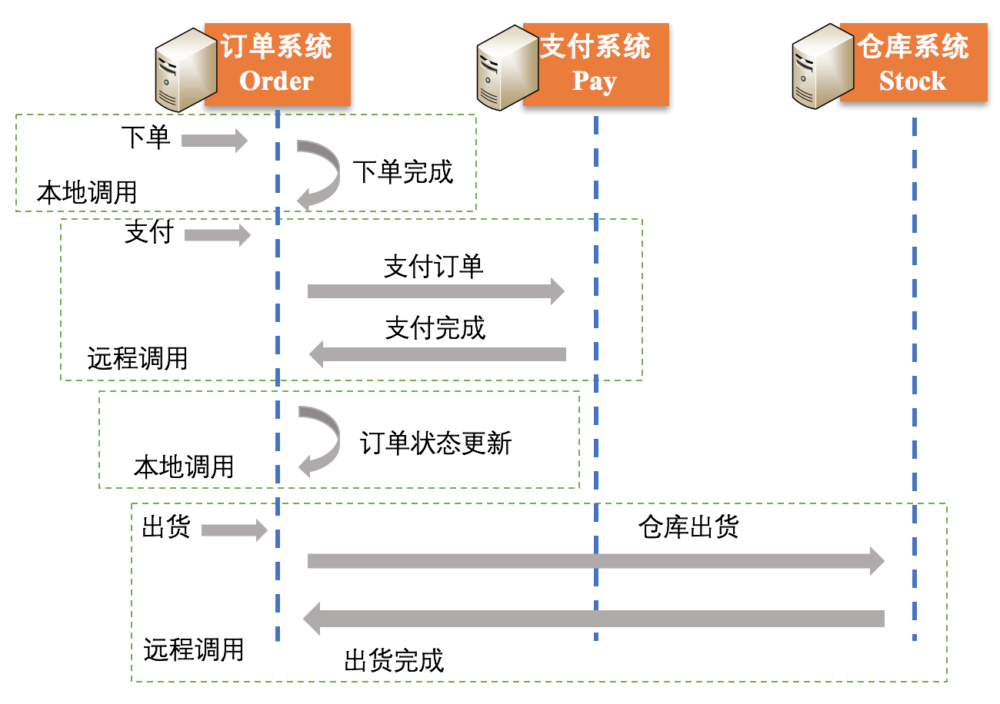
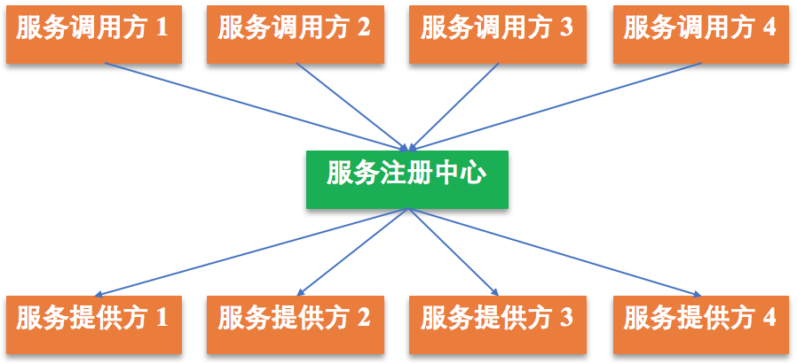
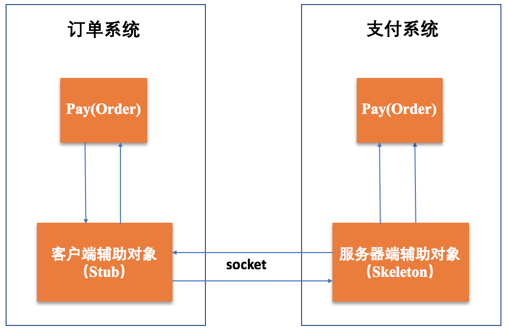
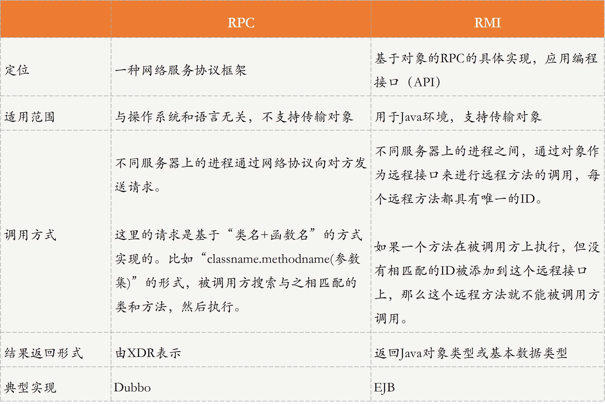

[TOC]

## 19 | 分布式通信之远程调用：我是你的千里眼

### 什么是远程调用？

-   示例，整个订单交易流程图如下：
    -   
-   **本地调用**，进程内函数间的相互调用。
-   **远程调用**，进程间函数间的相互调用。
-   远程调用可以分为如下两类：
    -   **本地过程调用（Local Procedure Call, LPC）**，指运行在同一台机器上的进程间的互相通信。
    -   **远程过程调用（Remote Procedure Call, RPC）**，指不同机器中运行的进程间的互相通信。

### 远程调用的原理及应用

#### RPC 的原理及应用

-   RPC 就是调用方式采用参数传递的方式，通过调用本机器上的一个函数或方法，去执行远程机器上的函数或方法（可统称为服务），并返回结果。整个过程中，RPC 会隐藏具体的通信细节。
-   电商购物中“支付”操作为例，如下图：
-   
-   **订单系统进程并不需要知道底层是如何传输的，在用户眼里，远程过程调用和调用一次本地服务没什么不同。这就是 RPC 的核心。**
-   **RPC 与本地调用（进程内函数调用）的区别**
    1.  **调用 ID 和函数的映射**。
    2.  **序列化和反序列化**。
    3.  **网络传输协议**。
-   **Apache Dubbo**,
    -   
-   Dubbo 架构中的 4 个部分：
    -   **服务提供方**
    -   **服务注册中心**
    -   **服务调用方**
    -   **监控中心**
-   Dubbo 工作流程图
    -   

#### RMI 的原理及应用

-   RMI 是一个基于 Java 环境的应用编程接口，能够让本地Java 虚拟机上运行的对象，像调用本地对象一样调用远程 Java 虚拟机上的对象。
-   与RPC 唯一不同的是，**RMI 是基于对象的，充分利用了面向对象的思想去实现整个过程，其本质就是一种基于对象的 RPC 实现**。
-   RMI 的具体原理图：
    -   

#### RPC 与 RMI 对比分析

-   

### 扩展：远程过程调用存在同步和异步吗？

-   答案是肯定的。
-   **同步调用和异步调用的区别是，是否等待被调用方执行完成并返回结果**。

### 总结

-   **本地调用**，通常指的是同一台机器进程间函数的相互调用，而**远程调用**是指不同机器进程间函数的相互调用。
-   **RPC** 是指调用方通过参数传递的方式调用远程服务，并得到返回结果。在整个过程中，RPC 会隐藏具体通信细节，使调用方好像在调用本地函数或方法一样。

-   RMI 是一个基于 Java 环境的应用编程接口，能够让调用方 Java 虚拟机上运行的对象像调用本地对象一样，调用其他机器Java 虚拟机上的对象。可以说，RMI 是 RPC 的一种具体实现形式。
-   Dubbo 是一个代表性的 RPC 框架，服务提供方首先向注册中心注册自己提供的服务，调用方通过注册中心获取提供的相对应的服务地址列表，然后选择其中一个地址去调用相应的服务。

-   思维导图
    -   