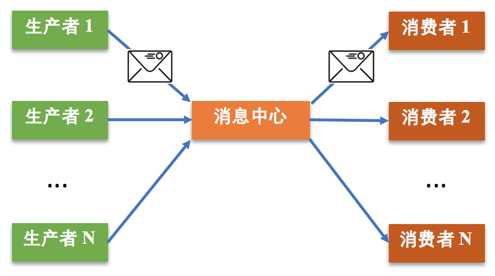
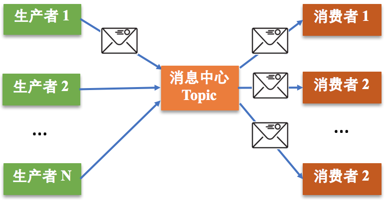
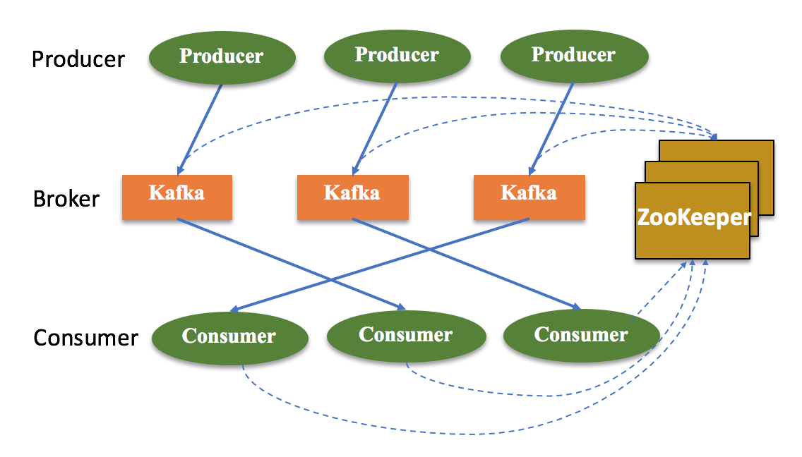
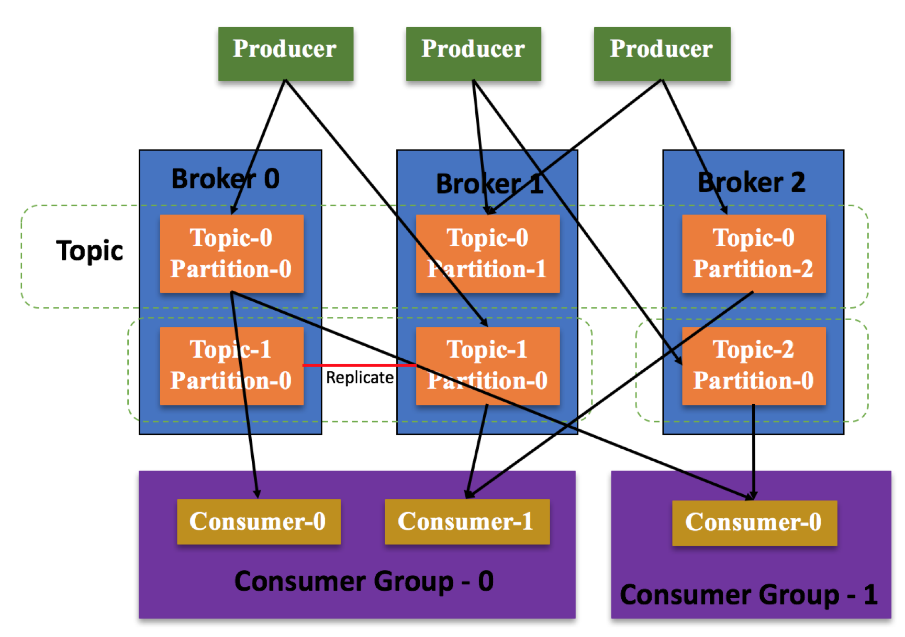
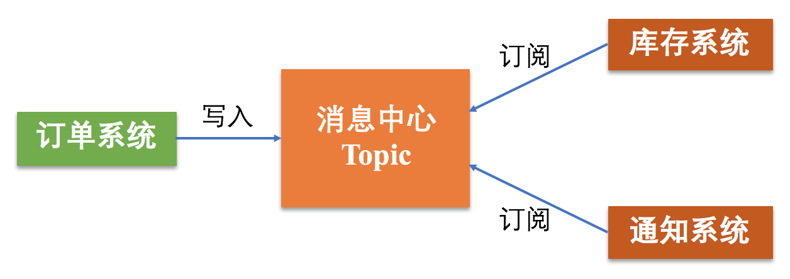

[TOC]

## 20 | 分布式通信之发布订阅：送货上门

### 什么是发布订阅

-   学术届电子论文的订阅方式。
-   
-   发布订阅的三要素是**生产者、消费者和消息中心**。

### 发布订阅的原理及应用

#### 发布订阅的基本工作原理

-   分布式通信领域中，消息系统一般有两种典型的模式。一种是点对点模式，另一种是发布订阅模式。
-   **点对点模式**
    -   一个消息只能被一个消费者消费，不允许重复消费。
    -   
-   **发布订阅模式**
    -   消息 -> 消息中心（以主题划分）-> 消费者
    -   
    -   与点对点模式本质区别在于，**发布订阅模式中一个消息可以被多个消费者进行消费**。

### Kafka 发布订阅原理及工作机制

-   Kafka 是一种典型的发布订阅消息系统，其系统架构也是包括生产者、消费者、消息中心。
-   在 Kafka 中，消息中心本质就是一组服务器，也可以说是 Kafka 集群。
-   Kafka 架构图，如下：
    -   
-   **Kafka 分区和消费组的原理和作用**：
    -   

### 发布订阅实践应用

-   

-   **发布订阅模式的关键特征**：
    -   实现了系统的解耦，易于维护。
    -   实现了异步，避免高负载。

### 扩展：观察者模式和发布订阅模式的区别是什么？

-   **观察者模式**，采用了直接通信，观察者和被观察者通信时会延时会低一些，但它们依赖关系比较强，不管是被观察者还是观察者逻辑或接口有更改，另一个均会受影响。
-   **发布者和订阅者**，采用了间接通信，引入的消息中心，相对比较厚重，且通信时延相对会高一点，但实现了订阅者和发布者的解耦。

### 总结

-   发布订阅就是生产者产生消息到消息中心，消费者订阅自己感兴趣的消息，消息中心根据消费者的订阅情况将相关消息发送给对应的消费者。
-   Kafka 是一个经典的发布订阅消息系统，采用多分区实现了消息备份、负载均衡，并引入消费组提高了消费者的消费能力，防止 Borker 因为存储资源不够丢弃消息的情况，从而提高了Kafka 系统的可靠性。
-   发布订阅模式可以使系统松耦合易于维护，也可异步执行解决高负载的问题，适用于系统解耦、流量削峰等场景。
-   思维导图：
    -   

