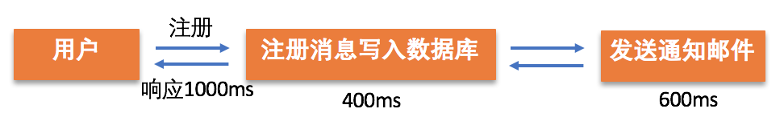
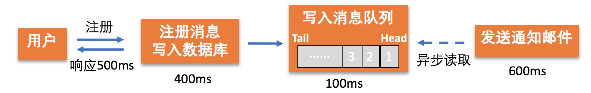
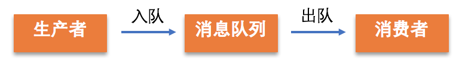
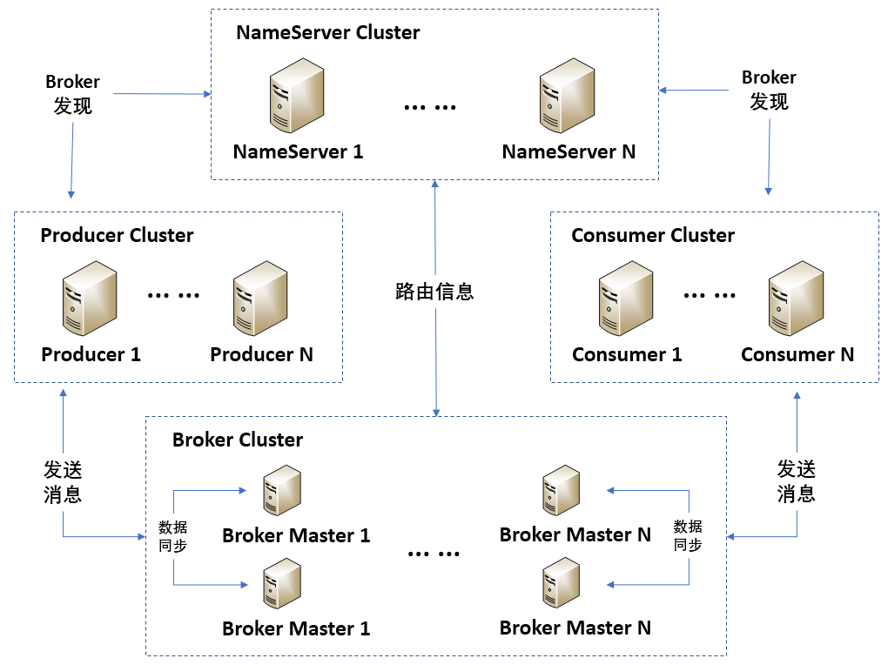
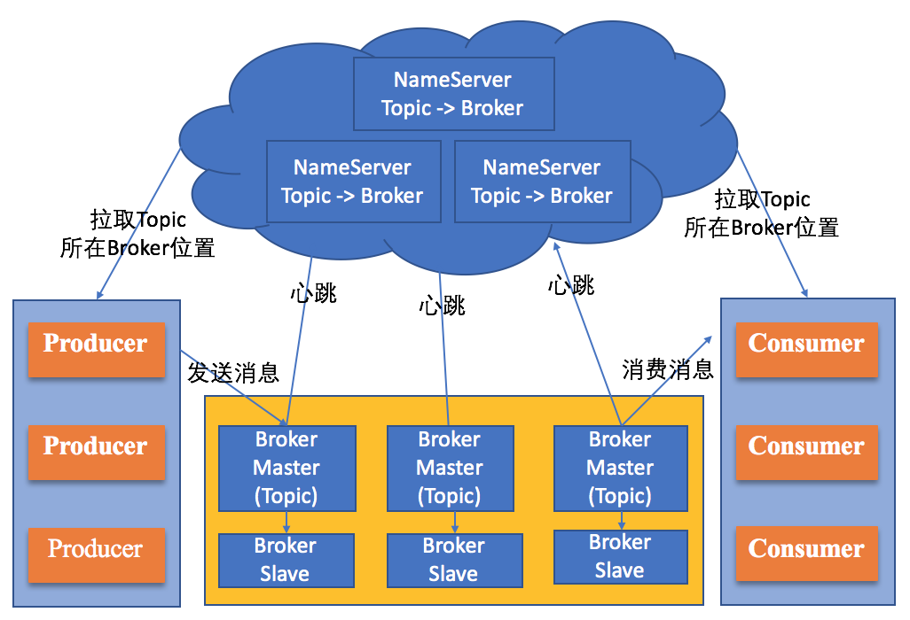

[TOC]

## 21 | 分布式通信之消息队列：货物自取

### 什么是消息队列？

-   引入消息队列前：
    -   
-   引入消息队列后：
    -   **消息队列的引入不会影响用户注册网站，但会提升用户响应效率**。
    -   
-   **消息队列是基于队列实现的，存储具有特定格式的消息数据**。消息存放到队列尾部后可以直接返回，并不需要马上处理，之后会有其他进程从队列头部开始读取消息，按消息放入的顺序逐一处理。
-   引入消息队列的好处：**提高响应速度，以实现组件间的解耦**。

### 消息队列的原理

#### 消息队列工作原理

-   消息队列模式也是包含3个核心部分：
    -   **生产者**
    -   **消息队列**
    -   **消费者**
-   流程图：
    -   

### RocketMQ 消息队列原理及工作机制

-   RocketMQ 架构图
    -   
-   RocketMQ 关键组件包含如下4部分：
    -   NameServer Cluster
    -   Producer Cluster
    -   Consumer Cluster
    -   Broker Cluster
-   RocketMQ 工作流程
    -    
-   **消息队列模式适用于什么场景**？
    -   消息队列模式，是根据消费者需求到消息队列获取数据消费的，消费者只需要知道消息队列地址即可，消息队列中心也无需提前知道消费者信息。
    -   这种模式对消费者没有特别需求，**因此比较适合消费者为临时用户的场景。**

### 扩展：发布订阅和消息队列模式都支持系统解耦，两者是否一致呢？

-   对于消息队列模式，消息队列中心无需提前获取消费者信息，因此对消费者比较灵活，适合消费者为临时用户的场景。
-   而发布订阅模式，需要消费者提前向消息中心订阅消息，也就是说消息中心需要提前获取消费者信息，比较适合消费者为长驻进程或服务的场景。

### 总结

-   消息队列模式中的核心**是以一种先进先出特点的队列结构来存储数据，实现组件的解耦和异步执行**。
-   思维导图
    -   