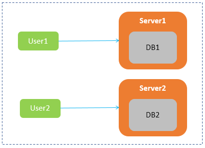
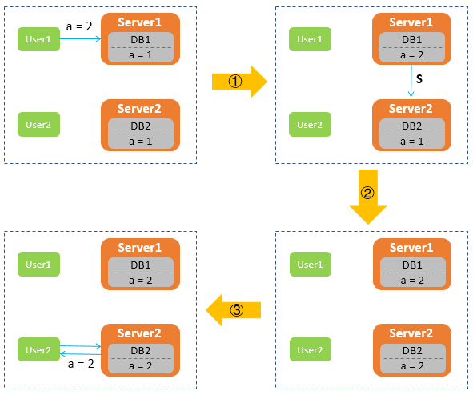
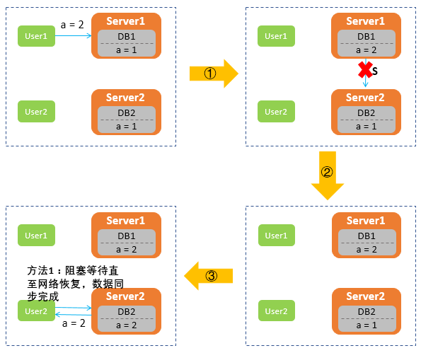
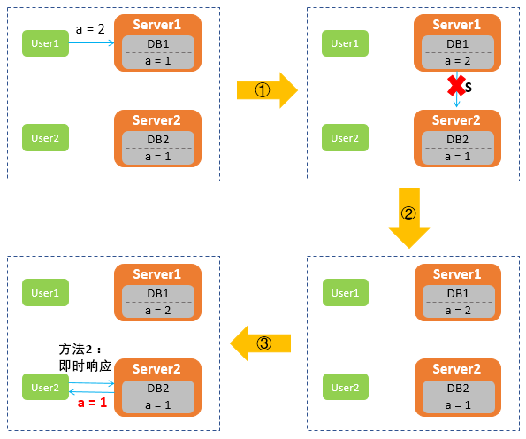
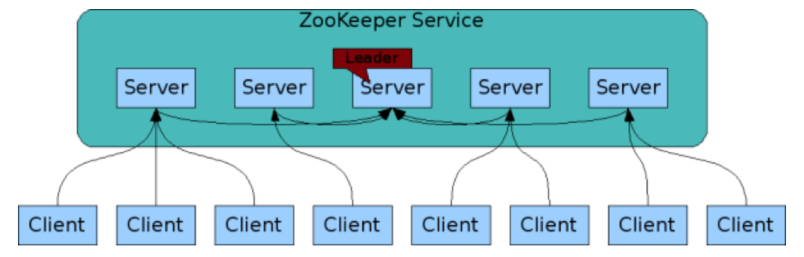
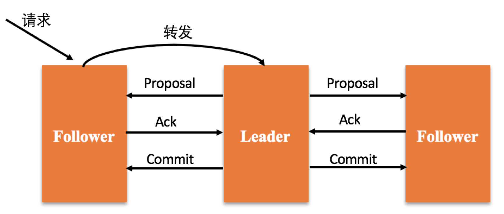
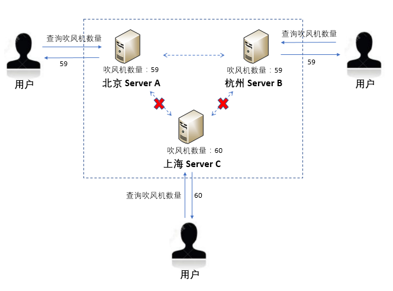
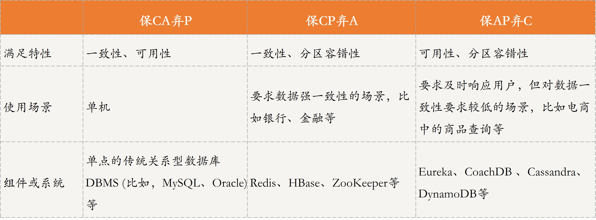

[toc]

## 23 | CAP 理论

-   CAP 理论指导分布式系统的设计，以保证系统的可用性、数据一致性等特征。

### 什么是 CAP ？

-   **C 代表 Consistency，一致性**。
    -   是指所有节点在同一时刻的数据是相同，即更新操作执行结束并响应用户完成后，所有节点存储的数据会保持相同。
-   **A 代表 Availability，可用性**。
    -   是指系统提供的服务一直处于可用状态，对于用户请求可即时响应。
-   **P 代表 Partition Tolerance，分区容错性**。
    -   是指分布式系统遇到网络分区的情况下，仍然可以响应用户的请求。

-   CAP 理论又是什么呢？

    -   **CAP 理论**是指的就是，在分布式系统中，C、A、P 这三个特征不能同时满足，只能满足其中两个。如下图所示：
    -   

-   接下来，我进一步解释下，**什么是 CAP 以及 CAP 为什么不能同时满足**吧。

    -   如下图所示，它们共同组成了一个分布式系统。
    -   

    -   用户更新，数据同步
    -   

-   在分布式系统中，网络分区不可避免，因此分区容错性 P 必须满足。接下来，我们就来讨论一下**在满足分区容错性 P 的情况下，一致性 C 和可用性 A 是否可以同时满足**。

-   这时，**User2 向 Server2 发送读取数据 a 的请求时，Server2 无法给用户返回最新数据，那么该如何处理呢**？

    -   **第一种处理方式，保证一致性 C，牺牲可用性 A**。Server2 选择让 User2 的请求阻塞，一直等到网络恢复正常，数据同步更新后，再给 User2 响应。
    -   

    -   **第二种处理方式是，保证可用性 A，牺牲一致性 C**。Server2 将旧的数据返回给用户，等到网络恢复，再进行数据同步。
    -   

-   可以看出：**在满足分区容错性 P 的前提下，一致性 C 和可用性 A 只能选择一个，无法同时满足**。

### CAP 选择策略及应用

-   接下来，**我们分别与你介绍保 CA 弃 P、保 CP 弃、保 AP 弃 C 这三种策略。以帮你面对不同的分布式场景时，知道如何权衡这三个特征**。

#### 保 CA 弃 P

-   在分布式系统中，现在的网络基础设施无法做到保持稳定，网络分区（网络不连通）难以避免。
-   **牺牲分区容错性 P，就相当于放弃使用分布式系统**。
-   单点系统毫无疑问就需要满足 CA 特征了。因为不存在网络通信问题，所以保证 CA 就可以了。

#### 保 CP 弃 A

-   如果一个分布式场景**需要很强的数据一致性，或者该场景可以容忍系统长时间无响应的情况下**，保 CP 弃 A 这个策略就比较适合。
-   这种策略通常用在涉及金钱交易的分布式场景下，因为它任何时候都不允许出现数据不一致的情况，否则就会给用户造成损失。这种场景下必须保证 CP。
-   典型例子有 Redis、HBase、ZooKeeper 等。下面，以 **ZooKeeper** 为例，带你了解它是如何保证 CP 的。
-   ZooKeeper 架构图：
    -   
-   在 ZooKeeper 集群中，Leader 节点外的节点被称为 Follower 节点，**Leader 节点会专门负责处理用户的写请求**。
    -   当用户节点发送写请求时，如果请求的节点刚好是 Leader，那就直接处理该请求。
    -   如果请求点是 Follower 节点，那该节点会将请求转发给 Leader，然后 Leader 会先向所有的 Follower 发出一个 Proposal，等超过一半的节点同意后，Leader 才会提交这次写操作，从而保证了数据的哟一致性。
-   具体示意图如下：
    -   
-   这种设计方式保证了分区容错性，但牺牲了一定的系统可用性。

#### 保 AP 弃 C

-   如果一个分布式场景**需要很高的可用性**，或者说在网络状况不太好的情况下，该场景允许数据暂时不一致，那这种情况下就可以牺牲一定的一致性了。
-   **适合保证 AP 放弃 C 的场景有很多**。如，查询网站，电商系统中的商品查询等，用户体验非常重要，所以大多会保证系统的可用性，而牺牲一定的数据一致性。
-   

#### 对比分析

-   

### 扩展：CAP 和 ACID 的 C、A 是一样的吗？

-   首先，我们看一下 CAP 中的 C 和 ACID 中的 C 是否一致？
    -   CAP 中的 C 强调的是**数据的一致性**，也就是集群中节点之间通过复制技术保证每个节点上的数据在同一时刻是相同。
    -   ACID 中的 C 强调的是**事务执行前后，数据的完整性保持一致或满足完整性约束**。也就是不管在什么时候，不管并发事务有多少，事务在分布式系统中的状态始终保持一致。
-   其次，再看下 CAP 中的 A 和 ACID 中的 A。
    -   CAP 中的 A 指的是**可以性（Availability）**，也就是系统提供的服务一直处于可用状态，即对于用户的请求可即时响应。
    -   ACID 中的 A 指的是**原子性（Atomicity）**，强调的是事务要么执行成功，要么执行失败。

### 总结

-   思维导图
    -   

