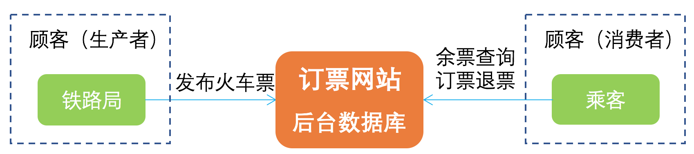
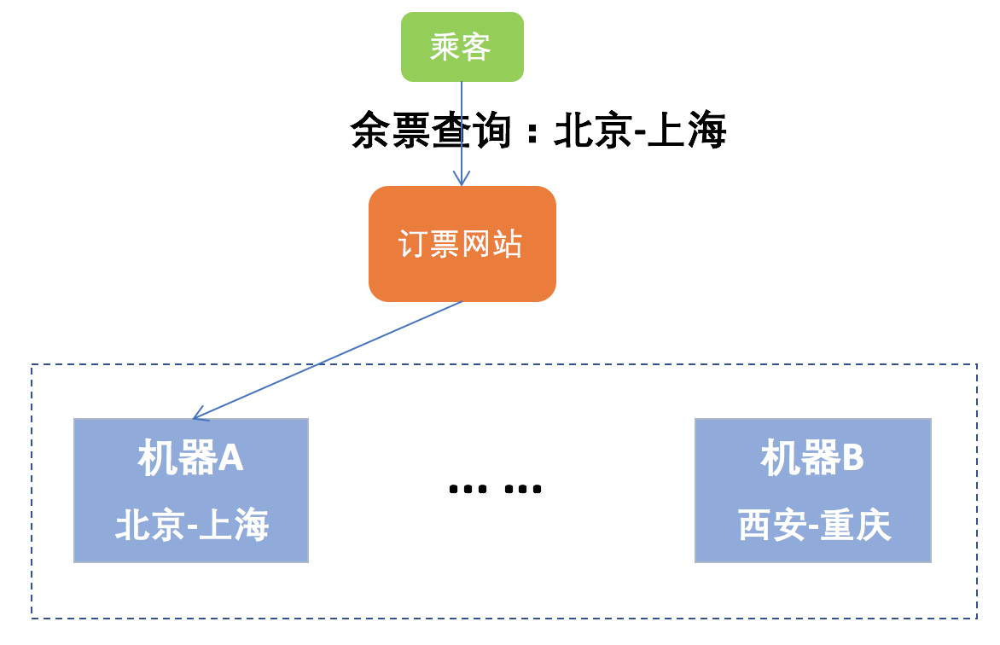
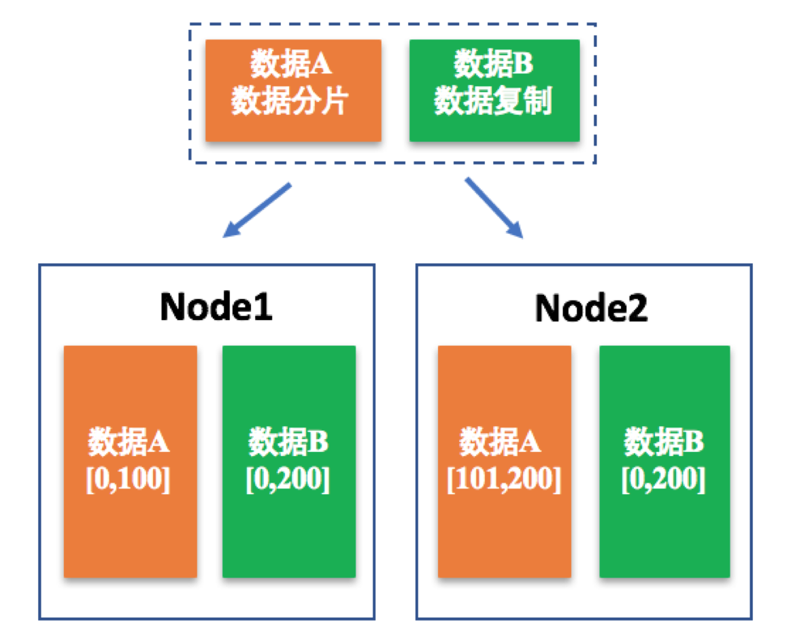
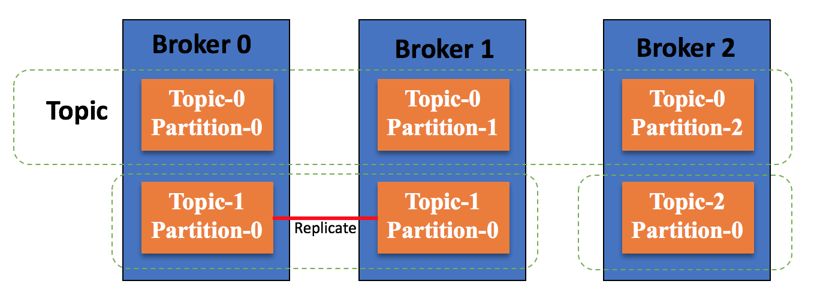
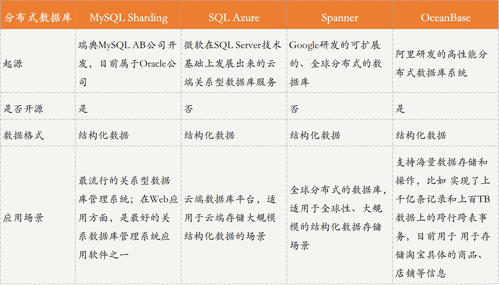

[toc]

## 24 | 分布式数据存储系统之三要素：顾客、导购与货架

### 什么是分布式数据存储系统？

-   分布式存储系统的核心逻辑，**就是将用户需要存储的数据根据某种规则存储到不同的机器上，当用户想要获取指定数据是时，再按照规则到存储数据的机器里获取**。
-   如图所示：
    -   
-   顾客、导购和货架分别对应分布式领域中的数据**生产者/消费者、数据索引和数据存储**。

### 分布式数据存储系统三要素

#### 顾客：生产和消费数据

-   
-   根据数据的特征，这些不同的数据通常被划分为三类：**结构化数据、半结构化数据和非结构化数据**。
    -   结构化数据通过是指**关系模型数据**，其特征是数据关联较大、格式固定。一般采用分布式关系数据库进行存储和查询。
    -   半结构化数据通常是指**非关系模型的**，有基本固定结构模式的数据，其特征是数据之间关系比较简单。一般采用分布式键值系统进行存储和使用。
    -   非结构化数据是指**没有固定模式的数据**，其特征是数据之间关联不大。这种数据可以存储到文档中，通过 ElasticSearch 等进行检索。

#### 导购：确定数据位置

-   分布式存储系统中，必须有相应的数据导购，否则系统响应会很慢，效率很低。为了解决这个问题，就需要**数据分片技术**。
-   数据分片技术，**是指分布式存储系统按照一定的规则将数据存储到相对应的存储节点中，或者到相对应的存储节点中获取想要的数据**，这是一种很常用的导购技术。
-   这种技术，一方面可以**降低单个存储节点的存储和访问压力**。另一方面，可以通过规定好的规则快速找到数据所在的存储节点，从而大大**降低搜索延迟，提高用户体验**。
-   
-   接下来，我就**针对数据范围这种数据分片方案做一个具体介绍**。
    -   针对数据范围的数据分片方案是指，按**照某种规则划分数据范围，然后将在这个范围内的数据归属到一个集合中**。
    -   如 1～100属于一个子集，101～200 属于一个子集。
-   再如下图所示，北京-上海属于另一个范围。
    -   
-   为了提高分布式系统的可用性和可靠性，除了通过数据分片减少单个节点的压力外，**数据复制**也是一个非常重要的方法。
-   如果，某个存储节点出现故障时，如果只采用数据分片技术，那这个节点数据就会丢失，从而给用户造成损失。因此，数据复制在分布式存储系统中是不可缺的。
-   **数据复制 VS 数据分片的区别**。
    -   
-   在实际的分布式存储系统中，**数据分片和数据复制通常是共存的**：
    -   数据通过分片方式存储到不同的节点上，以减少单节点的性能瓶颈问题。
    -   而数据的存储通常用主备方式保证可靠性，也就是对每个节点上存储的分片数据，采用主备方式存储，以保证数据的可靠性。其中，主备节点上数据是一致的，是通过数据复制技术实现的。
-   20 篇中的 Kafka 集群的总体架构图：
    -   

#### 货架：存储数据

-   货架存储的数据类型与顾客产生和消费的数据类型是一致的。
-   存储“货架”可以大致划分为以下三种：
    -   **分布式数据库**，通过表格来存储结构化数据，方便查找。如 MySQL、Sharding ……
    -   **分布式键值系统**，通过键值来存储半结构化数据。如 Redis、Memcache ……
    -   **分布式存储系统**，通过文件、块、对象来存储非结构化数据。如 Ceph、GFS、HDFS、Swift ……
-   而对货架材料也就是存储介质的选择，本质就是选择数据存储在磁盘还是内存（缓存）上：
    -   磁盘
    -   内存

### 扩展：业界主流的分布式数据存储系统有哪些？

-   分布式数据库
    -   
-   分布式存储系统
    -   

### 总结

-   思维导图
    -   

