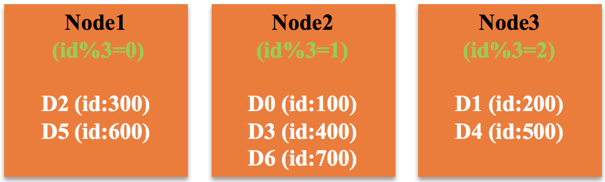
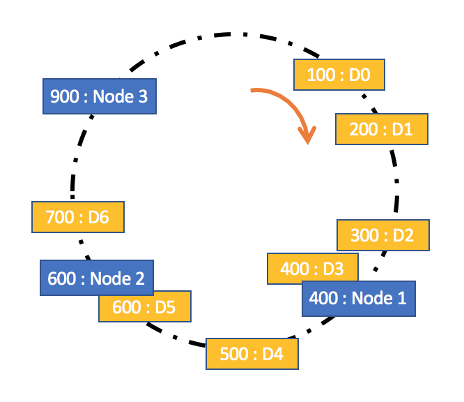
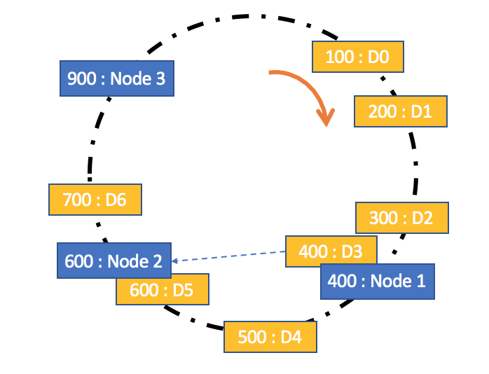
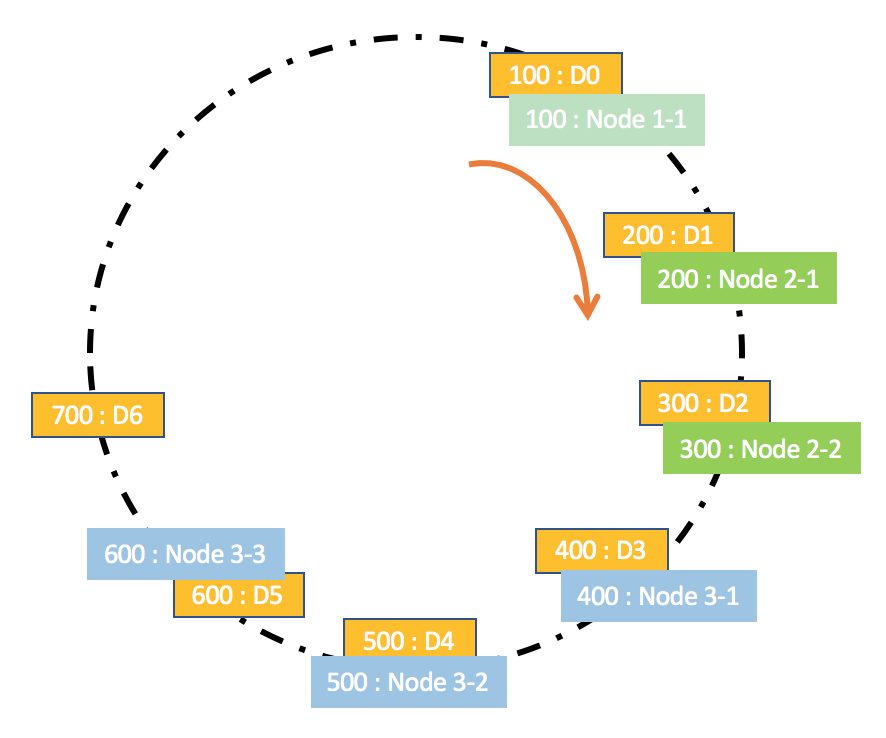
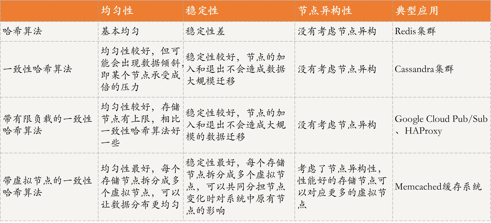

[toc]

## 25 | 数据分布方式之哈希与一致性哈希：“掐指一算”与“掐指两算”的事

### 数据分布设计原则

-   存储方案选型时，需要考虑的三个维度：
    -   **数据均匀**
    -   **数据稳定**
    -   **节点异构性**
-   其他：
    -   **隔离故障域**
    -   **性能稳定性**

### 数据分布方法

-   **哈希**是指，**将数据按照提前规定好的函数（哈希函数）映射到相应的存储节点**，即进行一个哈希计算，得到的结果就是数据应该存储的节点。
-   **一致性哈希**同样是采用哈希函数，进行两步哈希：
    1.  **对存储节点进行哈希计算**，也就是对存储节点做哈希映射。
    2.  当对数据进行存储或访问时，首先对数据进行映射得到一个结果，然后找到比该结果大的第一个存储节点，就是该数据应该存储的地方。

#### 哈希

-   哈希是一种非常常用的数据分片方法，其核心思想是，首先确定一个哈希函数，然后通过计算得到对应的存储节点。
-   示例：
    -   有三个存储节点，分别是 Node1、Node2、Node3。
    -   哈希函数 `id%3`，通过计算可以得到每个数据应该存入的节点。
    -   
-   优点
    -   只要哈希函数设置得当，可以很好地保证数据均匀性。
-   缺点
    -   但有一个较为严重的缺点，就是稳定性较差。
    -   如果，三个节点的容量无法再满足存储需求，需要再加一个节点。哈希函数变成了 `id%4`，原先存储在那三个节点的数据需要重新计算，然后存入相应的节点，即需要大规模的数据迁移，显然，会降低稳定性。
-   哈希方法适用于**同类型节点且节点数据比较固定的场景**。

#### 一致性哈希

-   一致性哈希是指将存储节点和数据都映射到一个首尾相连的哈希环上，存储节点可以根据 IP 地址进行哈希，**数据通常通过顺时针方向寻找的方式，来确定自己所属的存储节点**，即从数据映射在环上的位置开始，顺时针方向找到第一个存储节点。
-   
-   实现：
    -   **一致性哈希是对哈希方法的改进**，在数据存储时采用哈希方式确定存储位置的基础上，又增加了一层哈希，也就是在数据存储前，对存储节点预先进行了哈希。
    -   这种改进可以很好的解决哈希方法存在的稳定性问题。当节点加入或退出时，仅影响该节点在哈希环上顺时针相邻的后继节点。
-   场景：
    -   一致性哈希方法比较适合**同类型节点、节点规模会发生变化的场景**。
-   缺点：
    -   均匀性问题也比较明显，即对后继节点的负载会变大。
    -   有节点退出后，该节点的后继节点需要承担该节点的所有负载。

#### 带有限限负载的一致性哈希

-   核心原理：
    -   **给每个存储节点设置一个存储上限来控制存储节点添加或移除造成的数据不均匀**。
-   

-   场景：
    -   带有限负载的一致性哈希方法比较适合**同类型节点、节点规模会发生变化的场景**。
-   缺点：
    -   一致性哈希、带有限负载的一致性哈希，都**没有考虑节点异构性的问题**。

#### 带虚拟节点的一致性哈希

-   核心思想
    -   **根据每个节点的性能，为每个节点划分不同数量的虚拟节点，并将这些虚拟节点映射到哈希环中，然后再按照一致性哈希算法进行数据映射和存储**。
-   

-   场景：
    -   带虚拟节点的一致性哈希方法比较**适合异构节点、节点规模会发生变化的场景**。

### 四种数据分布方法对比

-   

### 扩展：数据分片和数据分区，有何区别？

-   数据分区，
    -   是从**数据存储块**的维度进行划分，不同的分区物理上归属于不同的节点。
    -   对于数据分区、可用于存储不同的数据，也可以用来**存储相同的数据实现数据备份**。数据分区可以归结为是“货架”相关的关键技术，也就是为数据存储提供合适的位置。
-   数据分片
    -   是从**数据**的维度进行划分，是指将**一个数据集合按照一定的方式划分为多个数据子集，不同的数据子集存在不同的存储块上**，而这些存储块可以在不同的节点上，也可以在同一节点上。
    -   具体的数据分片策略可以采用今天分享的哈希、一致性哈希等方法。
    -   数据分片是实现“导购”的关键技术，目的是构建索引，为数据确定位置，包含存储数据和查询数据时确定数据位置。
-   由此可见，**数据分片和数据分区是两个不同的概念，且属于分布式存储系统中不同角色的技术，前者是实现“导购”的关键技术，后者是“货架”相关的技术，不可直接等同**。

### 总结

-   首先，我带你了解了分布式数据存储系统中，设计数据分布方法需要考虑的原则：**数据均匀性、稳定性和节点异构性**。
-   其次，基于数据分布设计原则，介绍了**哈希、一致性哈希、带有限负载的一致性哈希和带虚拟节点的一致性哈希方法**。
-   最后，思维导图
    -   

