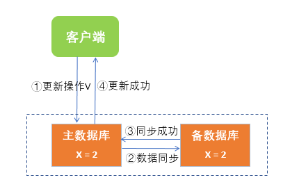
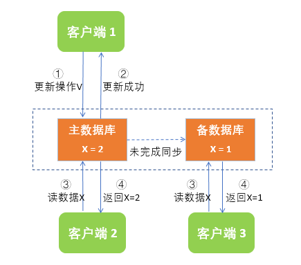
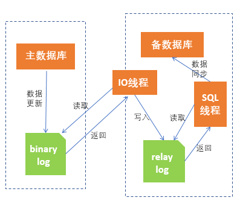
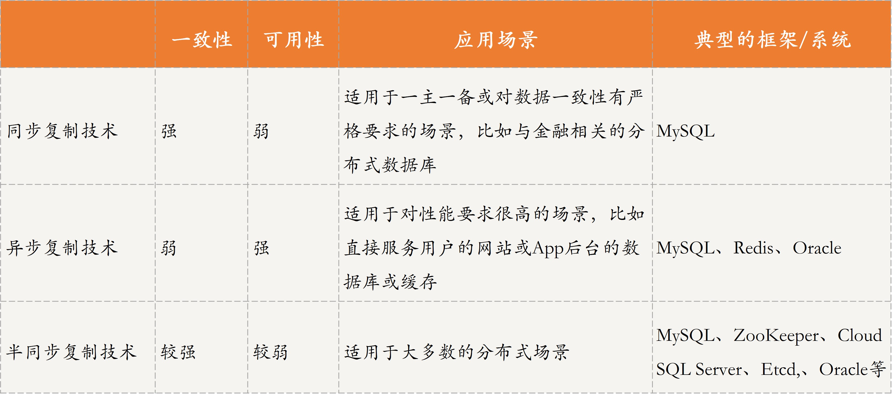

[toc]

## 26 | 分布式数据复制技术：分身有术

-   **在实际情况下，仅考虑数据分片，其实是无法真正应用到生产环境的**。

### 什么是数据复制技术？

-   数据复制是一种实现**数据备份**的技术。提高了系统的容错性。
-   数据复制技术，可以保证**存储在不同节点上的同一份数据是一致的**。
-   分布式数据库系统中，设置主备数据库，提高了分布式存储系统的**可用性及可靠性**。
-   数据复制技术是指，**如何让主备数据库保持数据一致的技术**。

### 数据复制技术原理及应用

-   对于分布式存储系统中的数据复制技术来讲，需要在一致性和可用性之间做出一些权衡。因此，这就导致出现了多种数据复制技术方法，大体上有三类：
    -   第一类，比较注重**一致性**，如同步复制技术。
    -   第二类，更注重**可用性**，如异步复制技术。
    -   第三类，是**介于前两者之间的**，如半同步复制技术。

### 同步复制技术原理及应用

-   同步复制技术是指，**当用户请求更新数据时，主数据库必须要同步到备数据库后才可给用户返回**。即如果主数据库没有同步到备数据库，用户的更新操作会一直阻塞。
-   这种方式保证了**数据强一致性，但牺牲了系统的可用性**。
-   MySQL 集群支持的全复制模式就是采用了同步复制技术。
    -   
-   场景
    -   同步复制技术经常用于**分布式数据库主备场景**。
    -   **或对数据一致性有严格要求的场合**。

### 异步复制技术原理及应用

-   异步复制技术是指，**当用户请求更新数据时，主数据库处理完请求后可直接给用户响应**。
-   这种方式**保证了系统的可用性，但牺牲了数据的一致性**。
-   MySQL 集群默认的数据复制模式采用的是异步复制技术。
    -   
-   MySQL 集群默认的复制模式为例，简单描述下主备数据库同步流程。
    1.  主数据库完成写操作后，可直接给用户回复执行成功，将写操作写入 binary log 中，binary log 中记录着数据库执行的所有更新操作，以便备数据库获取更新信息。
    2.  备数据库启动一个 IO 线程专门读取 binary log 中的内容然后写入 relay log 中。
    3.  备数据库启动一个 SQL 线程会定时检查 relay log 里的内容，如发现有新的内容则会立即在备数据库中执行，从而实现数据的一致。
-   

-   场景：
    -   异步复制技术大多应用在**对用户请求响应时延要求很高的场景**。

### 半同步复制技术原理及应用

-   介于前面两者之间的是，半同步复制技术。
-   核心：
    -   **用户发出写请求后，主数据库会执行写操作，并给备数据库发送同步请求，但主数据库不用等待所有备数据库回复数据同步成功便可响应用户**。
-   方式
    -   一种是，当主数据库收到多个备数据库中的某一个回复数据同步成功后，便可给用户响应写操作完成。
    -   另一种是，主数据库等超过一半节点（包括主数据库）回复数据更新成功后，再给用户响应写操作成功。
-   MySQL 一主多备场景下，也支持半同步复制模式，一般采用的是第一种半同步复制技术。
-   ZooKeeper 集群，采用的数据复制技术就是第二种半同步复制方案。
-   实际上，**多数的分布式存储系统可以通过配置来选择不同的数据复制技术**。
    -   最大保护模式，采用半同步复制技术的第一种方式。
    -   最大性能模式，采用异步复制技术。
    -   最大可用性模式，介于最大保护模式和最大性能模式两者之间。

### 三种数据复制技术对比

-   

### 扩展：在半同步复制技术中，对于未回复数据更新结果的节点，如果解决数据不一致或冲突呢？

-   对于这个问题，不同的场景有不同的处理方式，需要根据用户的需求进行选择。
-   在分布式系统中，很多系统采用了 Raft 算法。这里我以 Raft 算法的处理策略为例展开介绍。
-   Raft 算法采用的是第二种半同步复制技术，也就是主数据库等超过一半的节点回复数据更新成功后，再给用户响应写操作成功。**当 Follower 节点的数据与 Leader 节点数据不一致后，采用强制复制策略来解决不一致的情况**。
-   由于所有的数据更新操作最先在 Leader 节点执行，因此当产生冲突时，以 Leader 节点为准。

### 总结

-   思维导图
    -   

