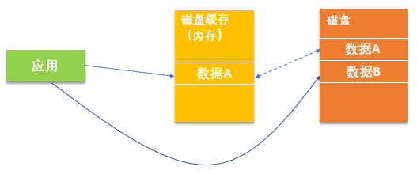
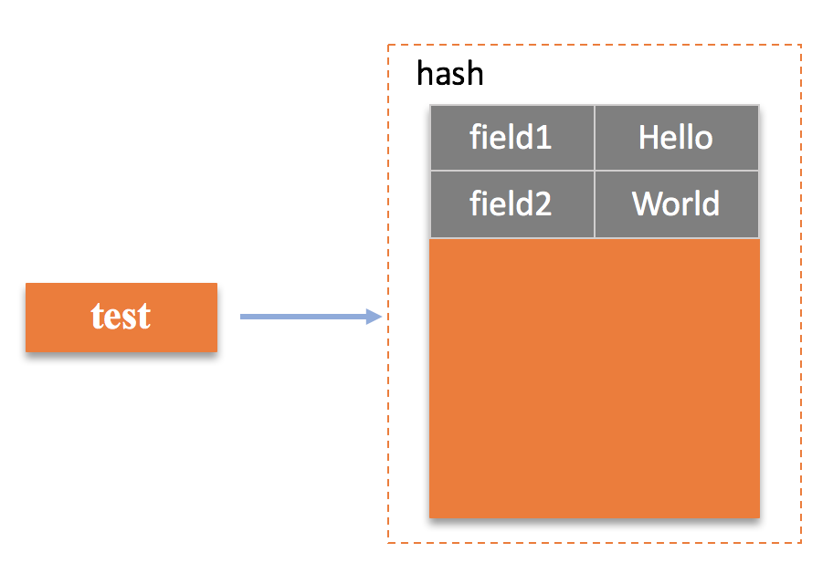
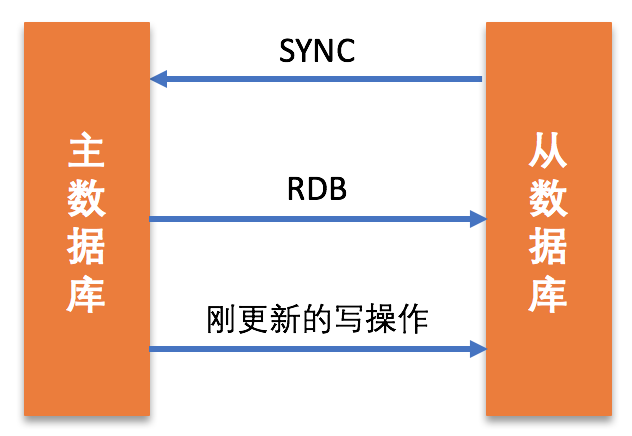
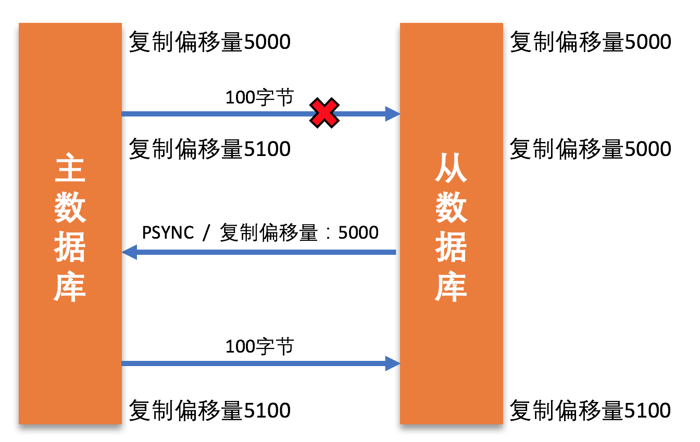
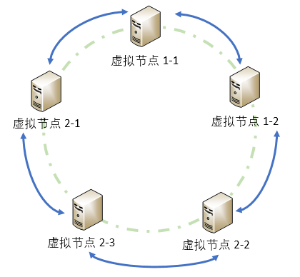
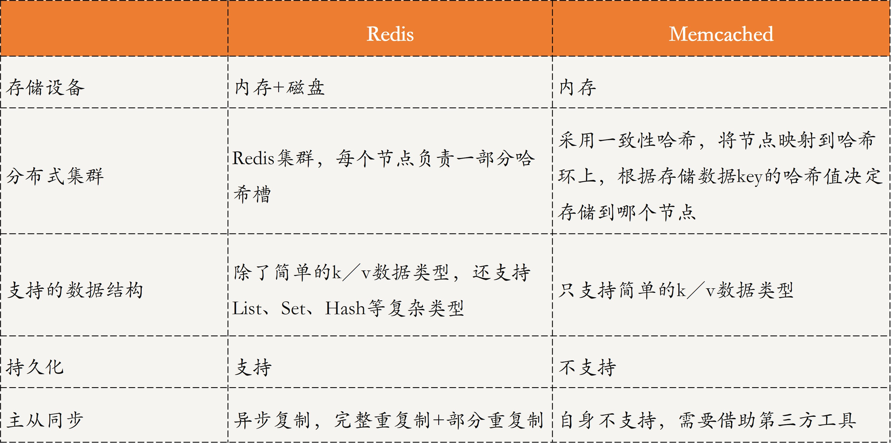

[toc]

## 27 | 分布式数据之缓存技术：“身手钥钱”随身带

-   这一讲，我将为你讲解分布式存储中“货架”的关键技术 —— 缓存技术。

### 什么是分布式缓存？

-   在计算机领域，**缓存技术**一般是指，**用一个更快的存储设备存储一些经常用到的数据，供用户快速访问**。
-   **分布式缓存**就是指在分布式环境或系统下，把一些热数据存储到离用户近、离应用近的位置，并尽量存储到更快的设置，以减少远程数据传输的延迟，让用户和应用可以很快访问到想要的数据。
-   **我们常说的分布式数据缓存，属于计算机应用中的缓存的一种**。
-   

### 分布式缓存原理

-   我以主流的分布式缓存系统 Redis 和 Memcached 为例，与你讲述分布缓存技术。

### Redis 分布缓存原理

-   它是以字典的结构**将数据存储在内存中**，应用可直接到内存读写 Redis 存储的数据。
-   Redis 集群是一个典型的**去中心化结构**，每个节点都负责一部分数据的存储，同时，每个节点还会进行主备设计来提高 Redis 的可靠性。

#### 第一，Redis 支持多数据结构

-   Redis 是一个基于内在的 Key-value 数据库，为了方便支持多应用的缓存。支持的数据结构**不仅有简单的 k/v 类型，还有 List、Set、Hash 等复杂类型的存储**。
-   如：`HMSET test field1 “Hello” field2 “World”`
    -   

#### 第二，Redis 支持持久化

-   持久化是指，**将数据从内存这种易失性存储设备中写入磁盘，从而让数据永久保存**。
-   主要有两种方式：
    -   **RDB**(Redis DataBase)，也称快照方式，简单来说，就是 Redis 会定义将内存中的数据备份到磁盘中，形成一个快照。
    -   **AOF**(Append Only File)的出现主要弥补了 RDB 数据不一致的问题，其思想与前面的数据库复制技术中 binary log 类似。
-   Redis 中，提供了三种实现 AOF 的策略：
    -   AOF_FSYNC_NO （不同步），即不会自动触发写操作的同步；
    -   AOF_FSYNC_EVERYSEC （每秒同步），即每隔一秒都会将写操作同步到磁盘；（默认策略）
    -   AOF_FSYNC_ALWAYS （每次写都同步），即每次发生写操作会立即同步到磁盘。

#### 第三，Redis 支持主备同步

-   Redis 采用的是异步复制技术，但 Redis 可以通过配置 min-replicas-to-write 和 min-replicas-max-lag 两个参数来有效的保证数据一致性。
-   除了上面对写操作同步，在 Redis 中，还有两种情况是需要进行数据同步的：
    -   一种情况是初次同步，即备数据库刚启动时的数据同步。
    -   另一种情况是，因网络故障导致主备数据库断开连接，待网络恢复后的备数据库的数据同步。
-   Redis 提供了两个同步模式，即完整重同步和部分重同步。
-   **完整重同步**流程如下：
    1.	当备服务器启动时，会向主服务器发送 SYNC 命令。
    2.	主服务器收到命令后会生成 RDB（快照）文件，并记录从现在起新执行的写操作。
    3.	RDB 生成后会发送给备服务器，备服务器通过 RDB 文件进行数据更新。
    4.	更新完成后，主服务器再将新记录的写操作发送给备服务器，备服务器执行完这些新记录的写操作，便与主服务器的数据保持一致了。 
-   
-   **部分重同步**，当网络恢复后，主数据库将主备数据库断开连接后的一系列写操作发送给备服务器，备数据库执行这些写操作，从而保证数据保持一致。
    -   

### Memcached 分布式缓存原理

-   与 Redis 类似，Memcached 也是一个基于内在的高性能的 key-value 缓存数据库。
-   Memcached 集群采用一致性哈希的思路，使用的是 Katema 算法。该算法的主要思想就是，**带虚拟节点的一致性哈希算法**。
-   
-   Memcached 不支持持久化。服务器和服务器间没有任何通信，即自身不支持主备。

### 对比分析

-   

### 扩展：除了分布式存储中的缓存，还有计算机体系结构和网络中的缓存，它们又分别是什么呢？

-   **计算机体系结构中的缓存**，通常是指专用的缓存设备。
-   **网络访问中的缓存**，通常指本地“磁盘”。
-   缓存的概念是相对的，基于不同的背景或应用场景，缓存所映射的存储设备是不一样的。

### 总结

-   分布式数据缓存是以内在作为磁盘的缓存，存储一些用户需要用的数据，以提高访问的速度。
-   思维导图
    -   

