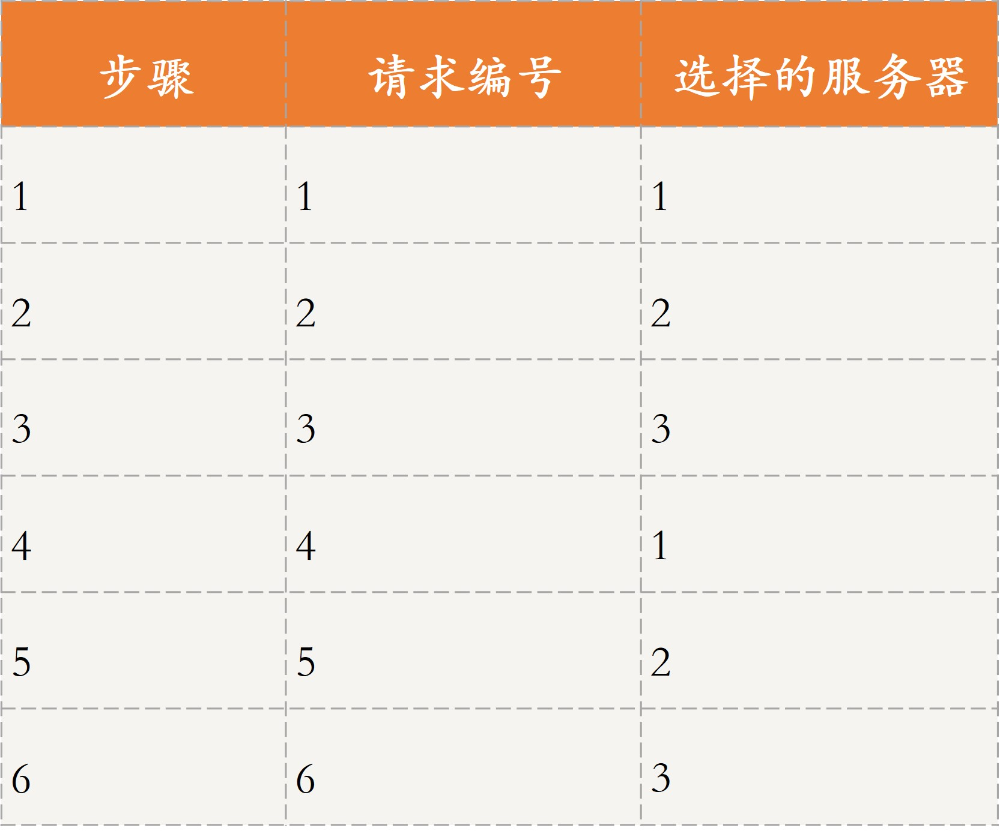
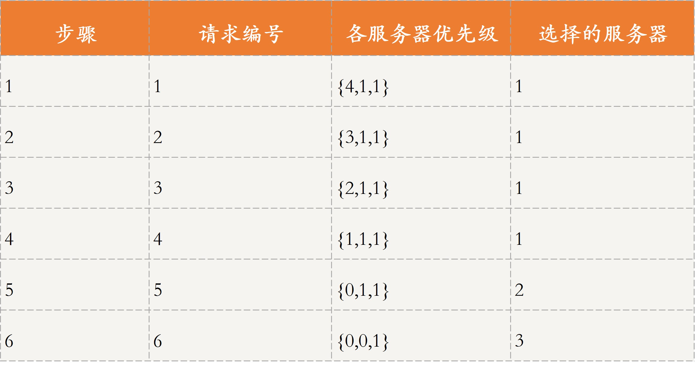
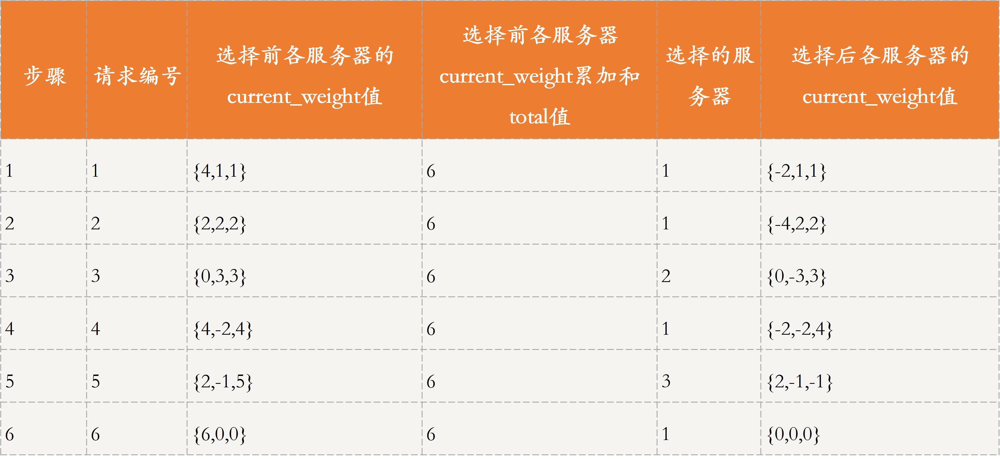
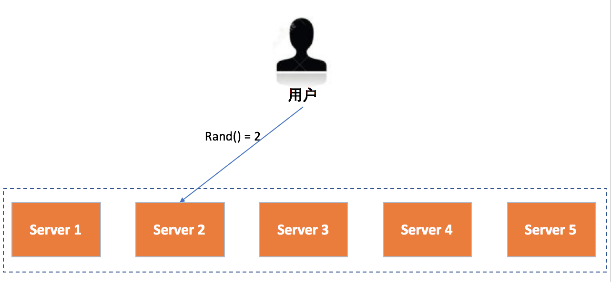
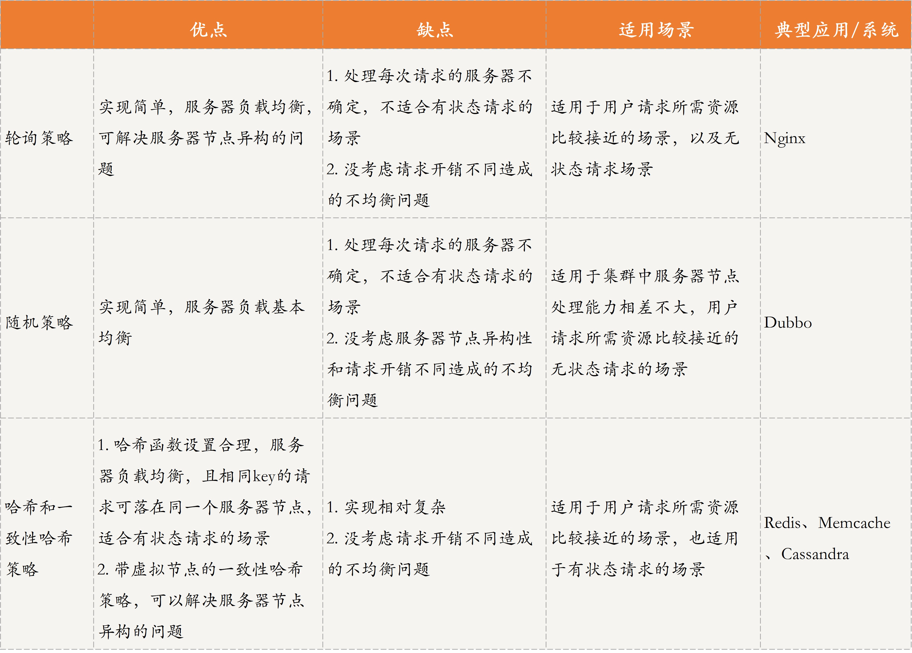

[toc]

## 28 | 分布式高可靠之负载均衡：不患寡，而患不均

### 什么是负载均衡？

-   负载均衡可以分为两种：
    -   一种是**请求负载均衡**，即将用户的请求均衡地分发到不同的服务器进行处理。
    -   另一种是**数据负载均衡**，即将用户更新的数据分发到不同的存储服务器。

-   今天，我们着重说说服务请求的负载均衡技术。

-   分布式系统中，服务请求的负载均衡是指，当处理大量用户请求时，请求应尽量均衡地分配到多台服务器进行处理，每台服务器处理其中一部分而不是所有的用户请求，以完成高并发的请求处理，避免因单机处理能力的上限，导致系统崩溃而无法提供服务的问题。

### 服务请求的负载均衡方法

-   计算机领域中，在不同层有不同的负载均衡方法。如网络层，中间件层。
-   今天，我着重与你分析的就是中间件层所涉及的负载均衡策略。主要包括：轮询策略、随机策略、哈希策略、一致性哈希策略。

### 轮询策略

#### 顺序轮询

-   

#### 加权顺序轮询

-   加权轮询为每个服务器设置了优先级，**每次请求过来时会挑选优先级最高的服务器进行处理**。

-   

-   **Nginx 默认的负载均衡策略就是一种改进的加权轮询策略**。

    -   需要用到的变量

        >   **weight**：配置文件中为每个服务节点设置的服务节点权重，固定不变。
        >
        >   **effective_weight**：服务节点的有效权重，初始值为 weight。 在 Nginx 的源码中有一个最大失败数的变量 max_fails，当服务发生异常时，则减少相应服务节点的有效权重，公式为 effective_weight = effective_weight - weight / max_fails；之后再次选取本节点，若服务调用成功，则增加有效权重，effective_weight ++ ，直至恢复到 weight。
        >
        >   **current_weight**：服务节点当前权重，初始值均为 0，之后会根据系统运行情况动态变化。

    -   

    -   可以看到，与普通加权轮询策略相比，这种轮询策略的优势在于，**当部分请求到来时，不会集中落在优先级较高的那个服务节点**。

-   优点

    -   实现简单，且对于请求所需要开销差不多时，负载均衡效果比较明显，同时**加权轮询策略**还考虑了服务器节点的异构性，即可以让性能更好的服务器具有更高的优先级，从而可以处理更多的请求，使得分布更加均衡。

-   缺点

    -   每次请求到达的目的节点不确定，不适用于有状态的请求场景。并且，轮询策略主要强调请求数据的均衡性，所以，不适用于处理请求所需要开销不同的场景。

-   场景

    -   **轮询策略适用于用户请求所需要资源比较接近的场景**。

### 随机策略

-   **当用户请求到来时，会随机发到某个服务节点进行处理**，可以采用随机函数实现。这里，随机函数的作用就是，让请求尽可能分散到不同节点，防止所有请求放到同一节点或少量节点上。
    -   
-   优点
    -   实现简单

-   缺点
    -   与轮询策略一样，每次请求到达的目的节点不确定，不适用有状态的场景。
    -   而且，没有考虑到处理请求所需开销。
    -   也没有考虑服务器节点的异构性。
-   场景
    -   适用于，集群服务器节点处理能力相差不大，用户请求所需资源比较接近的场景。

### 哈希和一致性哈希策略

-   无论是轮询还审随机策略，对一个客户端的多次请求，每次落到的服务器很大可能是不同的。解决方案就是，利用哈希算法定位到对应的服务器。
-   哈希和一致性哈希，是数据负载均衡的常用算法。前面 25 讲提到过：**数据分布算法的均匀性，一方面指数据的存储均匀，另一方面也指数据请求的均匀**。
-   数据请求就是用户请求的一种。
-   优点：
    -   哈希函数设置合理的话，负载会比较均衡。
    -   相同的 key 的请求会落在同一个服务节点上，可以用于有状态请求的场景。
    -   此外，带虚拟节点的一致性哈希策略还可以解决服务器节点异构的问题。
-   缺点：
    -   当某个节点出现故障时，采用哈希策略会出现数据大规模迁移的情况，采用一致性哈希策略可能会造成一定的数据倾斜问题。
    -   同样的，这两种策略也没考虑请求开销不同造成的不均衡问题。

### 对比分析

-   

### 扩展：如果考虑语法所需资源不同的话，应该如何设计负载均衡策略呢？

-   **常见的思路主要是对请求所需资源与服务器空闲资源进行匹配**，也称调度。
-   前面 11 讲中所讲的单体调度，我们可以使用**单体调度的思路**，让集群选举一个主节点，每个从节点会向主节点汇报自己的空闲资源。当请求到来时，主节点通过资源调度算法选择一个合适的从节点来处理该请求。
-   此外，**一致性哈希策略**也可以解决这个问题：让请求所需的资源和服务器节点的空闲资源与哈希函数挂钩，即通过将资源作为自变量，带入哈希函数进行计算，从而映射到哈希环中。

### 总结

-   今天，我与你介绍了常见的负载均衡策略，包括：轮询策略、随机策略、哈希和一致性哈希策略。
-   **轮询策略和随机策略**，因为每次请求到达的目的节点不确定，只适用于**无状态请求**的场景。
-   **哈希和一致性哈希策略**，因为相同key 的请求会落在同一个服务节点上，所以可以用于**有状态请求**的场景。
-   思维导图
    -   