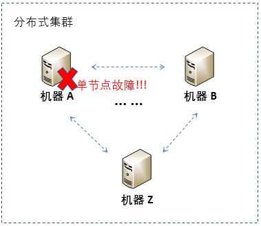
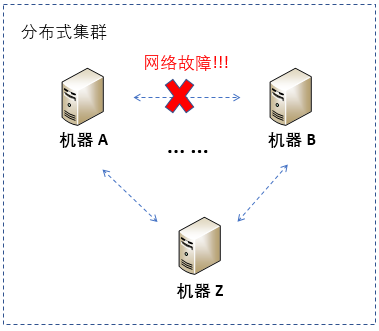
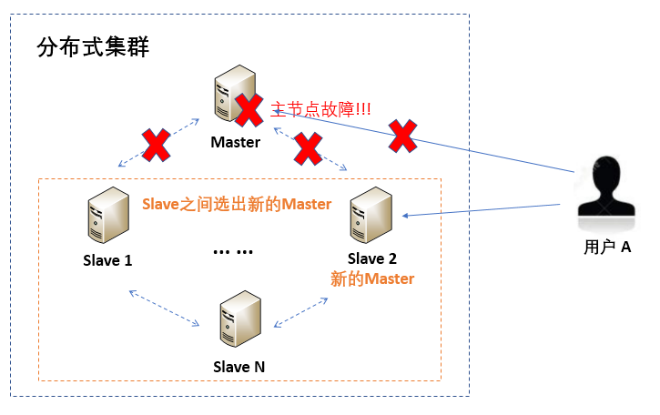

[toc]

## 31 | 分布式高可用之故障恢复：知错能改，善莫大焉

1.  分布式领域还有一个关键技术来保证系统的高可用，即**故障恢复**。

### 分布式故障基础知识

#### 故障类型

1.  这里的故障，通常包括两类：

    -   一类是，**物理故障**。
    -   另一类是，**软件层故障**。

2.  今天，我主要针对**物理故障**导致软件不可用的情况进行讲解。

    -   首先，我们看一下**节点故障**。
        -   
        -   节点故障有很多种，大体可以分为两类：
            -   一类是，**硬件故障**。
            -   另一类是，**软件故障**。
        -   表现结果，**该机器无法为用户提供服务**。

    -   其次，我们看一下**网络故障**。

        -   

        -   表现结果，**机器间无法通信，影响分布式应用正常提供服务**。

#### 故障检测

1.  故障检测，就是通过一定的方式**识别或发现故障**。
2.  在分布式系统中，检测硬件故障通常比较麻烦，因此会通过查看**软件层的表现结果**来进行故障检测。

#### 故障恢复

1.  故障恢复，就是指**修复**分布式系统中出现的故障。

### 分布式故障检测原理

1.  常见的故障检测方法是**心跳机制**。基于心跳进行故障检测的策略主要分为两类：**固定心跳**检测策略和根据**历史心跳**信息预测故障策略。
2.  我主要与你分享基于**历史心跳消息预测故障的策略**，也就是我们常说的 φ 值故障检测。那么，**φ 值是如何计算的呢**？
    -   第一步，**采样窗口存储心跳到达的时间**。
    -   第二步，**通过样本计算出心跳到达时间间隔的分布**。
    -   第三步，使用得到的正态分布计算当前的 φ 值。

### 故障恢复策略

1.  关于故障恢复策略，我从**单节点故障**和**网络故障**两个维度展开。
2.  对于**单节点故障**问题，往往采取**主备策略**。
    -   
3.  对于**网络故障**问题，简单来说，就是 **CAP 选择**的问题，即在分布式系统的可用性和数据一致性之间的权衡。

### 扩展：固定心跳检测和基于历史心跳信息预测故障的策略，各有什么特点呢？

1.  网络状况确定且比较**稳定**的情况下，大多会采用固定心跳检测策略。
2.  当网络状况**有所变化且变化有规律**的场景，则可以使用 φ 值故障检测策略。

### 总结

1.  分布式系统中的故障类型：**物理故障**和**软件故障**。
2.  物理故障：**节点故障**和**网络故障**。
3.  故障检测方法：心跳检测方法。包括：**固定心跳**策略和基于**历史信息的心跳**策略。
4.  故障恢复策略。
5.  思维导图：
    -   