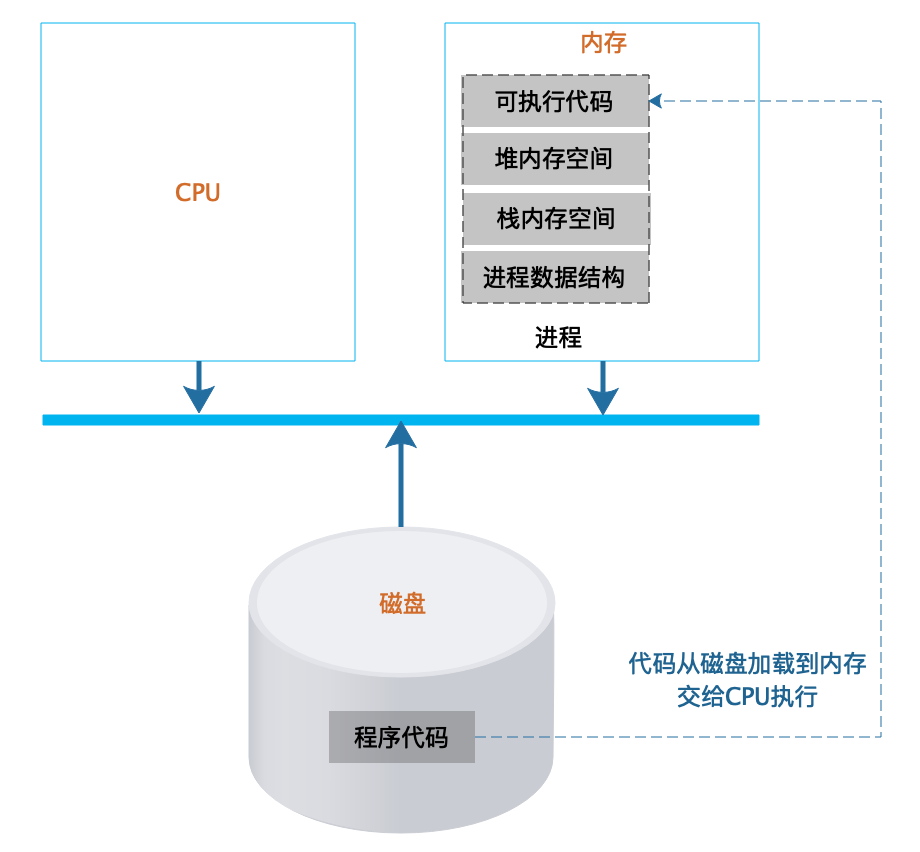
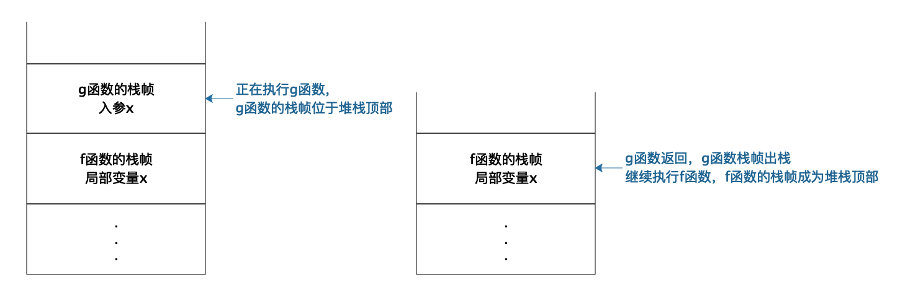
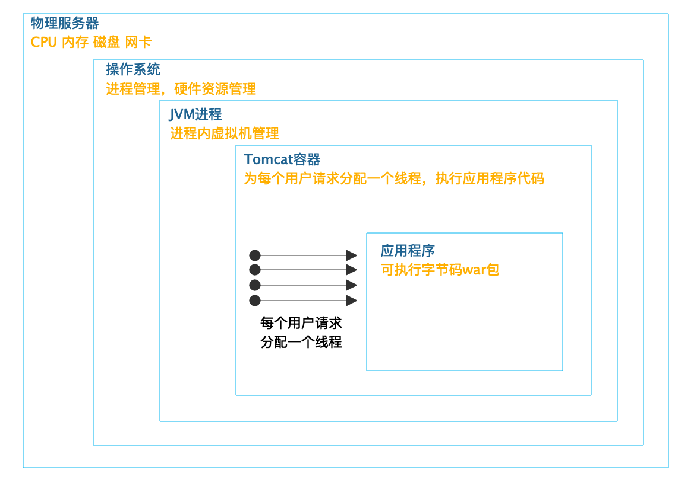

[toc]

## 01 | 程序运行原理：程序是如何运行？又是如何崩溃的？

-   代码是如何运行的？在运行中可能会出现什么问题呢？

### 程序是如何运行起来的

1.  **程序**，是文本格式的代码，是静态的。
2.  程序运行起来以后，被称作**进程**。
3.  进程在运行期间包括：内存堆空间、栈空间、数据结构
    -   
4.  **堆**是一块无序的内存空间，任何时候进程需要申请内存，都会从堆空间中分配，分配到的内存地址则记录在栈中。
5.  **栈**是一个严格的后进先出的数据结构，主要用来记录函数内部的局部变量、堆空间分配的内存地址等。
6.  每次函数调用，操作系统都会在栈中创建一个**栈帧**。
    -   
    -   真正执行的函数永远都在**栈顶**。

### 一台计算机如何同时处理数以百计的任务

1.  计算机可以同时处理数以百计的任务，主要是依靠操作系统的 **CPU 分时共享技术**。
2.  进程的三种状态：
    -   运行
    -   就绪
    -   阻塞

### 系统为什么会变慢，为什么会崩溃

1.  Tomcat 处理用户请求，如下图：
    -   
    -   web 开发天然就是多线程开发。
2.  如果多个线程同时执行，就可能会出现同时修改数据的情况，这就是人们常说的**线程安全**问题。
3.  多个线程访问共享资源的这段代码被称为**临界区**。

4.  如果并发线程数超过了资源数，那么就会有部分线程进行阻塞。并发的线程数越多，等待时间也越多。用户请求的响应时间变长，**系统变慢**。
5.  如果阻塞的线程数超过了某个系统资源的极限，就会导致系统宕机，**应用崩溃**。
6.  解决如上这些问题的主要手段是使用**分布式系统架构**。
    -   必要时还需要在请求入口进行**限流**。
    -   在应用内进行**业务降级**。

### 小结

1.  软件是如何运行的，应该是软件工程师和架构师的常识。
2.  在设计开发软件的时候，应该时刻以常识去审视自己的工作，保证软件开发在正确的方向上前进。

