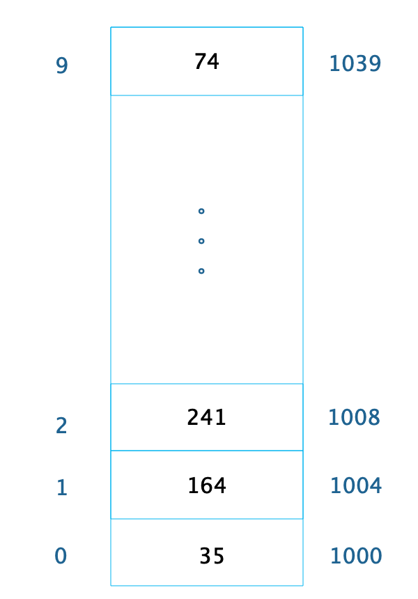
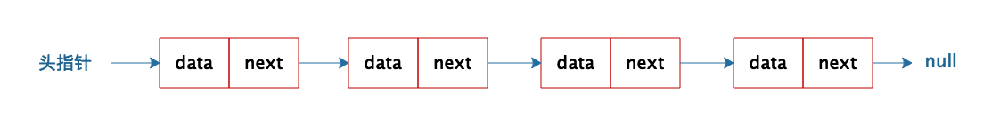
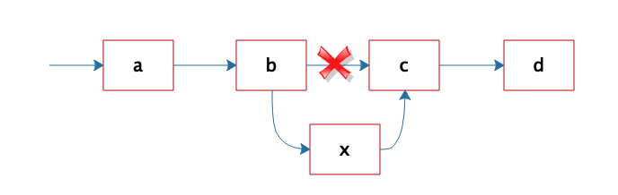
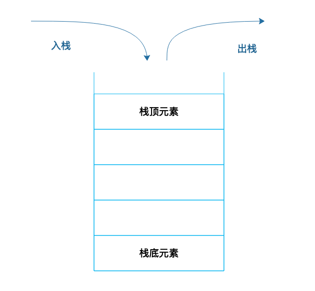
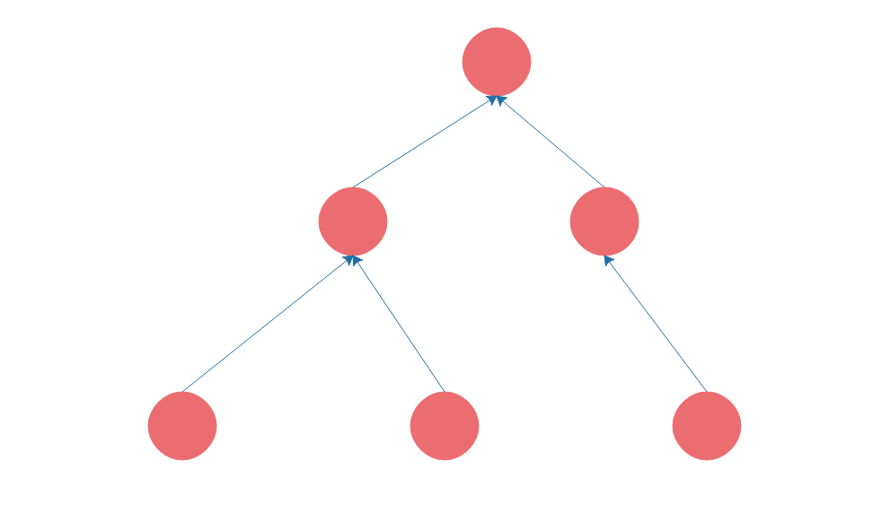

[toc]

## 02 | 数据结构原理：Hash 表的时间复杂度为什么是 O(1)？

-   **Hash 表的时间复杂度为什么是 O(1)?** 这个问题就是候选人技术水平的一个分水岭，是证明一个技术人员是否具有必备专业技术和技术悟性的门槛。

### 数组

1.  必须要一块**连接**的内存空间。
2.  必须存放**相同**的数据类型。
3.  内存中的存储格式：
    -   
4.  通过下标随机访问数据的时间复杂度是 O(1)。

### 链表

1.  存储格式
    -   
2.  插入、删除操作
    -   

### Hash 表

1.  存储格式
    -   

### 栈

1.  “后进先出”
2.  存储格式
    -   

### 队列

1.  先进先出
2.  存储格式
    -   

### 树

1.  非线性表
2.  存储格式
    -   

### 小结

1.  数据结构问题是当做是否跨过专业工程师门槛的试金石。