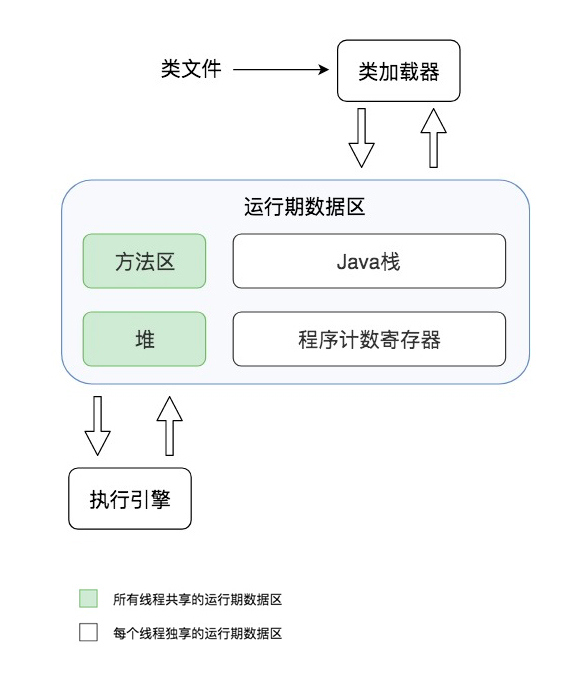
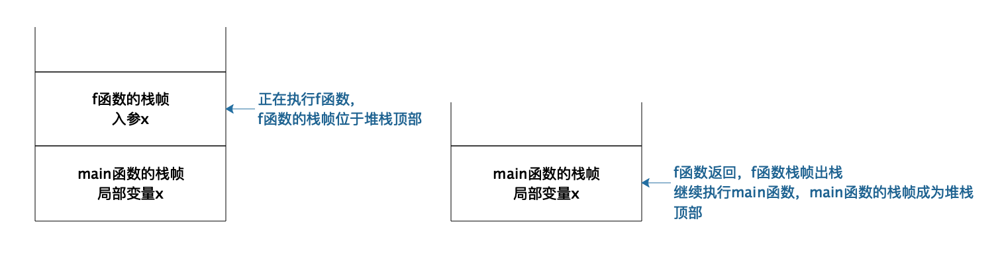
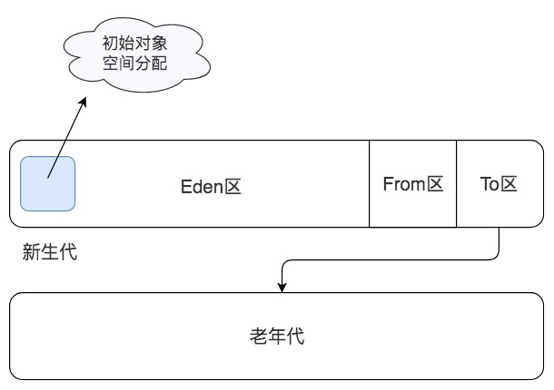

[toc]

## 03 | Java 虚拟机原理：JVM 为什么被称为机器（machine）?

### JVM 的组成构造

1.  JVM 主要由**类加载器、运行时数据区、执行引擎**三个部分组成。
    -   
2.  栈帧从 Java 栈中出栈。
    -   

### JVM 的垃圾回收

1.  如何知道哪些对象是不再被使用的，可以清理的呢？

    -   **可达性分析算法**（引用标记算法）进行垃圾对象的识别。

        >   具体过程是：
        >
        >   ​	从线程栈帧中的局部变量，或者是方法区的静态变量出发，将这些变量引用的对象进行标记，然后看这些被标记的对象是否引用了其他对象，继续进行标记，所有被标记过的对象都是被使用的对象，而那些没有被标记的对象就是可回收的垃圾对象了。

2.  JVM 内存回收主要有三种方法。如下

    -   回收前
    -   

#### 方式一：清理

1.  将垃圾对象占据的内存清理掉，标记为空闲，记录在一个空闲列表里。
    -   

#### 方式二：压缩

1.  从堆空间的头部开始，将存活的对象拷贝放在一段连续的内存空间中，那么，其余的空间就是连接的空闲空间。
    -   

#### 方式三：复制

1.  将堆空间分成两部分，只在其中一部分创建对象，当这个部分空间用完的时候，将标记过的可用对象复制到另一个空间中。
    -   

### 分代回收

1.  JVM 将堆空间分成**新生代**和**老年代**两个区域。
    -   

### 垃圾回收器

1.  JVM 中，具体执行垃圾回收的垃圾回收器有四种。

#### Serial 串行垃圾回收器

1.  一个线程执行垃圾回收。

#### Parallel 并行垃圾回收器

1.  多线程执行垃圾回收。
2.  当垃圾回收线程工作的时候，必须要停止用户线程的工作。

#### CMS 并发垃圾回收器

1.  在垃圾回收的某些阶段，垃圾回收线程和用户线程可以并发运行，因此对用户线程的影响较小。

#### G1 垃圾回收器

1.  它将整个堆空间分成多个子区域，然后在这些子区域上各自独立进行垃圾回收，在回收过程中垃圾回收线程和用户线程也是并发运行。G1 综合了以前几种垃圾回收器的优势，适用于各种场景，是未来主要的垃圾回收器。

#### 图解

1.  

### 小结

1.  我们为什么需要了解 JVM 呢？
    -   JVM 有很多配置参数。
    -   Java 开发过程中也可能会遇到各种问题，了解了 JVM 的基本构造，就可以帮助我们从原理上去解决问题。

