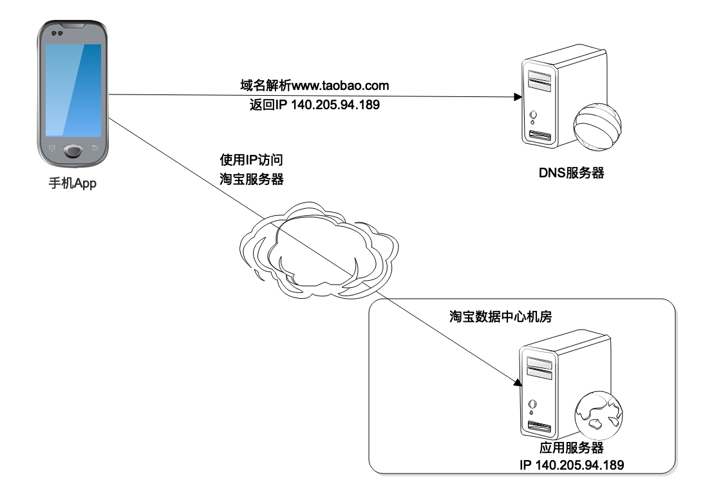
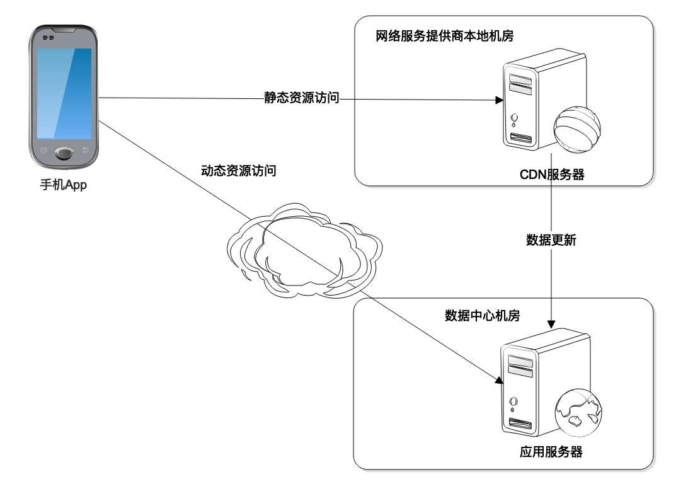
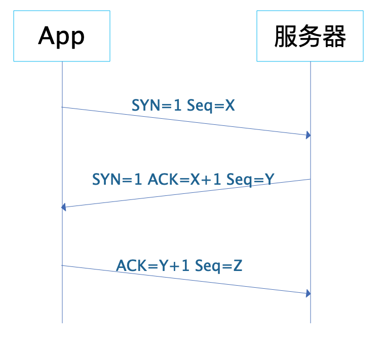
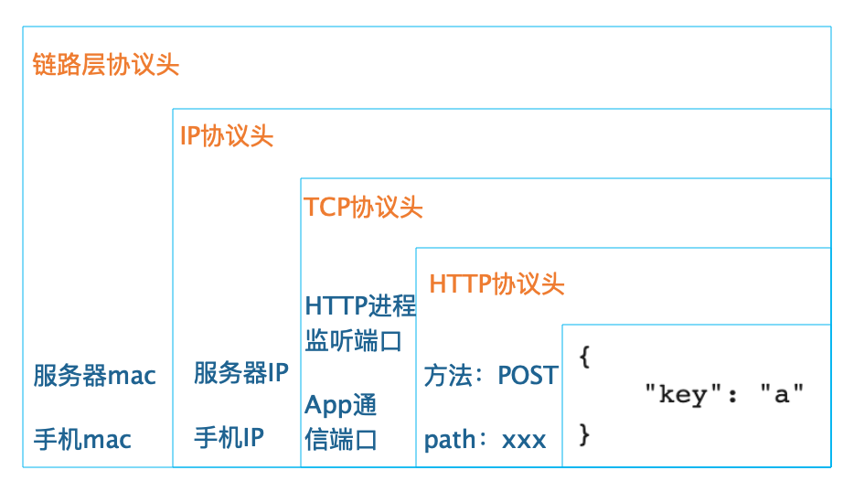
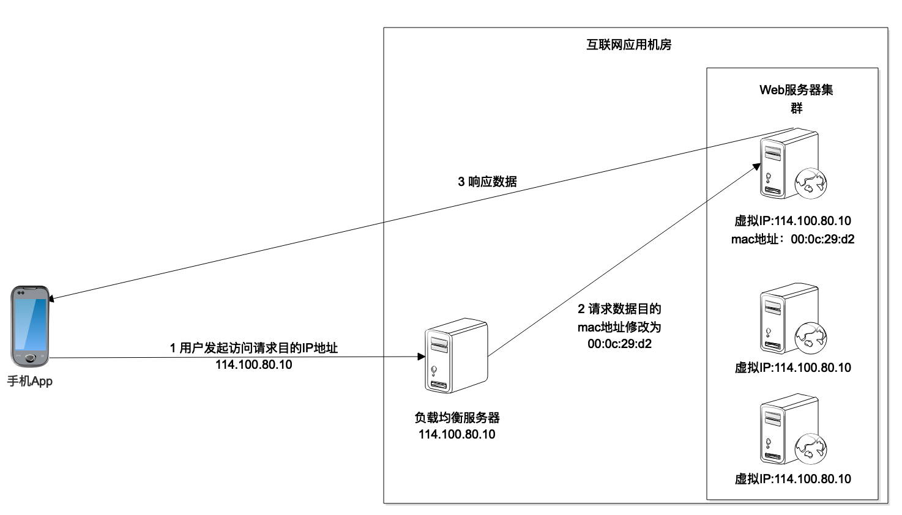

[toc]

## 04 | 网络编程原理

### DNS

-   

### CDN

-   应用层协议。

-   

### HTTP

### TCP

-   传输层协议
-   TCP/IP 协议栈
    -   
-   TCP 三次握手
    -   
-   **数据链路层的数据帧**
    -   

### LB （负载均衡）

-   Linux 内核支持的链路层负载均衡
    -   

### 小结

1.  通过**网络通信**，可以将整个互联网应用系统串起来，对理解互联网系统的技术架构很有帮助。