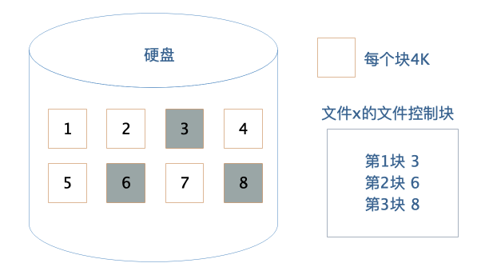
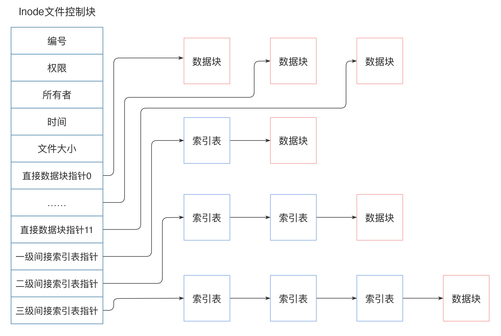

[toc]

## 05 | 文件系统原理：如何用 1 分钟遍历一个 100 TB的文件？

1.  文件是存储在硬盘上的，文件的读写访问速度必然受到硬盘的物理限制，那么如何才能 1 分钟完成一个 100T 大文件的遍历呢？

### 硬盘

1.  硬盘是一种可持久保存、多次读写数据的存储介质。
2.  硬盘的形式主要有两种：
    -   一种是，机械式硬盘。
    -   另一种是，固态硬盘。

### 文件系统

1.  作为程序开发者，我们通过操作系统，以**文件**的方式对硬盘上的数据进行读写访问。
2.  文件系统将硬盘空间以块为单位进行划分，每个文件占据若干个块，然后再通过一个文件控制块 FCB 记录每个文件占据的硬盘数据块。
    -   
3.  这个文件控制块在 Linux 操作系统中就是 innode。
4.  inode 是固定结构的，能够记录的硬盘地址索引数也是固定的，只有 15 个索引。
    -   

### RAID

### 分布式文件系统

1.  以 Hadoop 分布式文件系统 HDFS 为例，看下分布式文件系统具体架构设计。
    -   
2.  HDFS 的关键组件有两个，一个是 **DataNode**，一个是 **NameNode**。
    -   DataNode 负责文件数据的存储和读写操作。
    -   NameNode 负责整个分布式文件系统的元数据（MetaData）管理。
3.  HDFS 可以实现单一文件存储几百 T 的数据，再配合大数据计算框架 MapReduce 或 Spark，可以对文件的数据块进行并发计算。也可以使用 Impala 这样的 SQL 引擎对这个文件进行结构化查询，在数千台服务器上并发遍历 100 T 的数据，1 分钟都是绰绰有余的。

### 小结

1.  从操作系统文件，到 RAID，再到分布式文件系统，其设计思路其实是具有统一性的。
    -   一方面，体现在**文件数据如何管理**。
    -   另一方面，体现在**如何利用更多的硬盘实现越来越大的文件存储需求和越来越快的读写速度需求**。

