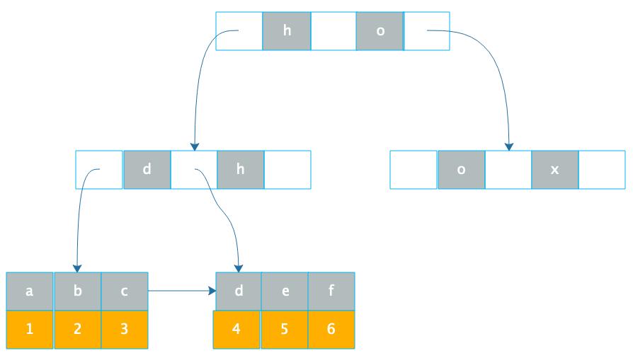

[toc]

## 06 | 数据库原理：为什么 PrepareStatement 性能更好更安全？

1.  在 Java 程序中访问数据库的时候，有两种提交 SQL 语句的方式

    -   一种是，通过 **Statement** 直接提交 SQL。
    -   另一种是，先通过 **PrepareStatement** 预编译 SQL，然后设置可变参数再提交执行。

2.  Statement 提交方式：

    -   ```sql
        
        statement.executeUpdate("UPDATE Users SET stateus = 2 WHERE userID=233");
        ```

3.  PrepareStatement 提交方式：

    -   ```sql
        
        PreparedStatement updateUser = con.prepareStatement("UPDATE Users SET stateus = ? WHERE userID = ?"); 
        updateUser.setInt(1, 2); 
        updateUser.setInt(2,233); 
        updateUser.executeUpdate();
        ```

4.  MyBatis 等 ORM 框架，内部也是使用第二种方式提交 SQL。**那为什么要舍简单而求复杂呢**？

### 数据库架构与 SQL 执行过程

1.  SQL 执行过程
    -   
2.  连接器
    -   为每个连接请求分配一块专用的内存空间用于会话上下文管理。
3.  语法分析器
    -   根据 SQL 语法规则生成对应的抽象语法树。
4.  语义分析与优化器
    -   会对抽象语法树进一步做语义优化。也就是在保证 SQL 语义不变的前提下，进行语义等价转换，使最后的计算量和中间过程数据量尽可能小。
    -   SQL 语义分析与优化器就是要将各种复杂嵌套的 SQL 进行语义等价转化，得到有限几种关系代数计算结构，并利用索引等信息进一步进行优化。
    -   可以说，**各个数据库最黑科技的部分就是在优化这里了**。
5.  执行引擎
    -   完成数据查询或更新。

### 使用 PrepareStatement 执行 SQL 的好处

1.  一个是，PrepareStatement 会预先提交带占位符的 SQL 到数据库进行预处理，提前生成执行计划。**效率更好一点**。
2.  另一个是，PrepareStatement 可以**防止 SQL 注入攻击**。

### 数据库文件存储原理

1.  为什么索引能加快查询速度呢？
2.  数据库索引使用 **B+ 树**。
3.  数据库索引有两种：
    -   一种是，**聚簇索引**。
        -   在叶子节点，索引 1 和所在的记录行 r1 存储在一起。把到索引 1 就找到 r1 数据行。
    -   另一种是，**非聚簇索引**。
        -   在叶子节点，索引 a 和索引 a 所在的主键 1 存储在一起。
        -   通过 a 找到主键索引 1，再通过主键索引找到行记录的过程也被称作**回表**。 
4.  聚簇索引
    -   
5.  非聚簇索引
    -   
6.  事务日志文件
    -   数据库实现事务主要就是依靠**事务日志文件**。
7.  binlog 日志文件

### 小结

1.  做应用开发需要了解的 RDBMS 的架构原理：
    -   掌握数据库的架构原理与执行过程
    -   数据库文件的存储原理与索引的实现方式
    -   数据库事务与数据库复制的基本原理

