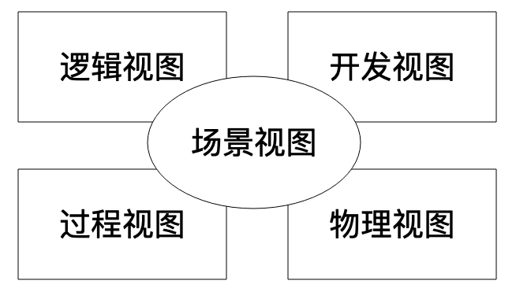

[toc]

## 08 | 软件设计的方法论：软件为什么要建模？

1.  如何使软件系统准确反映现实世界的业务逻辑和需求？ -- **软件设计**
2.  软件设计的主要过程就是**软件建模**。

### 软件建模

1.  软件建模，就是**为要开发的软件建造模型**。
2.  通过**建模**，我们可以**把握事物的本质规律和主要特征**，正确建造模型和使用模型，以防在各种细节中迷失方向。
3.  通过**软件建模**，我们可以**抽象软件系统的主要特征和组成部分**，梳理这些关键组成部分的关系，在软件开发过程中依照模型的约束开发，系统整体的格局和关系就可控。
4.  软件开发中，有两个客观存在：
    -   一个是，领域问题。
    -   另一个就是，软件系统。
    -   
5.  这两方面，就是我们的软件模型：
    -   一方面，我们要对领域问题和软件系统进行分析、设计、抽象。
    -   另一方面，我们根据抽象出来的模型开发，实现最终的软件系统。
    -   对领域问题和软件系统进行分析、设计和抽象的这个过程，我们专门划分出来，就是**软件建模与设计**。

### 4+1 视图模型

1.  4+1 模型是一种软件建模方法的方法，即**建模方法论**。
2.  4+1 视图模型认为，一个完整的软件设计模型，应该包括 5 部分的内容：
    -   
    -   **逻辑视图**，描述软件的功能逻辑，由哪些模块组成，模块中包含中哪些类，依赖关系如何。
    -   **开发视图**，包括系统架构层面的划分，包括管理，依赖关系与第三方的程序包。
    -   **过程视图**，描述程序运行期的进程、线程、对象实现，及与此相关的并发、同步、通信等问题。
    -   **物理视图**，软件如何部署到物理的服务器上，不同服务器之间如何关联、通信。
    -   **场景视图**，针对具体的用例场景，将上述 4 个视图关联起来：
        -   一方面，从业务角度描述功能流程如何完成。
        -   一方面从软件角度描述，相关组成部分如何互相依赖、调用。

### UML 建模

1.  UML，即**统一建模语言**，是目前最常用的建模工具，使用 UML 可以实现 4+1 视图模型。
2.  特点：
    -   一方面，满足设计阶段和各个相关方沟通的目的。
    -   另一方面，可以用来思考。

### 小结

1.  架构师的核心工作，就是**做好软件设计**，软件设计是软件开发过程中的一个重要环节。

