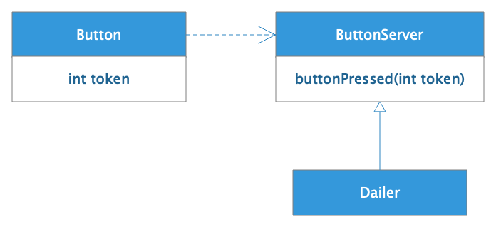
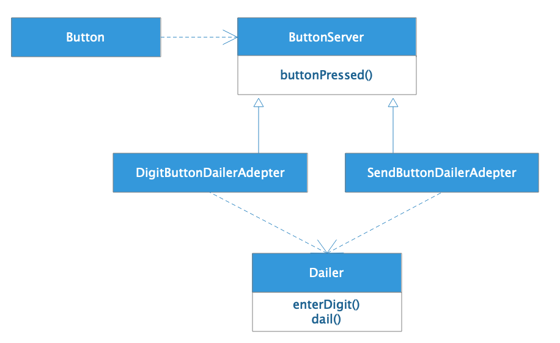
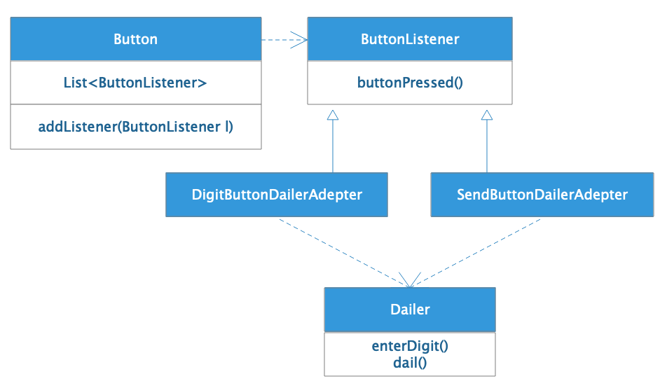
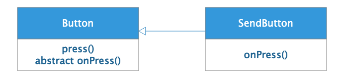

[toc]

## 11 | 软件设计的开闭原则：如何不修改代码却能实现需求变更？

-   有没有办法不修改代码却能实现需求变更呢？ —— **开闭原则**

### 开闭原则

1.  开闭原则说：**软件实体（模块、类、函数等）应该是对扩展开放的，对修改是关闭的**。通俗的说就是，**软件功能可以扩展，但是软件实体不可以被修改**。

### 一个违反开闭原则的例子

1.  需求：设计一个可以通过按钮拨号的电话，核心对象是按钮和拨号器。

2.  设计：

    -   

3.  代码：

    -   ```java
        
        public class Button {
            public final static int SEND_BUTTON = -99;
        
            private Dialer          dialer;
            private int             token;
        
            public Button(int token, Dialer dialer) {
                this.token = token;
                this.dialer = dialer;
            }
        
            public void press() {
                switch (token) {
                    case 0:
                    case 1:
                    case 2:
                    case 3:
                    case 4:
                    case 5:
                    case 6:
                    case 7:
                    case 8:
                    case 9:
                        dialer.enterDigit(token);
                        break;
                    case SEND_BUTTON:
                        dialer.dial();
                        break;
                    default:
                        throw new UnsupportedOperationException("unknown button pressed: token=" + token);
                }
            }
        }
        ```

    -   ```java
        
        public class Dialer {
            public void enterDigit(int digit) {
                System.out.println("enter digit: " + digit);
            }
        
            public void dial() {
                System.out.println("dialing...");
            }
        }
        ```

4.  似乎对 Button 类做任何的功能扩展，都需要修改 Button 类，显然**违反了开闭原则**。

5.  粗暴一点说，**当我们在代码中看到 else 或 switch/case 关键字的时候，基本就可以判断违反开闭原则了**。

### 使用策略模式实现开闭原则

1.  设计：
    -   
    -   我们在 Button 和 Dailer 间增加一个抽象接口 ButtonServer，Button 依赖 ButtonServer，而 Dailer 实现 ButtonServer。
2.  策略模式是一种行为模式，**多个策略实现同一个策略接口**，编程的时候 client 程序依赖策略接口，运行期间根据不同的上下文向 client 程序传入不同的策略实现。

### 使用适配器模式实现开闭原则

1.  Button 符全开闭原则，但是 Dailer 又不符合了，因为 Dailer 要实现 ButtonServer 接口，根据参数 token 决定执行 enterDigit 还是 dail 方法。又需要 if/else 或 switch/case，不符合开闭原则。
2.  使用**适配器模式**进行设计。适配器模式是一种结构模式，用于**将两个不匹配的接口适配起来**。
    -   
3.  适配器 DigitButtonDailerAdapter 和 SendButtonDailerAdapter 实现 ButtonServer 接口，使 Button 能够调用自己，并在自己的 buttonPressed 方法中调用  Dailer 的方法，适配了 Dailer。

### 使用观察者模式实现开闭原则

1.  如果需求能够**一个按钮控制多个设备**。

2.  使用**观察者模式**设计

    -   

    -   重要的是在 Button 类里增加了成员变量 List 和成员方法 addListener。

    -   Button 代码

        -   ```java
            
            public class Button {
                private List<ButtonListener> listeners;
            
                public Button() {
                    this.listeners = new LinkedList<ButtonListener>();
                }
            
                public void addListener(ButtonListener listener) {
                    assert listener != null;
                    listeners.add(listener);
                }
            
                public void press() {
                    for (ButtonListener listener : listeners) {
                        listener.buttonPressed();
                    }
                }
            }
            ```

    -   将 Button 和 Dailer 组合成一个电话，Phone 代码

        -   ```java
            
            public class Phone {
                private Dialer   dialer;
                private Button[] digitButtons;
                private Button   sendButton;
            
                public Phone() {
                    dialer = new Dialer();
                    digitButtons = new Button[10];
                    for (int i = 0; i < digitButtons.length; i++) {
                        digitButtons[i] = new Button();
                        final int digit = i;
                        digitButtons[i].addListener(new ButtonListener() {
                            public void buttonPressed() {
                                dialer.enterDigit(digit);
                            }
                        });
                    }
                    sendButton = new Button();
                    sendButton.addListener(new ButtonListener() {
                        public void buttonPressed() {
                            dialer.dial();
                        }
                    });
                }
            
                public static void main(String[] args) {
                    Phone phone = new Phone();
                    phone.digitButtons[9].press();
                    phone.digitButtons[1].press();
                    phone.digitButtons[1].press();
                    phone.sendButton.press();
                }
            }
            ```

3.  观察者是一种**行为模式**，**解决一对多的对象依赖关系**，将被观察者对象的行为通知到多个观察者，也就是监听者对象。

### 使用模板方法模式实现开闭原则

1.  按钮除了控制设备，**还需要执行一些操作**。这种情况情况可以用**模板方法模式**进行设计。

    -   

2.  Button 类中增加抽象方法 onPress，并在 press 方法中调用 onPress方法。

    -   ```java
        
        abstract void onPress();
        
        public void press() {
             onPress();
             for (ButtonListener listener : listeners) {
                 listener.buttonPressed();
             }
        }
        ```

    -   每个子类可以定义自己在 press 执行时状态操作，无需修改 Button 类。

3.  **模板方法模式**，就是在父类中用抽象方法定义计算的骨架和过程，而抽象方法和实现则留在子类中。

### 小结

1.  **实现开闭原则的关键是抽象**。
2.  开闭原则可以说是软件设计原则的原则，是软件设计的**核心原则**。
3.  其他设计原则更偏向技术性，具有技术性的指导意义。而开闭原则是**方向性**的。

