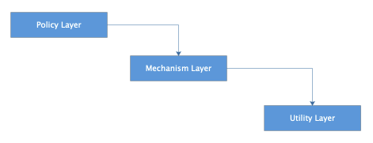

[toc]

## 12 | 软件设计的依赖倒置原则：如何不依赖代码却可以复用它的功能？

1.  当开发者使用框架开发一个应用和程序时，**无需在程序中调用框架的代码，就可以使用框架的功能特性**。

### 依赖倒置原则

1.  框架设计的核心关键点，也就是面向对象的基本设计原则：**依赖倒置原则**。
2.  依赖倒置原则：
    -   **高层模块不应该依赖低层模块，二者都应该依抽象**。
    -   **抽象不应该依赖具体实现，具体实现应该依赖抽象**。
3.  **软件分层**，已经是软件开发者的共识。
    -   为了建立清晰的软件分层关系，便于高层模块依赖低层模块。
4.  高层模块依赖低层模块的分层依赖有什么缺点呢？
    -   一是，**维护困难**。
        -   高层模块常是业务逻辑和策略模型，是一个软件的核心。
        -   低层模块则是更多的技术细节。
        -   技术细节的改变而影响业务代码的改变，这是不合理的。
    -   二是，**复用困难**。
        -   如果高层依赖低层模块，那么对高层的复用将会导致对底层的连带依赖，使复用变得困难。

5.  依赖倒置原则使用：
    -   Java 代码 -> JDBC <- 数据库驱动
    -   Java 代码 -> J2EE <- web 容器

### 依赖倒置的关键是接口所有权的倒置

1.  层次依赖示例，**策略层**依赖**方法层**，**方法层**依赖**工具层**。
    -   
    -   这种传递依赖导致的**级联**改动可能会导致软件维护过程非常糟糕。
2.  解决办法是，**依赖倒置**的设计原则。
    -   每个高层模块都为它所需要的服务声明一个抽象接口，而低层模块则实现这些接口接口，**高层模块通过抽象接口使用低层模块**。
    -   
3.  依赖倒置原则中，除了具体实现要依赖抽象，最重要的是，**抽象是属于谁的抽象**。
    -   依赖倒置原则，接口的所有权是被倒置的，也就是说，接口被高层模块定义，**高层模块拥有接口，低层模块实现接口**。

### 使用依赖倒置实现高层模块复用

1.  依赖倒置原则适用于，**一个类向另一个类发送消息**的场景。
2.  例，Button 按钮控制 Lamp 灯泡。
    -   
    -   Button 依赖 Lamp，对 Lamp 的任何改动，都可能会使 Button 受到牵连，做了联连改变。
3.  解决之道：将设计中的依赖于实现，重构为**依赖于抽象**。
    -   
    -   抽象接口 ButtonServer 的所有权是倒置的，它不属于底层模块 Lamp，而是属于高层模块 Button。
4.  依赖倒置原则也被称为**好莱坞原则**：
    -   **Don’t call me，I will call you. 即不要来调用我，我会调用你**。

### 小结

1.  依赖倒置原则就是，**高层模块不依赖低层模块，而是都依赖抽象接口，这个抽象接口通常是由高层模块定义，低层模块实现**。
2.  编码守则：
    -   应用代码中**多使用抽象接口**，尽量避免使用那些多变的具体实现类。
    -   **不要继承具体类**，如果一个类在设计初不是抽象类，那么，尽量不要去继承它。对具体类的继承是一种强依赖关系，维护的时候，难以改变。
    -   **不要重写（override）包含具体实现的函数**。
3.  依赖倒置原则最典型的使用场景就是**框架设计**。

