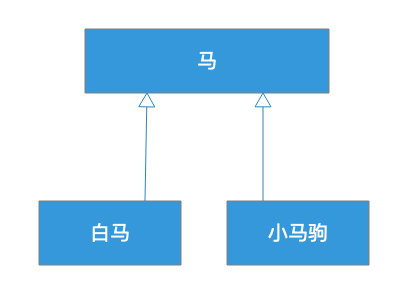
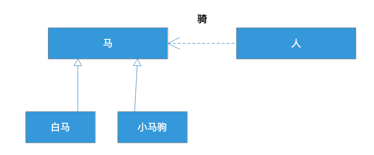

[toc]

## 13 | 软件设计的里氏替换原则：正方形可以继承长方形吗？

1.  面向对象编程语言有三大特性：**封装、继承、多态**。
2.  实践中，**继承**的误用也很常见。

### 里氏替换原则

1.  如何设计类的继承关系，怎么使继承不违反开闭原则。 -- **里氏替换原则**
2.  这个原则说：若对每个类型 T1 的对象 o1，都存在一个类型 T2 的对象 o2，使得在所有针对 T2 编写的程序 P 中，用 o1 替换 o2 后，程序 P 的行为功能不变，则 T1 是 T2 的子类型。
3.  通俗的说：**子类型必须能够替换掉它们的基类型**。详细点说：程序中，所有使用基类的地方，都应该可以用子类代替。
4.  **一个继承是否合理**，从继承关系本身是看不出来的，需要把继承放在应用场景的**上下文**中去判断。
5.  一个马的继承设计：
    -   
    -   应用场景：
    -   
    -   作为子类的白马可以替换掉基类马，但是，小马不能替换马。违反了里氏替换原则。

### 一个违反里氏替换规则的例子

1.  看如下代码：

    -   ```java
        
        void drawShape(Shape shape) {
            if (shape.type == Shape.Circle ) {
                drawCircle((Circle) shape);
            } else if (shape.type == Shape.Square) {
                drawSquare((Square) shape);
            } else {
                ……
            }
        }
        ```

    -   首先，看到 if/else 代码，就可以判断违反了开闭原则。

    -   其次，同样原则违反了里氏替换原则。当新增 Shape 类型的时候，如果没有增加 if/else ，那么，这个新类型无法替换基类 Shape。

2.  **优化**，在基类 Shape 中定义 draw 方法，在子类中都实现这个方法。

    -   ```java
        
        public abstract Shape{
          public abstract void draw();
        }
        ```

    -   drawShape() 代码

    -   ```java
        
        void drawShape(Shape shape) {
          shape.draw();
        }
        ```

3.  这段代码既满足开闭原则：**增加新的类型不需要修改任何代码**。也满足里氏替换原则：**在使用基类的这个方法中，可以用子类替换，程序正常运行**。

### 正方形可以继承长方形吗？

1.  一个长方形的类：

    -   ```java
        
        public class Rectangle {
            private double width;
            private double height;
            public void setWidth(double w) { width = w; }
            public void setHeight(double h) { height = h; }
            public double getWidth() { return width; }
            public double getHeight() { return height; }
            public double calculateArea() {return width * height;}
        }
        ```

2.  具体实现

    -   ```java
        
        public class Square extends Rectangle {
            public void setWidth(double w) {
                width = height = w;
            }
            public void setHeight(double h) {
                height = width = w;
            }
        }
        ```

3.  使用场景

    -   ```java
        
        void testArea(Rectangle rect) {
            rect.setWidth(3);
            rect.setHeight(4);
            assert 12 == rect.calculateArea(); 
        }
        ```

4.  继承是否合理：**在应用场景中**，子类可以替换父类，那么继承就是合理的，如果不能替换，那么继承就是不合理的。

### 子类不能比父类更严格

1.  **类的公有方法其实是对使用者的一个契约**，使用者按照这个契约使用类，并期望类按照契约运行，返回合理的值。
2.  当子类继承父类的时候，根据里氏替换原则，使用者可以在使用父类的地方使用子类替换，那么从契约的角度，**子类的契约就不能比父类更严格**，否则使用者在用子类替换父类的时候，就会因为更严格的契约而失败。
3.  子类可以有比父类更宽松的契约。
4.  子类比父类的契约更严格，都是违反里氏替换原则的。

### 小结

1.  如果不是抽象类或者接口，最好不要继承它。
2.  组合优于继承。
3.  里氏替换原则，使用父类的地方是不是可以用子类替换？

