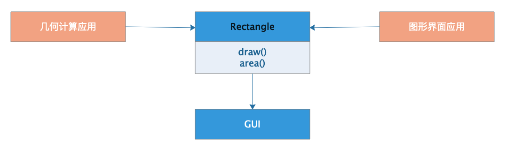
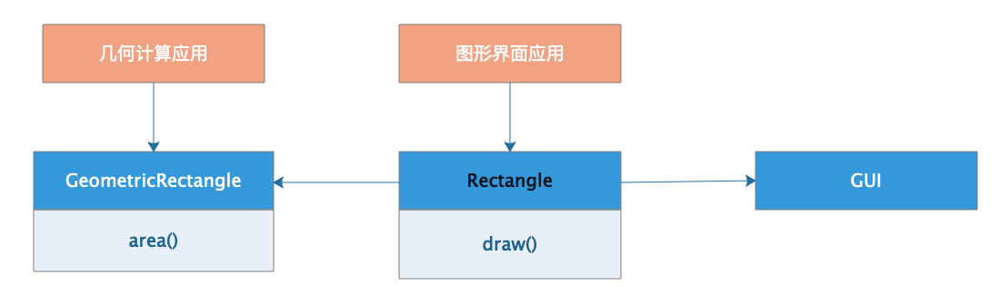
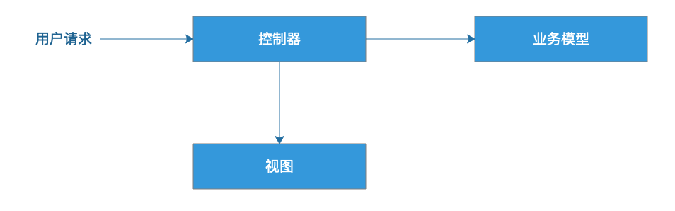
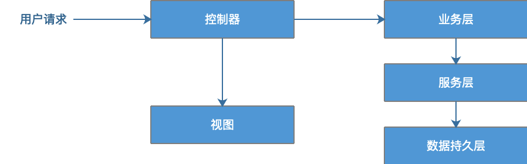

[toc]

## 14 | 软件设计的单一职责原则：为什么说一个类文件打开最好不要超过一屏？

### 单一职责原则

1.  软件设计的两个基本准则：**低耦合、高内聚**。

#### 一个类，应该只有一个引起它变化的原因

1.  这就是软件设计的单一职责原则。
2.  编程最佳实践：**一个类文件打开后，最好不要超过屏幕的一屏**。

### 一个违反单一职责原则的例子

1.  如何判断一个类的职责是否单一，就是看**这个类是否只有一个引起它变化的原因**。
2.  设计示例：
    -   
    -   Rectangle 类的设计就违反了单一职责原则。**Rectangle 承担了两个职责**，一个是几何形状的设计，一个是在屏幕上绘制图形。
3.  优化设计，将两个职责分离开来。
    -   

### 从 web 应用架构演进看单一职责原则

1.  互联网早期
    -   
2.  有了 JSP 
    -   
3.  MVC 框架
    -   
4.  业务模型分层
    -   

### 小结

1.  类的职责应该是单一的，**也就是引起业的变化的原因应该只有一个**，这样的类的代码通常也是比较少的。
2.  在开发实践中，一个类文件在 IDE 打开，**最好不要超过一屏**。