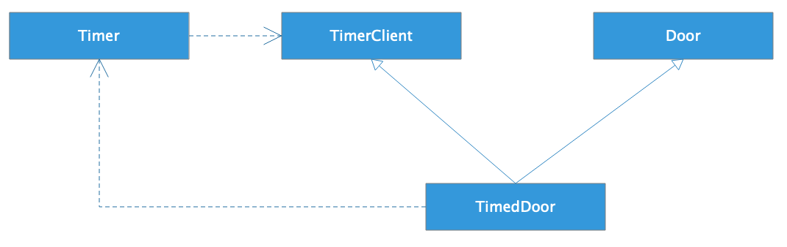

[toc]

## 15 | 软件设计的接口隔离原则：如何对类的调用者隐藏类的公有方法？

1.  **如何对类的调用者隐藏类的仅有方法**？

### 接口隔离原则

1.  **不应该强迫用户依赖他们不需要的方法**。

2.  一个简单的例子：

    -   ```java
        
        class Modem {
            void dial(String pno);
            void hangup();
            void send(char c);
            void recv();
        }
        
        ```

    -   对调用者而言，某些方法可以完全不需要，也不应该看到。

3.  解决这种问题的方法，就是**通过接口进行方法隔离**。Modem 类实现两个接口，DataChannel 接口和 Connection 接口。

    -   

4.  通过使用**接口隔离原则，我们可以将一个实现类的不同方法包装在不同的接口中对外暴露**。

### 一个使用接口隔离原则优化的例子

1.  一个 Door 对象：

    -   ```java
        
        class Door {
            void lock();
            void unlock();
            boolean isDoorOpen();
        }
        ```

2.  现在需要一个 TimedDoor。我们已经有一个类 Timer 和一个接口 TimerClient。

    -   ```java
        
        class Timer {
            void register(int timeout, TimerClient client);
        }
        
        
        interface TimerClient {
            void timeout();
        }
        ```

    -   需求实现

    -   ```java
        
        class Door implements TimerClient {
            void lock();
            void unlock();
            boolean isDoorOpen();
            void timeout(){
              lock();
            }
        }
        ```

3.  使用接口隔离优化

    -   

### 接口隔离原则有迭代器设计模式中的应用

1.  for 循环遍历

    -   ```java
        
        List<String> ls = new ArrayList<String>();
        ls.add("a");
        ls.add("b");
        for(String s: ls) {
          System.out.println(s);
        }
        ```

    -   标准的 Java for 语法

    -   ```java
        
        for(Iterator<String> itr=ls.iterator();itr.hasNext();) {
          System.out.println(itr.next());
        }
        ```

2.  之所以可以写成上面那种简单的形式，是因为 Java 实现了 Iterable 接口。Iterable 接口定义如下：

    -   ```java
        
        public interface Iterable<T> {
            Iterator<T> iterator();
        }
        ```

    -   

### 小结

1.  使用接口隔离原则，就是**定义多个接口，不同调用者依赖不同的接口**，只看到自己需要的方法。而实现类则实现这些接口，通过多个接口将类内部不同的方法隔离开来。

