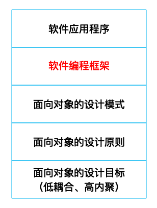
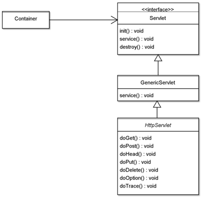
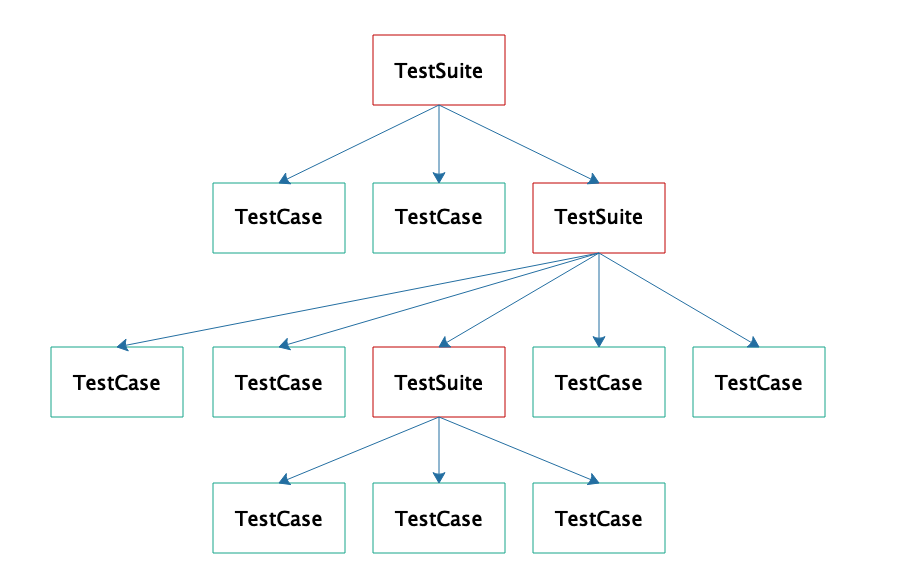

[toc]

## 17 | 设计模式应用：编程框架中的设计模式

### 什么是框架

1.  **框架是对某一类架构方案可复用的设计与实现**。
2.  框架通常规定了一个软件的主体结构，可以支撑起软件的整体或局部的架构形式。
3.  使用框架编程时，需要遵循框架的规范编写代码。**框架会调用我们编写的代码，我们编写的代码则会调用工具**。
4.  如何设计、开发一个编程框架？
    -   满足**开闭原则**
    -   满足**依赖倒置原则**
5.  编程框架、应用程序、设计模式、设计原则间的关系：
    -   

### Web 容器中的设计模式

1.  Web 容器主要使用了**策略模式**，多个策略实现同一个策略接口。

2.  J2EE 规范定义了 Servlet 接口：

    -   ```java
        
        public interface Servlet {
            public void init(ServletConfig config) throws ServletException;
            public void service(ServletRequest req, ServletResponse res)
                    throws ServletException, IOException;
            public void destroy();
        }
        
        ```

3.  我们开发具体的 Servlet 程序时，并不会直接实现 Servlet 接口，而是继承 HttpServlet 类，HttpServlet 类实现了 Servlet 接口。HttpServlet 用到了**模板方法模式**。

4.  HttpServlet 的 service 方法，针对不同的 HTTP 请求类型调用相应的方法。

    -   ```java
        
            protected void service(HttpServletRequest req, HttpServletResponse resp) throws ServletException, IOException
            {
                String method = req.getMethod();
                if (method.equals(METHOD_GET)) {
                        doGet(req, resp);
                } else if (method.equals(METHOD_HEAD)) {
                    long lastModified = getLastModified(req);
                    maybeSetLastModified(resp, lastModified);
                    doHead(req, resp);
                } else if ...
        ```

5.  Servlet 相关类关系如下：

    -   

### JUnit 中的设计模式

1.  开发者只需要继承 JUnit 的 TestCase，开发自己的测试用例类，通过 JUnit 框架执行测试。

2.  测试用例如下：

    -   ```java
        
        public class MyTest extends TestCase {
           protected void setUp(){
             ...
           }
           public void testSome(){
             ...
           }
           protected void tearDown(){
             ...
           }
        }
        ```

3.  这些测试用例如何被 JUnit 执行呢？如何保证测试用例中这几个方法的执行顺序呢？JUnit 在这里也使用了**模板方法模式**。

    -   ```java
        
        public void runBare() throws Throwable {
                setUp();
                try{
                        runTest();
                }
                finally {
                        tearDown();
                }
        }
        ```

4.  JUnit 提供了一个测试套件 TestSuit 管理、组织测试用例。

    -   ```java
        
        public static Test suite() {
          TestSuite suite = new TestSuite("all");
          suite.addTest(MyTest.class);//加入一个TestCase
          suite.addTest(otherTestSuite);//加入一个TestSuite
          return suite;
        }
        ```

5.  TestSuite 是一个树形结构

    -   

### 小结

1.  架构师应该通**过代码落实自己的架构设计**，也就是通过**开发编程框架**，**约定软件开发的规范**。开发团队依照框架的接口开发程序，最终被框架调用执行。
2.  架构师只需要**基于框架写个 Demo**，大家就都清楚架构是什么了。