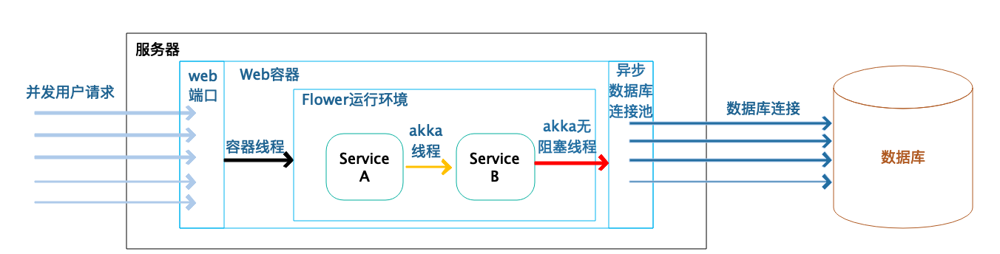
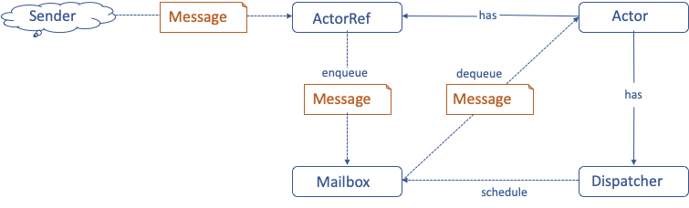
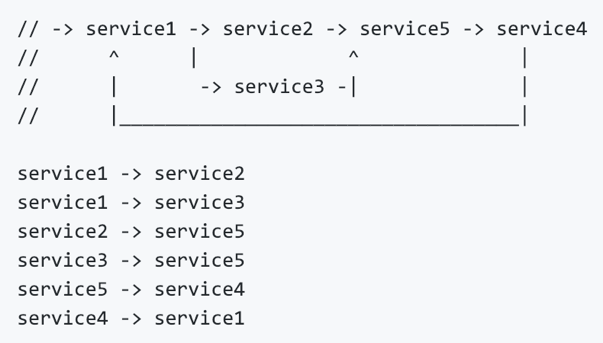
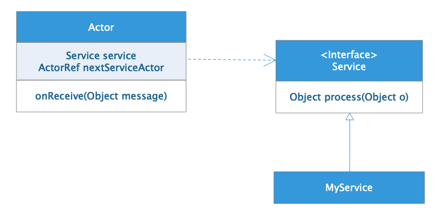
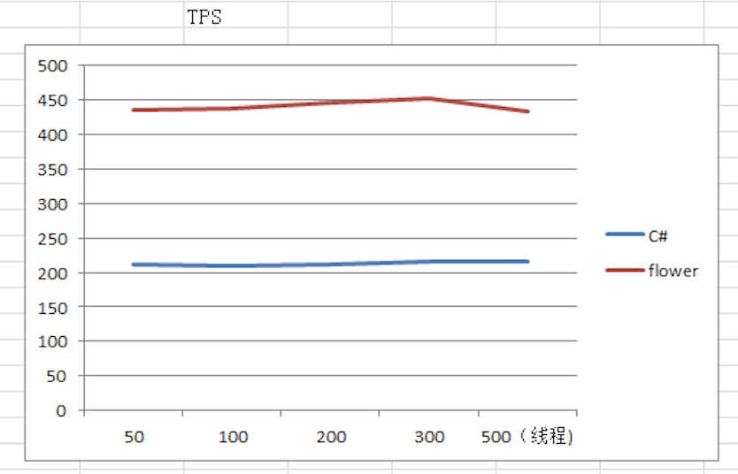
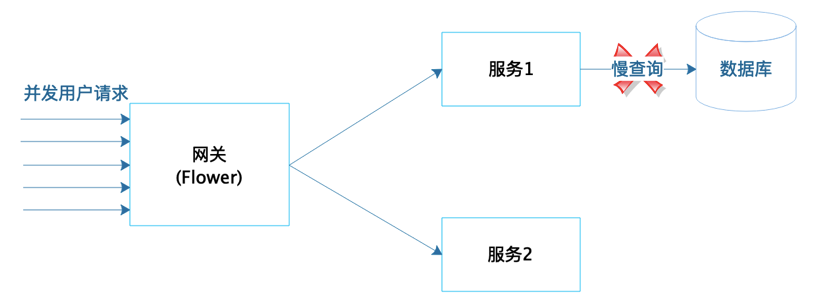

[toc]

## 18 | 反应式编程框架设计：如何使用程序调用不阻塞等待，立即响应？

1.  有没有不阻塞线程的编程方法呢？

### 反应式编程

1.  反应式编程本质是一种**异步编程方案**。
2.  反应式系统应该具备如下物质：
    -   **即时响应**，调用非阻塞。
    -   **回弹性**，自我修复。
    -   **弹性**，自动伸缩。
    -   **消息驱动**，模块、服务间，通过消息进行驱动。
3.  Flower 就是一个纯消息驱动，完全异步，支持命令式编程的反应式编程框架。

### 反应式编程框架 Flower 的基本原理

1.  一个使用 Flower 框架开发的典型 Web 应用
    -   
2.  **使用 Flower 框架只需要极少的容器线程就可以处理较多的并发用户请求，而且容器线程不会阻塞**。
3.  Flower 的 Service 间使用 AKKA Actor 进行消息通信。**只需要有限的几个线程就可以完成大量的 Service 处理和消息传输，这些线程不会阻塞等待**。
4.  Flower 使用异步数据库操作，这时依然不会有线程被阻塞。
5.  **有限的线程可以完成大量的并发用户请求，从而大大提高了系统的吞吐能力和响应时间**。同时，**应用不会因为并发量太大或数据库处理缓慢而宕机，从而提高系统的可用性**。
6.  Flower 框架实现异步无阻塞：
    -   一方面是，利用 **Web 容器的异步特性**。Servlet 3.0 后提供的 AsyncContext。
    -   另一方面是，利用**异步数据库驱动**及**异步的网络通信**。HttpAsyncClient 等异步通信组件。
7.  Flower 框架内，核心的应用代码间的异步无阻塞调用，则是利用 **Akka 的 Actor** 模型实现。Akka Actor 的异步消息驱动实现如下：
    -   

### 反应式编程框架 Flower 的设计方法

1.  Flower 框架对 Actor 进行了封装，开发者只需要编写一些细粒度的 Service，Service 会被包装在 Actor 里面，进行异步通信。

    -   ```java
        
        public class ServiceA implements Service<Message2> {
          @Override
          public Object process(Message2 message) {
            return message.getAge() + 1;
          }
        }
        ```

2.  Service 的流程编排有两种方式：

    -   一种是，**编程实现**。

        -   ```java
            
            getServiceFlow().buildFlow("ServiceA", "ServiceB");
            
            ```

    -   另一种是，或**视化的 Service 流程编排**。

        -   

3.  Flower 框架是如何实现的呢？

    -   Flower 框架的设计也是基于**依赖倒置原则**。
    -   Actor 与 Service 的依赖倒置关系如下：
        -   

### 反应式编程框架 Flower 的落地效果

1.  一方面，Flower 可以显著提高系统的**性能**。
    -   
2.  另一方面，Flower 对系统**可用性**也有较大提升。
    -   

### 小结

1.  Flower 不仅是一个反应式 Web 编程框架，还是反应式的微服务框架。
2.  整体架构和主流的微服务架构很像，主要的区别就是：
    -   **Flower 的服务是异步的，通过流程编排方式进行服务调用**。而不是通过接口依赖的方式进行调用。

