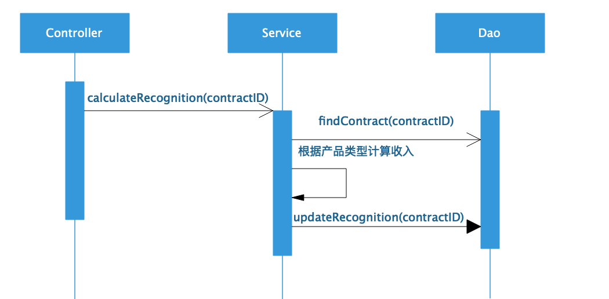
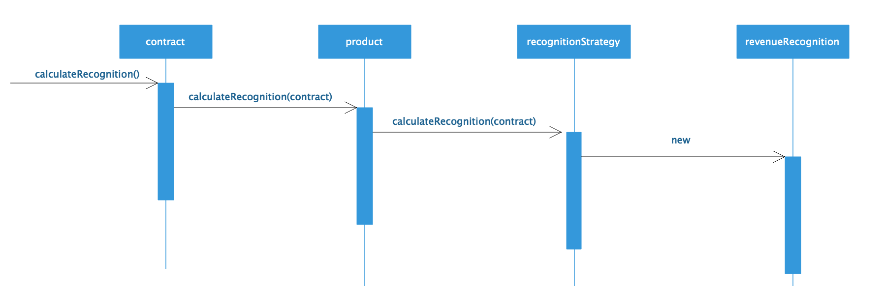
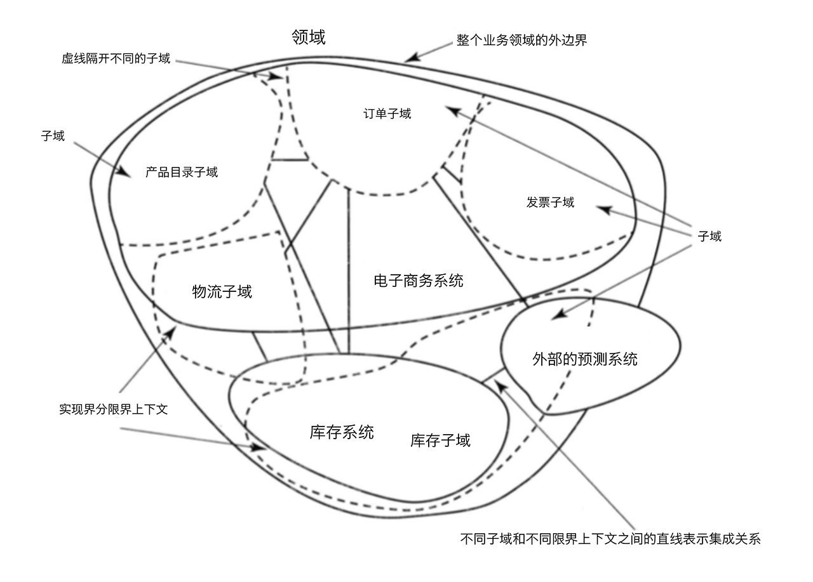
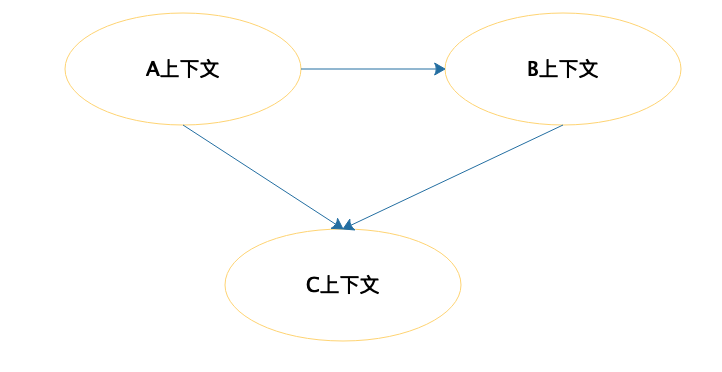
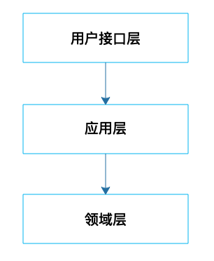
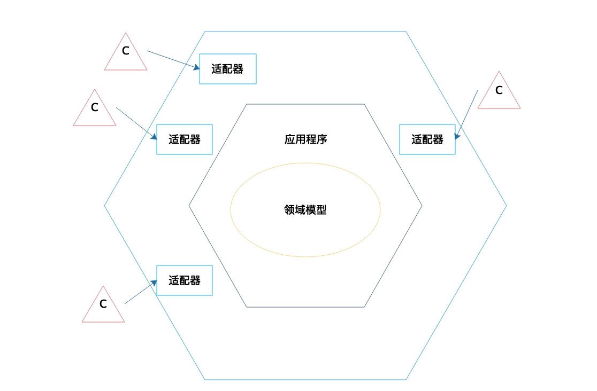

[toc]

## 20 | 领域驱动设计：35 岁的程序员应该写什么样的代码？

1.  对业务领域，清晰的**定义和边界**，**系统的领域模型**。
2.  软件只有需求分析，没有真正的设计，系统没有一个统一的领域模式维持其内在的逻辑一致性。

### 领域模型模式

1.  **事务脚本模式**
    -   按照业务处理的过程组织业务逻辑。
    -   设计模式，**Controller -> Service -> Dao**。
    -   程序设计：
        -   
    -   Service、Dao 只有方法，没有数值成员变量。
    -   又称：**贫血模型**。
2.  **领域模型模式**
    -   业务逻辑围绕领域模式设计。
    -   对象包含了对象数据和计算逻辑。
    -   程序设计：
        -   
    -   **领域模型是合并了行为和数据的领域的对象模型**。
    -   又称：**充血模型**。
    -   对于复杂的业务逻辑实现来说，用领域模型模式更有优势。

### 领域驱动设计（DDD）

1.  如何用领域模型模式设计一个完整而复杂的系统？ -- **领域驱动设计，即 DDD**。
2.  **领域驱动设计就是从领域出发，分析领域内模型及其关系进而设计软件系统的方法**。
3.  界限上下文和子域共同组成组织的领域。如下：
    -   
4.  各种的交互合作，DDD 使用**上下文映射图**来完成。
    -   
5.  领域模型对象也被称为**实体**。**实体设计**是 DDD 的核心所在。
    -   最重要的，**是要把握实体的特征是什么，实体应该承担什么职责，不应该承担什么职责，分析时要结合上下文**。
6.  DDD 推荐尽可能将对象设计为**值对象**。
    -   特征：**不变性**，一个值对象创建后就不能再改变了。
7.  DDD 支持各种架构方案，如**分层架构**。
    -   
8.  **六边形架构**是 DDD 中比较知名的一种架构方式，领域模型通过应该程序封装成一个相对比较独立的模块，而不同的外部系统则通过不同的适配器和领域模型交互。
    -   
9.  **通过领域实体及其交互完成业务逻辑处理**，才是 DDD 的核心目标。

### 小结

1.  35 岁的程序员真正有优势的是他在一个业务领域的多年**积淀**，对业务领域有更深刻的**理解和认知**。

