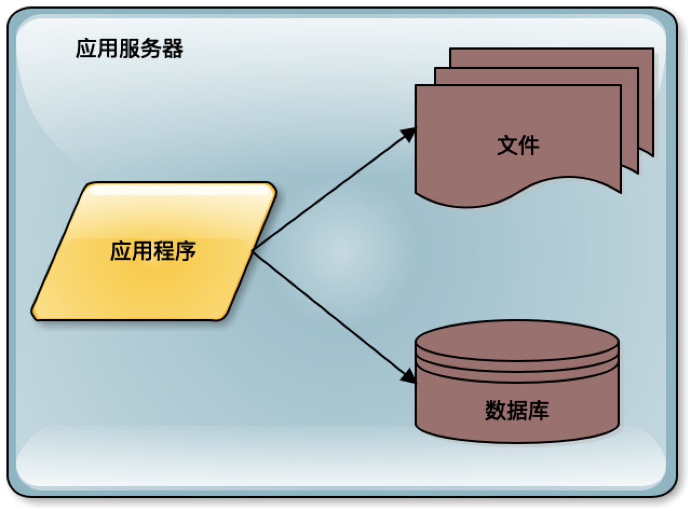
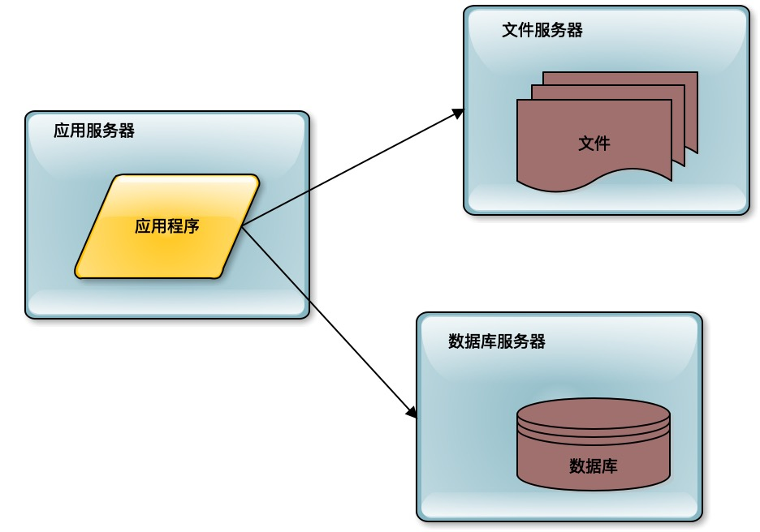
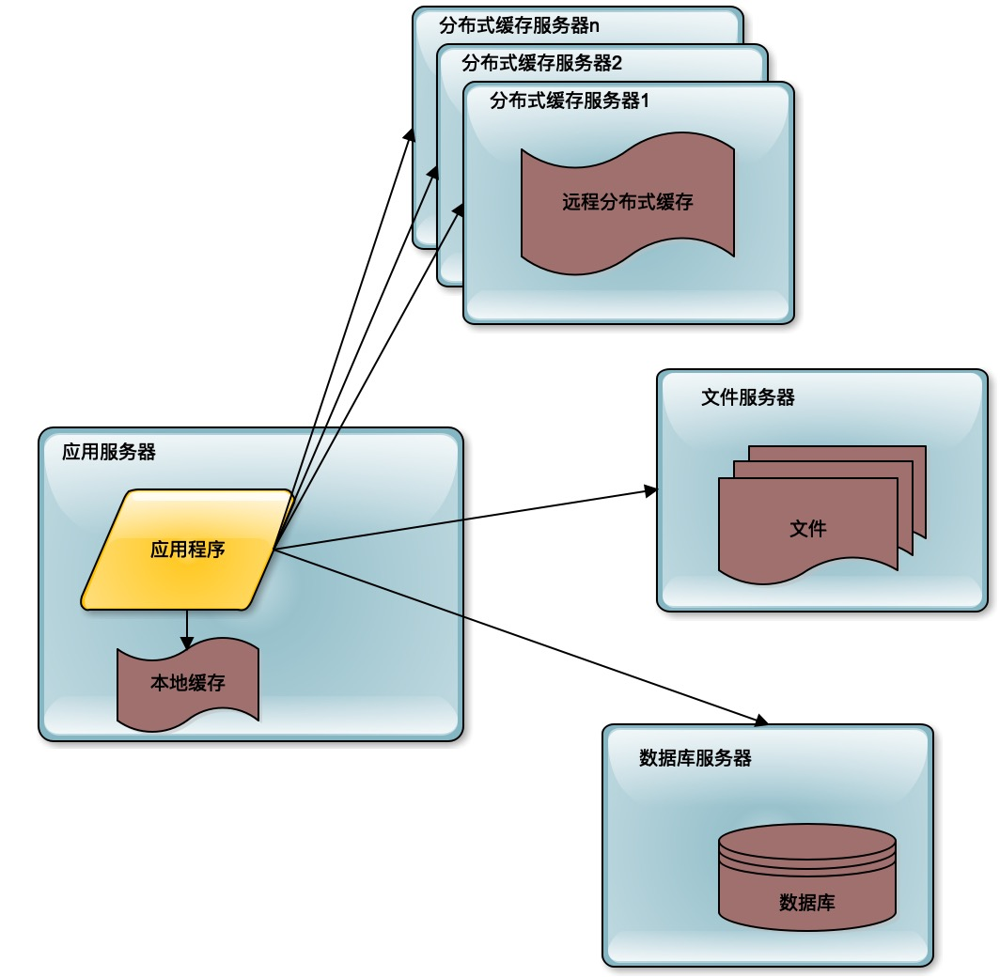
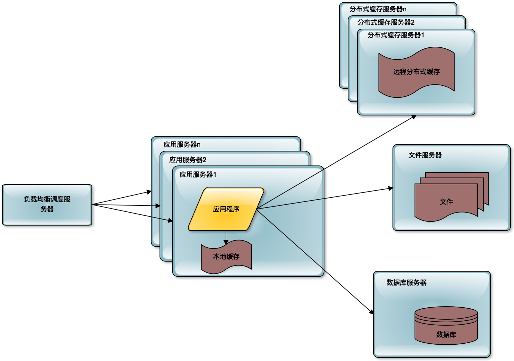
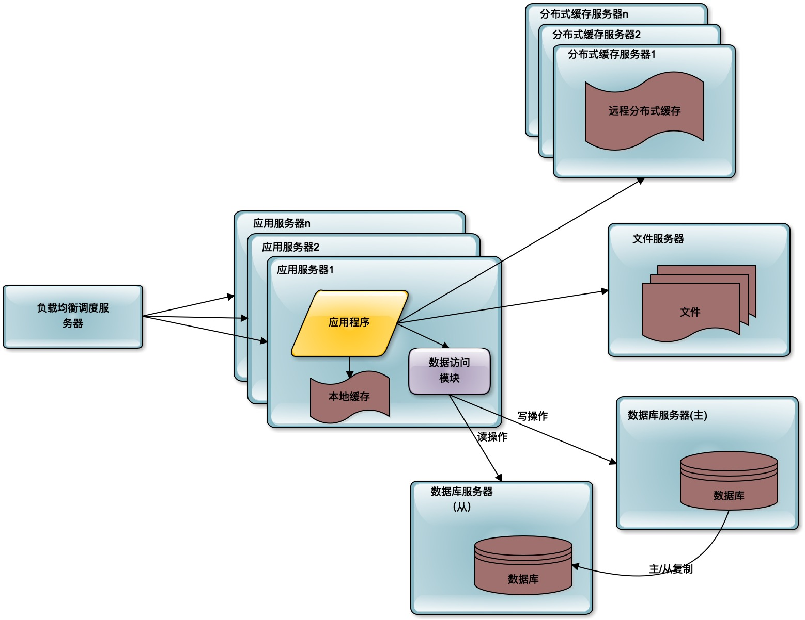
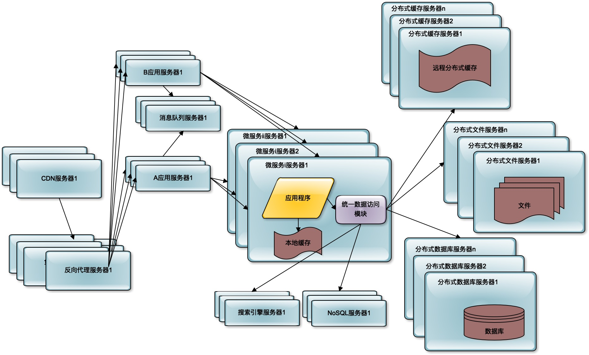

[toc]

## 21 | 分布式架构：如何应对高并发的用户请求

1.  如何解决高并发的用户请求带来的问题？

### 垂直伸缩与水平伸缩

1.  垂直伸缩就是，**提升单台服务器的处理能力**。
    -   垂直伸缩带来的价格成本和服务器的处理能力并**不一定呈线性关系**。
    -   单台服务器的计算能力并不能无限增加。
2.  水平伸缩是，使用**更多的服务器**，将这些服务器构成一个分布式集群，通过这个集群，对外统一提供服务，以此来提高系统整体的处理能力。

### 互联网分布式架构演化

1.  单机系统
    -   
2.  数据库与应用分离
    -   
3.  使用缓存
    -   
4.  负载均衡将应用服务器部署为一个集群，添加更多的应用服务器去处理用户的访问。
    -   
5.  数据库读写分离
    -   
6.  分布式、微服务
    -   

### 小结

1.  **如何增加计算资源以满足高并发的用户访问压力**，正是互联网架构技术的核心驱动力。主要就是各种分布式技术。

