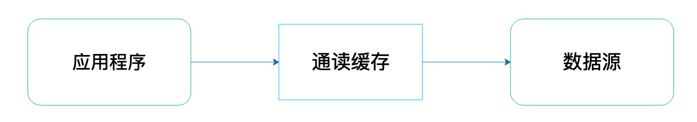
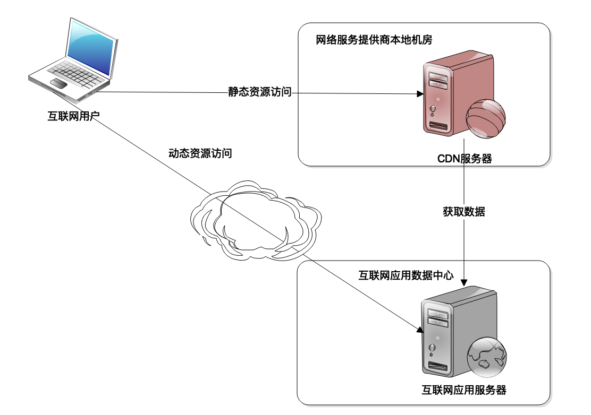
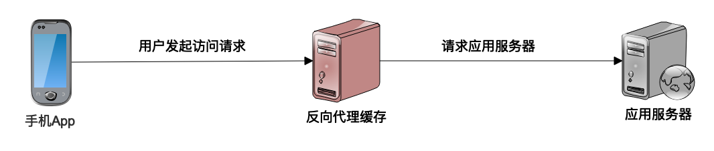
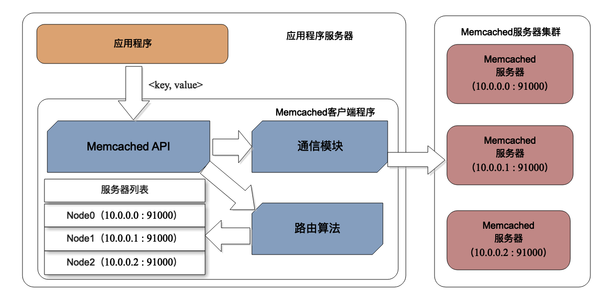

[toc]

## 22 | 缓存架构：如何减少不必要的计算？

1.  缓存可以，减少并发请求压力、减少不必要的计算、降低服务器的计算资源消耗。
2.  缓存可以分成两种：**通读缓存**和**旁路缓存**。
3.  **通读缓存**，如果请求缓存没有命中，则通读缓存自己访问数据源，并返回，最后将数据缓存在自己缓存中。
    -   
4.  **旁路缓存**，如果请求缓存没有命中，就返回空（null）。应用程序自己从数据源读取数据，然后写入旁路缓存。
    -   

### 通读缓存

1.  互联网中主要使用的通读缓存是 **CDN** 和 **反向代理**缓存。
2.  **CDN** ，网络连接的第一跳。
    -   
    -   CDN 只能缓存静态数据内容。

3.  **反向代理**缓存也是一种通读缓存。尽快将数据返回给用户。
    -   

### 旁路缓存

1.  应用程序在代码中主要使用的是**对象缓存**，对象缓存是一种**旁路缓存**。
2.  **通读缓存和旁路缓存在实现上，基本上用的是 Hash 表**。
3.  程序中使用的对象缓存，可以分成两种。
    -   一种是，**本地缓存**，使用程序的堆空间存放缓存数据。
    -   另一种是，**分布式缓存**，指将一组服务器构成一个缓存集群，共同对外提供缓存服务。
4.  分布式缓存架构：
    -   

### 缓存注意事项

1.  带来的三个方面的**好处**：
    -   缓存的数据通常存储在内存中，距离用户更近一点。**速度更快，性能表现更好**。
    -   缓存的数据通常是计算结果数据，使用缓存可以**减少 CPU 的计算消耗，加快处理速度**。
    -   缓存获取数据，可以**降低数据库的负载压力**。间接提高整个系统的处理能力。
2.  带来的**问题**：
    -   **数据脏读**，解决方法有两个，如下
        -   一个是，**过期失效**。
        -   别一个是，**失效通知**。程序更新源数据时，同时发送通知，将缓存数据清除。
    -   缓存**热点**数据，如果缓存的数据没有热点，那使用缓存就不是很有必要。

### 小结

1.  任何查询数据、请求数据的场合都可以考虑使用缓存。
2.  除系统架构缓存外，客户端也可以使用缓存。

