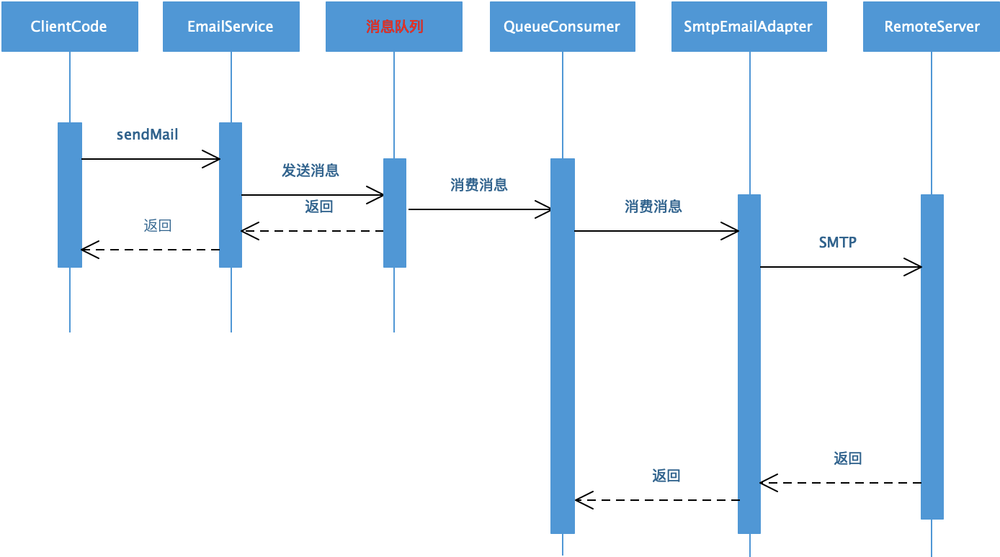
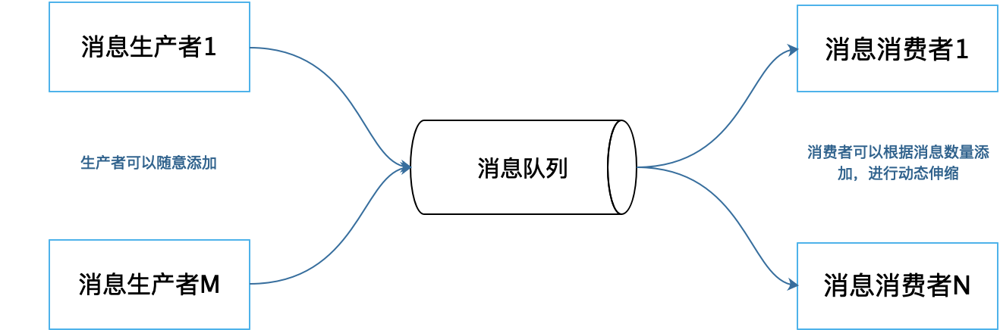
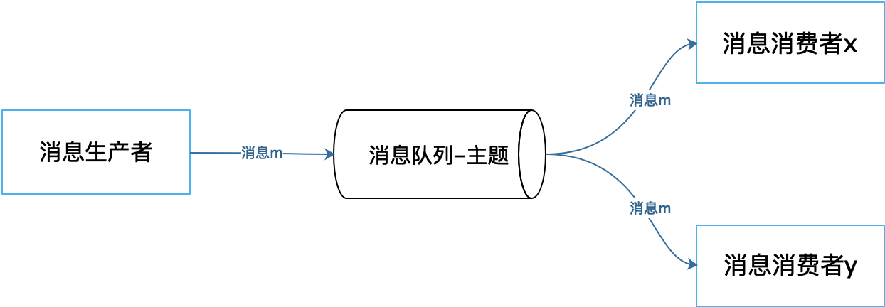
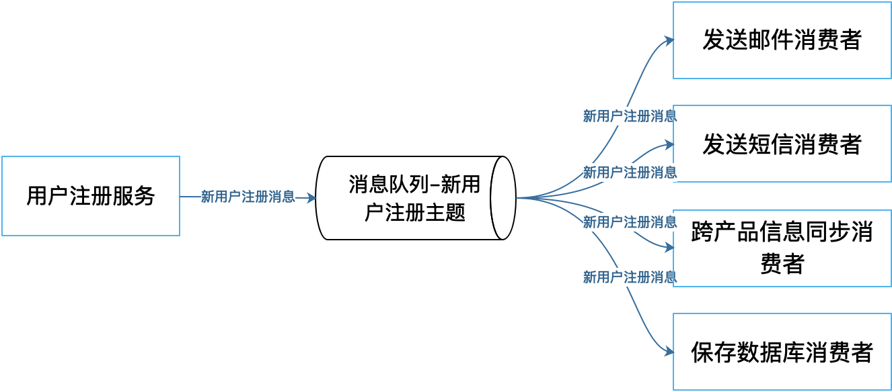
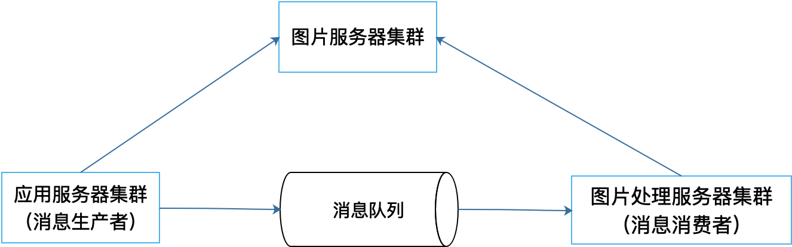

[toc]

## 23 | 异步架构：如何避免互相依赖的系统间耦合？

1.  如何提高系统的写操作的性能呢？
2.  系统间的耦合情况又该如何避免呢？

### 使用消息队列实现异步架构

1.  **同步架构**，当应用程序调用服务的时候，当前程序需要阻塞等待服务完成。
2.  如何使应用程序不阻塞等待呢？ -- **消息队列实现异步架构**。
    -   
3.  典型的消息队列异步架构
    -   
4.  消息队列根据消费方式又分为**点对点模式**和**发布订阅模式**。
5.  点对点模式
    -   
6.  发布订阅模式
    -   
    -   一个主题可以被重复订阅
    -   

### 消息队列异步架构的好处

1.  异步架构，实现更高的写操作性能以及更低的耦合性。

#### 改善写操作请求的响应时间

1.  更快速地完成请求处理操作，快速响应用户。

#### 更容易进行伸缩

1.  更小粒度的集群伸缩
    -   

#### 削峰填谷

1.  利用消息队列，我们可以将需要处理的消息放入消息队列，而**消费者可以控制消费速度**。因此可以降低系统访问高峰时的压力，而在访问低谷时，还可以继续消息消息队列中未处理的消息，保持系统的资源利用率。

#### 隔离失败

1.  消费者处理过程中失败，不会传递给生产者。具有更高的可用性。

#### 降低耦合

1.  使用消息队列的异步架构可以降低调用者和被调用者的耦合。

### 小结

1.  消息队列实现异步架构是改善互联网应用**写操作性能**的重要手段。也是一种低耦合、易扩展的**分布式**应用架构模式。

