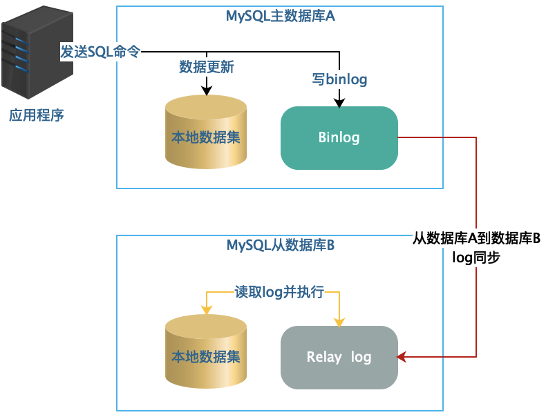
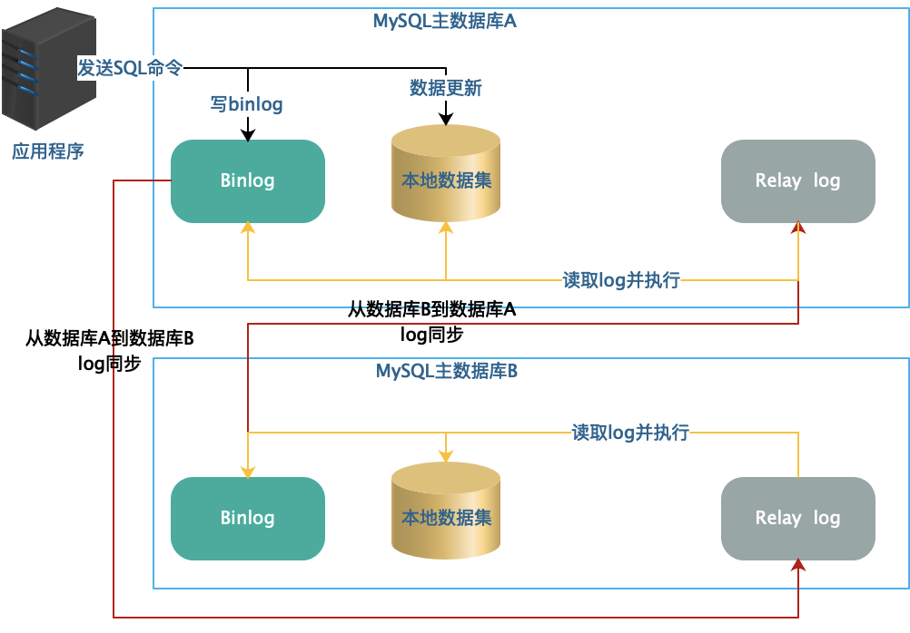
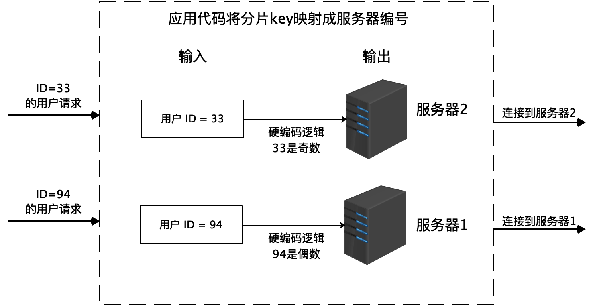
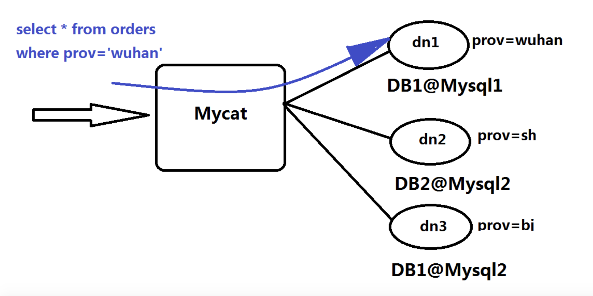
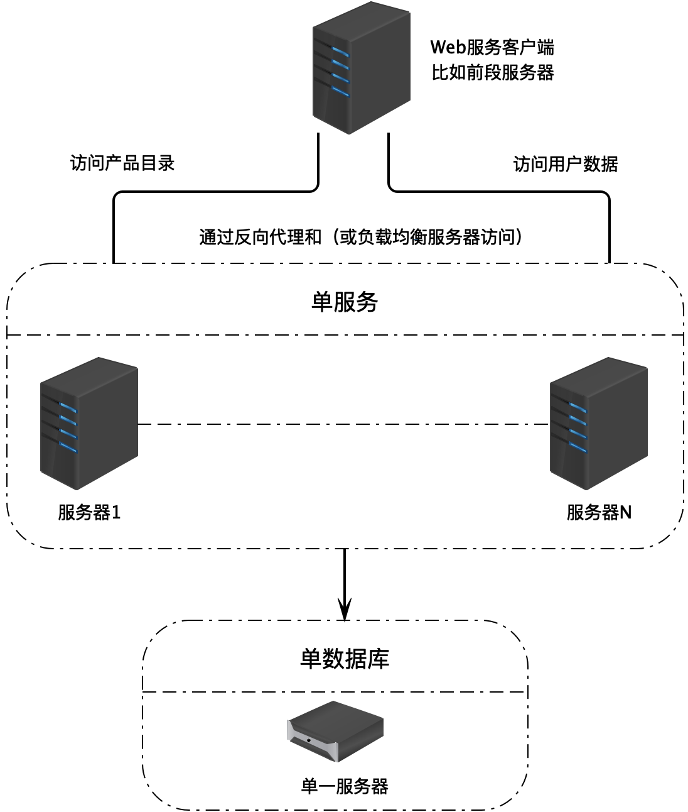
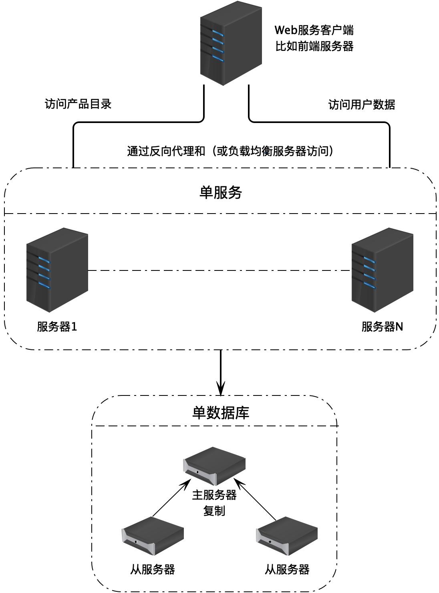
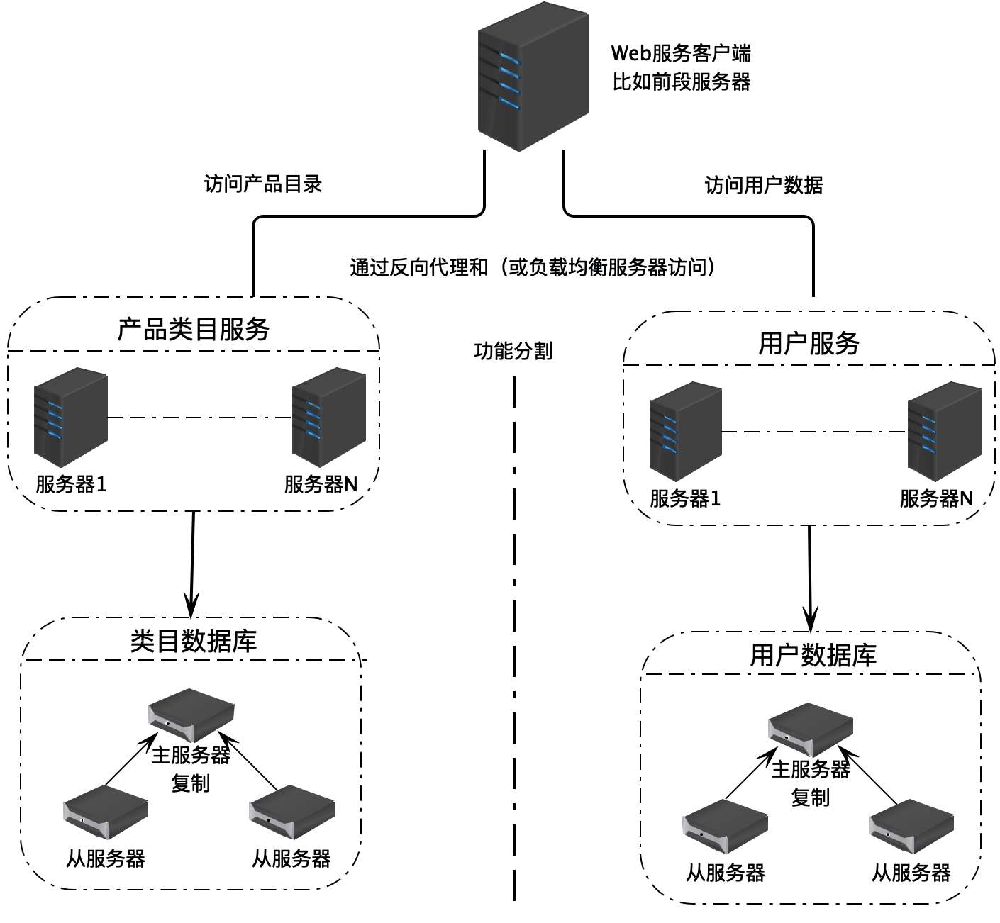
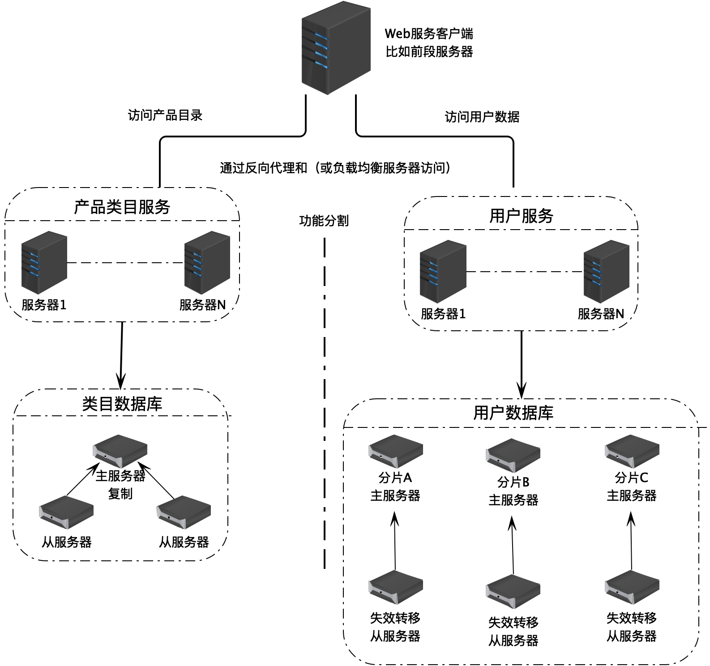
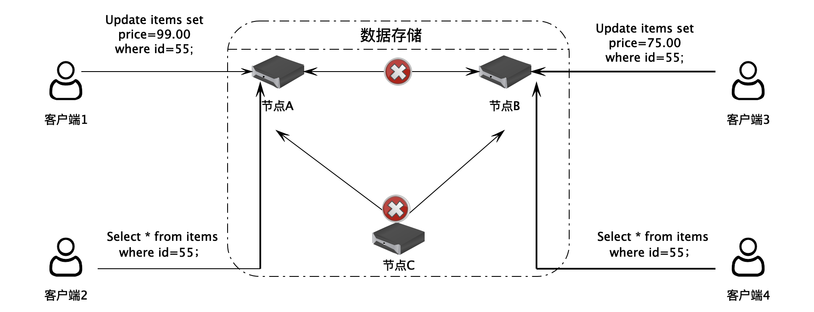
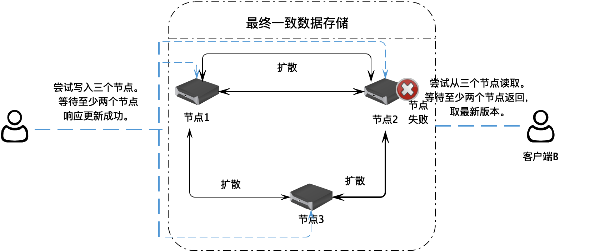

[toc]

## 27 | 数据存储架构：如何改善系统的数据存储能力？

1.  目前用来改善数据存储能力的主要手段包括：
    -   数据库主从复制
    -   数据库分片
    -   NoSQL 数据库

### 数据库主从复制

1.  MySQL 的主从复制
    -    
2.  MySQL 主主复制
    -   
    -   主主复制仅仅用来提升数据库写操作的**可用性**，并不能用来提高写操作的性能。
3.  此外，如上两种方案，都无法提升数据库的存储能力。

### 数据库分片

1.  数据库分片技术可以解决**数据库存储的问题**。
    -   将一张表的数据分成若干片，每一片都包含了数据表中一部分的行记录，然后，每一片存储在不同的服务器上，这样一张表就可以存储在多台服务器上了。
2.  采用硬编码的方式：
    -   
3.  使用分布式关系数据库中间件，将数据的分片逻辑在中间件中完成，对应用程序透明。如 MYCAT。
    -   
4.  常见的数据库分片算法：**余数 Hash 算法**。

### 关系数据库的混合部署

1.  上面提到的几种方案可以根据应用场景的需要混合部署。
2.  单一实例：
    -   
3.  主从复制
    -   
4.  业务分库
    -   
5.  数据分片
    -   

### NoSQL 数据库

1.  NoSQL 数据库主要用来解决**大规模分布式数据的存储问题**。

2.  数据一致性问题
    -   
3.  **CAP 原理**：
    -   C 数据一致性
    -   A 可用性
    -   P 分区耐受性
    -   CAP 原理是说，当网络分区失效发生的时候，我们要么取消操作，保证数据一致。要么继续写入数据，保证可用性。
4.  Apache Cassandra 解决数据一致性的方案是：**在用户写入数据的时候，将一个数据写入集群中的三个服务器节点，等待至少两个节点响应写入成功**。
    -   

### 小结

1.  架构是一门关于**权衡**的艺术。
2.  数据存储架构没有银弹，没有一劳永逸的解决方案，唯有在**深刻理解自己业务场景和各种分布式存储技术特点的基础上，进行各种权衡考虑，选择最合适的解决方案**。

