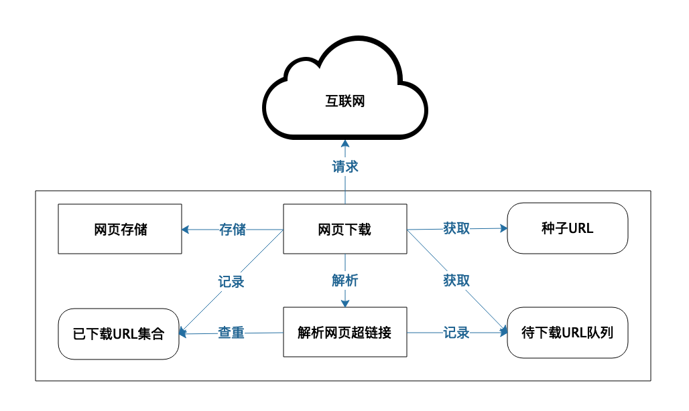
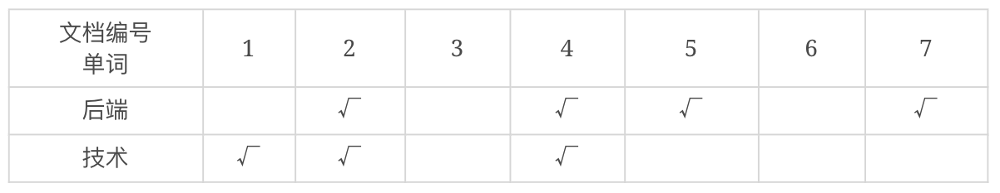
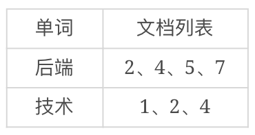
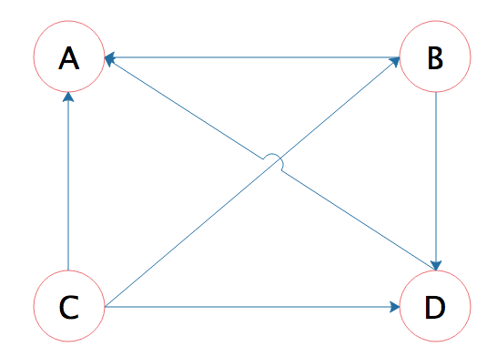

[toc]

## 26 | 搜索引擎架构：如何瞬间完成海量数据检索？

1.  Google 是如何做到在如此短的时间内完成了如此庞大的数据搜索呢？

### 搜索引擎倒排索引

1.  对于海量文档进行快速内容检索，主要使用的是**倒排索引技术**。
2.  搜索引擎如何知道全世界的网页都在哪里呢？
    -   全世界的网页通过**超链接**联系起来。
3.  爬虫系统架构如下：
    -   
    -   我们得到一个单词、文档矩阵：
    -   
    -   把这个单词、文档矩阵按照单词 -> 文档列表的方式组织起来，就是倒排索引了：
    -   
4.  在实践中，搜索引擎应用还会使用缓存对搜索进行加速，将整个搜索词对应的搜索结果直接放入**缓存**。

### 搜索引擎结果排序

1.  Google 使用一种叫 **PageRank** 的算法，**计算每个网页的权重**，搜索结果就按照权重排序。
2.  PageRank 算法认为，如果一个网页里包含了某个网页的超链接，那么就表示该网页认可某个网页。
    -   
3.  PageRank 值表示一个网页受到的推荐程度。
4.  PageRank 算法对于互联网网页排序效果很好。
5.  如果想在这些网站内部进行搜索，就需要利用其它一些信息及算法。如文章的点赞数。

### 小结

1.  如果想要对稍具规模的数据进行快速检索，都需要使用搜索引擎技术。

