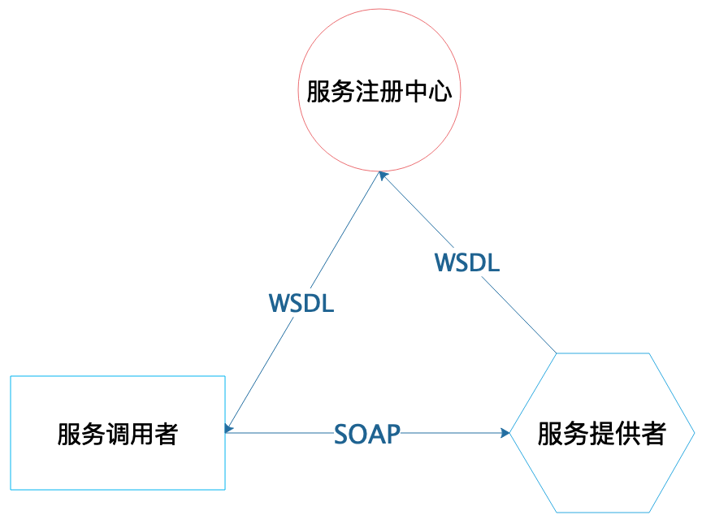
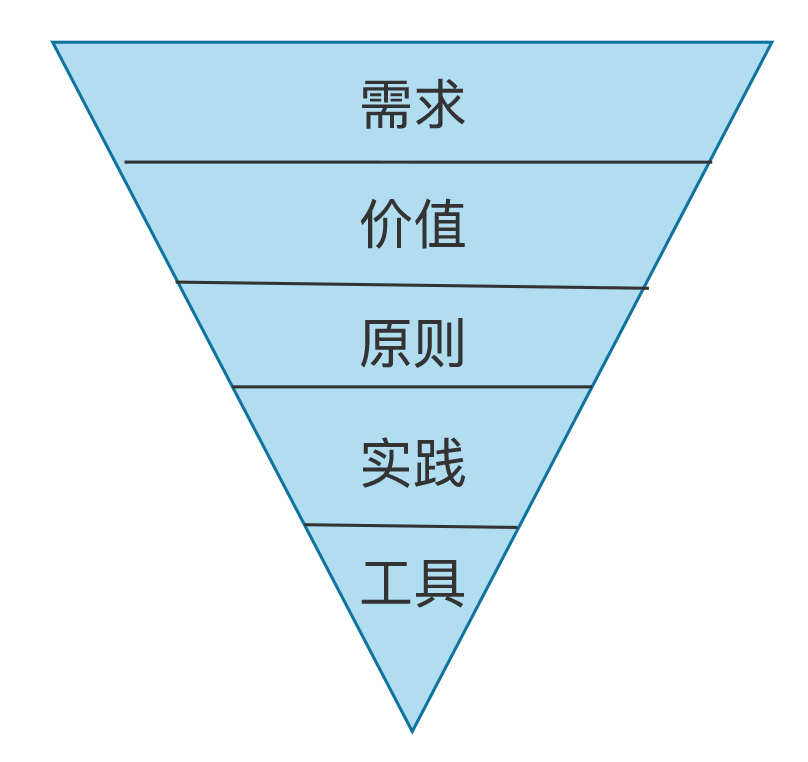

[toc]

## 27 | 微服务架构：微服务究竟是灵丹还是毒药？

1.  究竟该不该上微服务？

### 单体架构的困难和挑战

1.  回顾下，当前阿里为什么要上微服务架构？微服务架构能解决什么问题？用好微服务需要做哪些准备？

#### 编译、部署困难

1.  一个应用系统一个 war 包，这个 war 可能很大。即使只改了一行代码，也必须重新打包完整的系统。

#### 代码分支管理困难

1.  因为单体应用非常庞大，代码模块也是由多个团队共同维护。极易发生代码冲突。

#### 数据库连接耗尽

1.  大量的应用服务器连接到数据库，会对数据库连接产生巨大的压力，甚至会耗尽连接。

#### 新增业务困难

1.  所有业务都耦合在一个单一的大系统里，随着时间的发展，这个系统会变得非常复杂，想要维护这样的一个系统是非常困难和复杂的。

#### 发布困难

1.  因为单体系统一个 war 包就包含了所有的代码，新版本发布的时候，即使跟自己开发的代码一点关系没有，就因为包含了自己的代码，以防万一，所有开发工程师不得不跟着发布值班。

### 微服务框架原理

1.  **Dubbo** 借鉴了更早的 SOA 架构方案，即**面向服务**的体系架构。
    -   
2.  Dubbo 在借鉴SOA 架构的基础上进行了优化，抛弃了 SOA 一些不必要的规范约束，使用二进制协议进行服务注册与调用，执行效率和使用的简洁性都得到了极大提升。
    -   

### 微服务架构的落地实践

1.  **目标**比较明确。
2.  即使在单体时代，war 包内的**模块关系也还是比较清晰**。
3.  实施微服务的时候，最重要的是**使用微服务究竟能得到什么，也就是自己的需求是什么**？
4.  实施微服务的关注点应该遵循以下一个倒三角模型：
    -   

### 总结

1.  策服务和业务的关系是非常紧密的。
2.  成功实施微服务最重要的是做好业务的**模块化设计**，模块间低耦合，高聚合，模块间的依赖关系要清晰简单。
3.  模块的设计，可参考 [19-组件设计原则]。

