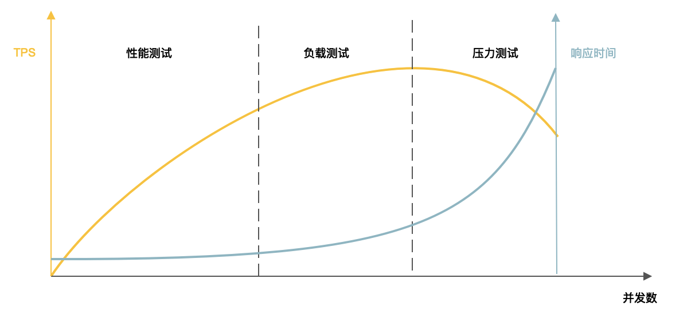

[toc]

## 28 | 高性能架构：除了代码，你还可以在哪些地方优化性能？

1.  **系统性能**是互联网应用的非功能性架构目标，高并发访问引起的首要问题就是性能问题。
2.  性能优化是互联网架构的核心职责之一。

### 性能指标

1.  系统性能指标主要有**响应时间、并发数、吞吐量和性能计数器**。
2.  **响应时间**，指从发出请求开始到收到最后响应数据所需的时间。
3.  **并发数**，指系统同时处理的请求数。
4.  **吞吐量**，指单位时间内系统处理请求的数量。
5.  **性能计数器**，指的是服务器或者操作系统性能的一些指标数据。

### 性能测试

1.  整个测试过程又可细分为**性能测试、负载测试、压力测试**三个阶段。
2.  **性能测试**，指系统资源在可接受的范围内是否达到了性能的预期目标。
3.  **负载测试**，指对系统不断施加请求，增加系统压力，直到系统的某项或多项指标达到安全临界值。
4.  **压力测试**，指对系统持续施加压力，直到系统崩溃。
5.  系统的性能特性曲线：
    -   
6.  **稳定性测试**
    -   持续较长时间。
    -   不稳定的并发压力。

### 性能优化

#### 主观的性能优化 -- 用户体检优化

1.  性能优化最直接的其实是优化用户体验。

#### 客观的性能优化 -- 系统优化

1.  从系统的宏观层面逐渐往下看。

##### 一：数据中心优化

1.  多数据中心

##### 二：硬件优化

1.  垂直伸缩，优化服务的硬件能力。

##### 三：操作系统优化

1.  不同操作系统及操作系统内的某些特性也会对软件性能有重要影响。
2.  如 Linux 中，`transparen huge page`，关闭这个参数后，系统的 CPU 占用下降。

##### 四：虚拟机优化

1.  像 Java 这样的语言开发的系统需要运行在 JVM 虚拟机里。虚拟机性能对系统的性能也有较大的影响，特别是垃圾回收。
2.  关于 JVM 虚拟机优化，可以参考 [Java 虚拟机原理]。

##### 五：基础组件优化

1.  基础组件的性能也会对系统性能有较大影响。

##### 六：架构优化

1.  缓存、消息队列、集群。
2.  缓存，优化查询性能。
3.  消息队列，提升写性能。
4.  集群，水平伸缩。

##### 七：代码优化

1.  通过各种编程技巧和设计模式提升代码的执行效率，也是我们最能控制的一个优化手段。

### 小结

1.  性能优化的**步骤**
    -   性能测试，寻找性能瓶颈。
    -   针对瓶颈进行优化。
    -   不断迭代优化。

2.  性能优化**前提**
    -   性能测试
    -   了解系统内部结构，分析性能问题
3.  性能优化是对一个架构师技能和经验的全面挑战，是架构师的必备技能之一。

