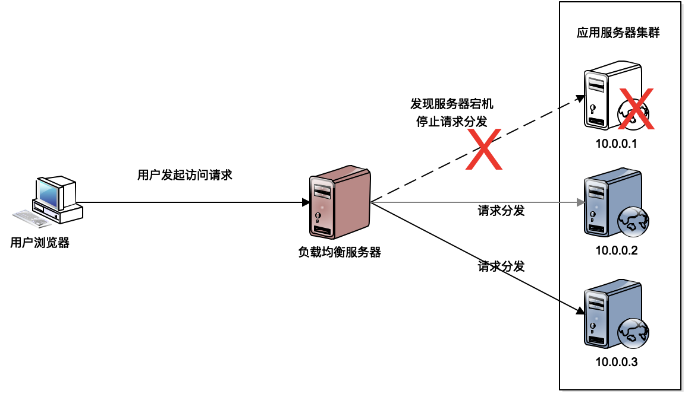
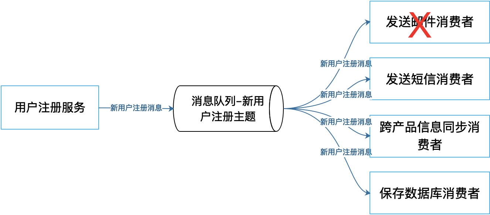

[toc]

## 29 | 高可用架构：我们为什么感觉不到淘宝应用升级时的停机？

### 高可用的度量

1.  首先，我们看下，什么叫做应用的高可用，及可用性的度量。
2.  计算公式：
    -   
3.  **可用性并不是越高越好**，而是根据产品策略寻找高可用投入产出的最佳平衡点。

### 高可用的架构

1.  我们从高可用的视角重新审视下这些架构是如何实现高可用的。

#### 冗余备份

1.  冗余备份是说，**提供同一服务的服务器要存在冗余**。
2.  **负载均衡**还可以实现系统的高可用。
    -   
3.  **数据库主主复制**，也是一咱冗余备份。

#### 失败隔离

1.  失败隔离，就是**将失败限制在一个较小的范围之内，使故障影响范围不扩大**。具体实现失败隔离的主要架构技术是**消息队列**。
2.  一方面，消息的生产者和消费者通过消息队列进行隔离。
    -   
3.  另一方面，由于分布式消息队列具有**削峰填谷**的作用。
    -   也就是**将压力隔离开来**。
4.  消息队列还使得**程序解耦**，将程序的调用和依赖隔离开来。

#### 限流降级

1.  **限流**，是指对进入系统的用户请求进行流量限制。丢弃一部分的用户请求，保证整个系统可用，保证大部分用户是可以访问系统的。
2.  **降级**，是关闭一些非核心的功能。

#### 异地多活

1.  异地多活，就是**将数据中心分布在多个不同地点的机房里**，这些机房都可以对外提供服务。
2.  异地多活架构考虑的重点：
    -   **用户请求如何分发到不同的机房去**。这个主要可以在**域名解析**的时候完成。
    -   **数据冲突问题**，该如何解决？类似 MySQL 的主主模式，多个机房在某个时刻是有一个主机房，只有主机房才能处理某些请求，以此来避免关键数据的冲突。

### 小结

1.  除了高可用架构方案，还在一些高可用的运维方案：
    -   自动化测试
    -   自动化监控
    -   预发布
    -   灰度发布
    -   评估版本影响

