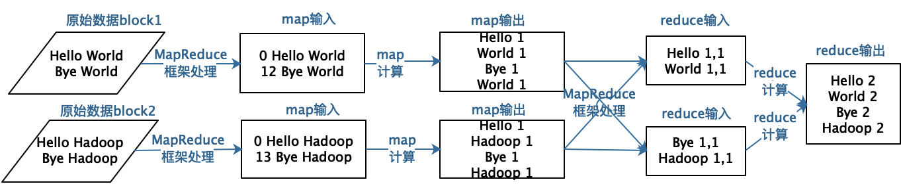
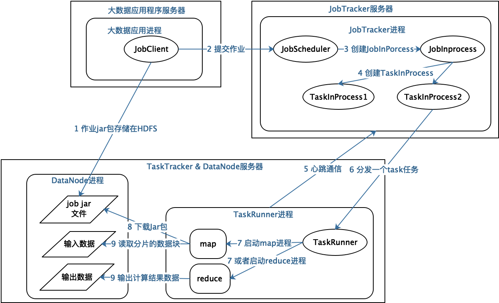
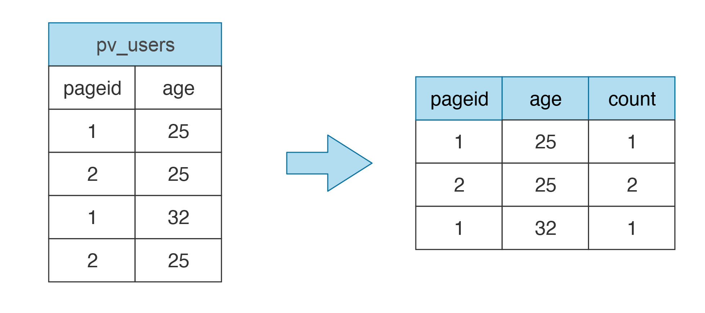
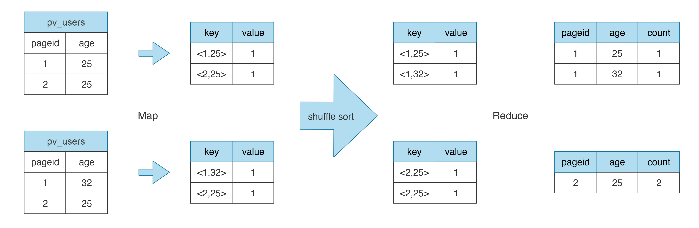
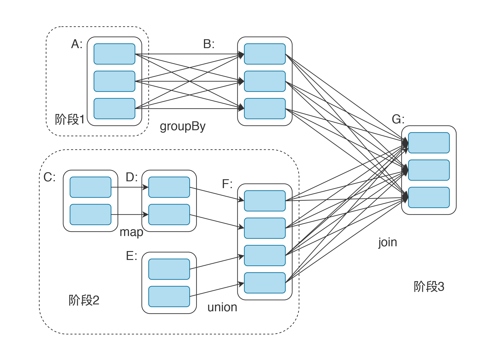
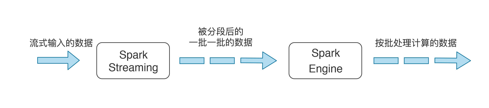

[toc]

## 31 | 大数据架构：大数据技术架构的思想和原理是什么？

1.  大数据技术讨论的是，**如何利用更多的计算机满足大规模的数据计算要求**。
2.  **如何存储，如何利用大规模的服务器集群处理计算大量的数据**，就是大数据技术的核心关键。

### 分布式文件存储 HDFS 架构

1.  大数据计算首先要解决的是**大规模数据的存储问题**。
2.  参考：[05-分布式文件系统 HDFS 的架构]

### 大数据计算 MapReduce 架构

1.  数据存储的最终目标还是为了**计算**。

2.  经典的计算框架是 **MapReduce**。MapReduce 的核心思想是**对数据进行分片计算**。

3.  MapReduce 计算过程

    -   一个是，**map 过程**。
    -   另一个是，**reduce 过程**。

4.  WordCount 计算过程

    -   

5.  具体的 MapReduce 程序如下：

    -   ```java
        
        public class WordCount {
        
          public static class TokenizerMapper
               extends Mapper<Object, Text, Text, IntWritable>{
        
            private final static IntWritable one = new IntWritable(1);
            private Text word = new Text();
        
            public void map(Object key, Text value, Context context
                            ) throws IOException, InterruptedException {
              StringTokenizer itr = new StringTokenizer(value.toString());
              while (itr.hasMoreTokens()) {
                word.set(itr.nextToken());
                context.write(word, one);
              }
            }
          }
        
          public static class IntSumReducer
               extends Reducer<Text,IntWritable,Text,IntWritable> {
            private IntWritable result = new IntWritable();
        
            public void reduce(Text key, Iterable<IntWritable> values,
                               Context context
                               ) throws IOException, InterruptedException {
              int sum = 0;
              for (IntWritable val : values) {
                sum += val.get();
              }
              result.set(sum);
              context.write(key, result);
            }
        ```

6.  这些进程是如何在分布式的服务器集群上启动的呢？数据是如何流动，最终完成计算的呢？

    -   

### 大数据仓库 Hive 架构

1.  Hive 根据 SQL 自动生成 MapReduce。

    -   SQL

        -   ```mysql
            
            SELECT pageid, age, count(1) FROM pv_users GROUP BY pageid, age;
            ```

    -    数据输入和执行结果

        -   

    -   MapReduce 计算过程

        -   

2.  Hive 内置了很多 Operator，Hive 将这些 Operator 构造成一个有向无环图 DAG，示例如下：

    -   

3.  **Hive 整体架构**如下

    -   数据存储在 HDFS
    -   表结构存储在 Metastore
    -   Client 提交 SQL 到 Driver，Driver 请求 Compiler 将 SQL 编译成 DAG 执行计划，然后交给 Hadoop 执行。
    -   

### 快速大数据计算 Spark 架构

1.  Spark 在 MapReduce 基础上进行改进，主要**使用内存进行中间计算数据存储**，加快了计算执行时间。

2.  Spark 的主要编程模型是 **RDD**，弹性数据集。在 RDD 上定义了许多常见的大数据计算函数，利用这些函数，可以用极少的代码完成较为复杂的大数据计算。

3.  WorkCount 计算

    -   ```java
        
        val textFile = sc.textFile("hdfs://...")
        val counts = textFile.flatMap(line => line.split(" "))
                         .map(word => (word, 1))
                         .reduceByKey(_ + _)
        counts.saveAsTextFile("hdfs://...")
        ```

4.  Spark DAG 示例如下

    -   

### 大数据流计算架构

1.  **大数据流计算**，需要在毫秒级完成不断输入的海量数据的计算处理。
2.  早期流式大数据计算引擎 Storm。
3.  Spark 上的流式计算引擎 **Spark Streaming**。
    -   **架构原理**：将实时流入的数据切分成小的一批一批的数据，然后将这些小的一批数据交给 Spark 执行。
    -   
4.  近几年比较流行的 Flink 其架构原理和 Spark Streaming 很相似。

### 小结

1.  大数据技术可以说是分布式技术的一个分支。
2.  差别是，大数据技术要处理的数据具有关联性。