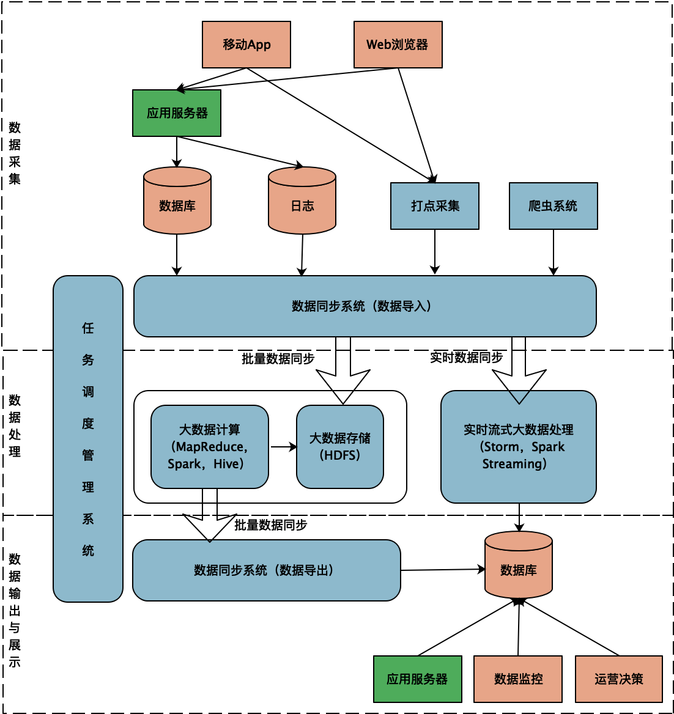
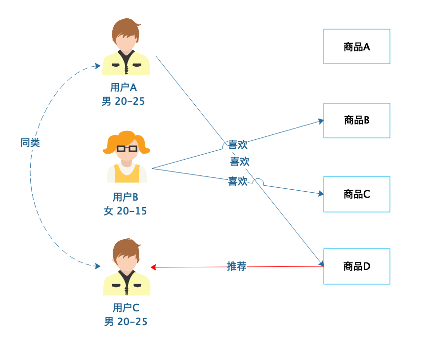
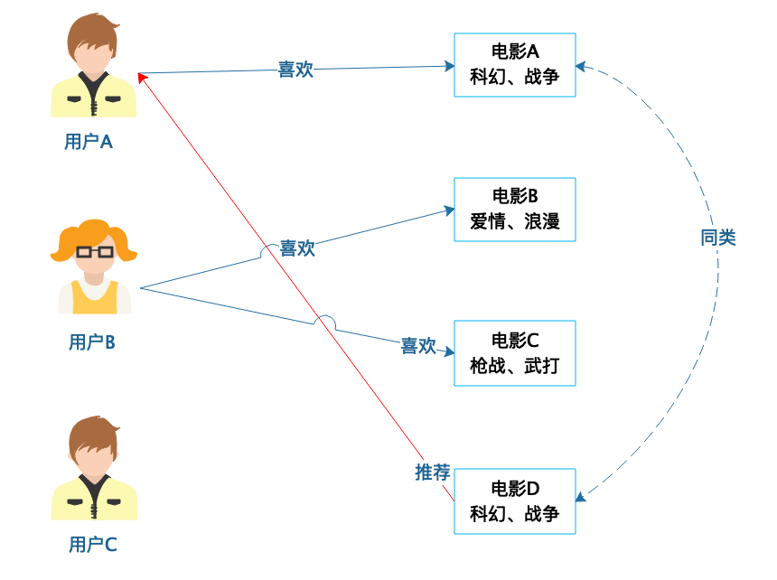
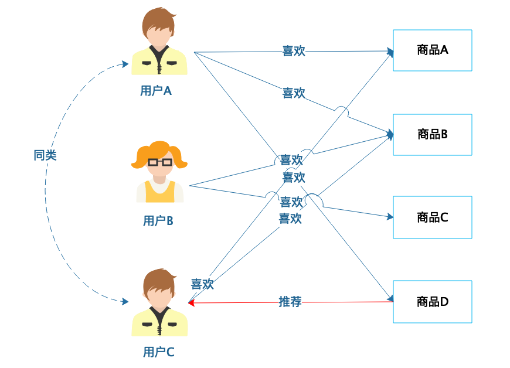
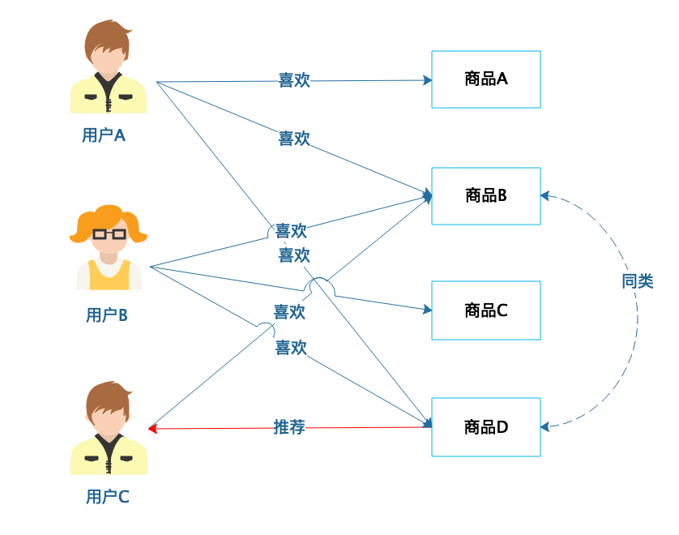
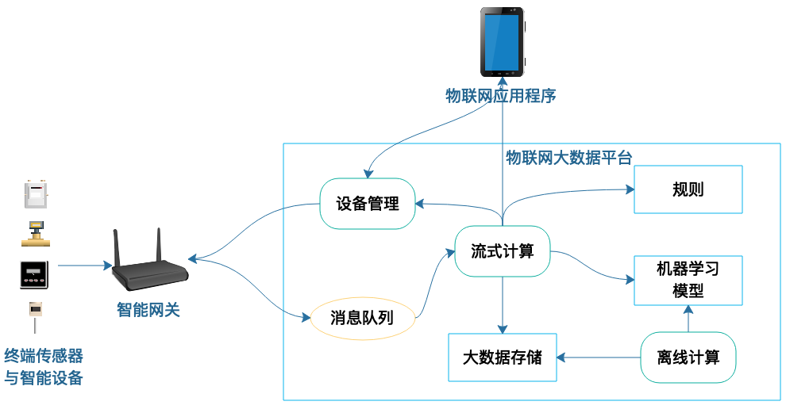

[toc]

## 32 | AI 与物联网架构：从智能引擎到物联网平台

1.  大数据底层技术
    -   指的就是各种大数据计算框架、存储系统、SQL 引擎等等。
2.  大数据平台技术
    -   互联网系统架构中，需要把处理用户请求的在线业务系统和大数据计算系统打通。这就需要一个大数据平台来完成。
3.  数据分析与机器学习算法
    -   通过算法向用户呈现他感兴趣的商品。

### 大数据平台架构

1.  大数据平台主要就是跨越需要长时间处理的大数据计算和需要实时响应的互联网应用之间的鸿沟，使系统成为一个完整的整体。

2.  一个典型的大数据平台架构如下：
    -   

### 智能推荐算法

1.  让数据发挥价值的是各种**机器学习算法**。最常见的大概就是**智能推荐算法**了。

2.  基于**人口统计的推荐**。

    -   根据用户的基本信息进行分类，然后将商品推荐给同类用户。
    -   

3.  基于**商品属性的推荐**。

    -   根据商品的属性进行分类，然后根据商品分类进行推荐。
    -   

4.  基于**用户的协过滤推荐**。

    -   根据用户的喜好进行用户分类，然后根据用户分类进行推荐。

    -   

5.  基于商品的协同过滤推荐。

    -   根据用户的喜好对商品进行分类，然后根据商品分类进行推荐。
    -   

### 物联网大数据架构

1.  物联网大数据平台架构
    -   

### 小结

1.  在大数据应用中，我们需要开发的是**大数据平台**。
2.  真正使数据发挥价值，使大数据平台产生效果的，其实是**大数据算法**。

