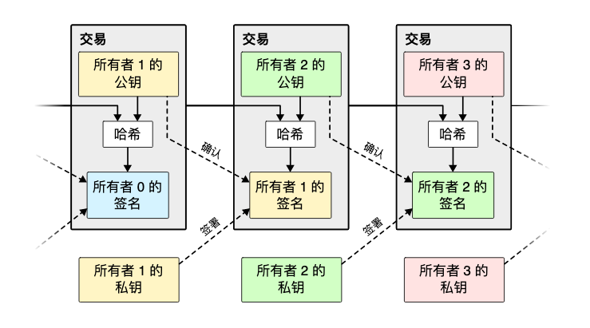
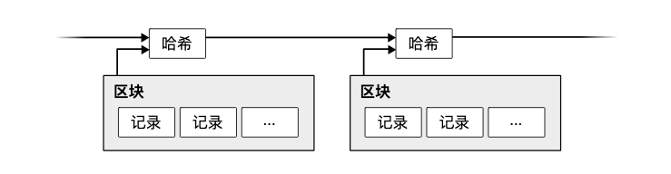
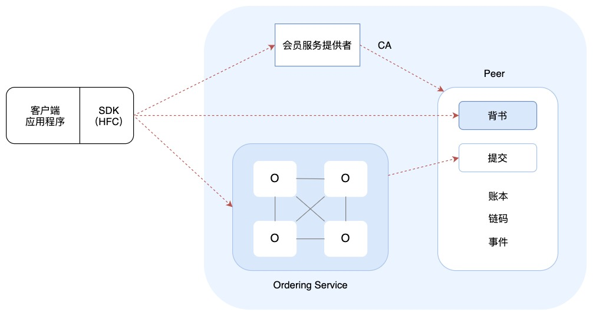
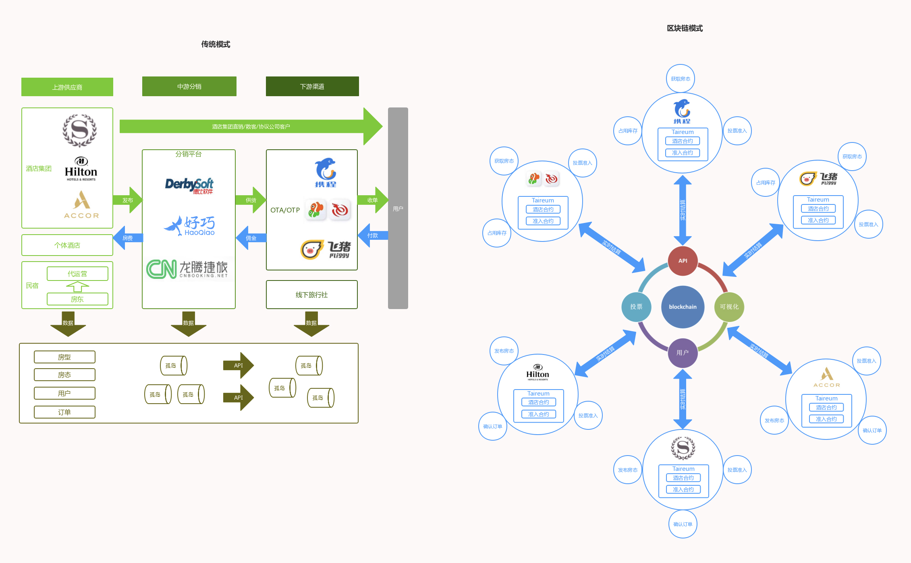

[toc]

## 33 | 区块链技术架构：区块链到底能做什么？

1.  区块链为什么能吸引这么多的关注？它到底能做什么？它的技术原理是什么？又为何如此曲折？

### 比特币与区块链原理

1.  数字货币的发行困难
    -   **认可**
    -   **交易记账**
2.  解决交易记账的问题
    -   比特币的主要思路：**构建一个无中心、去信任的分布式记账系统**。
    -   这个记账系统必须从设计上实现**去信任**，也就是不需要信任记账者身份，却可以信任这个人记的账。这正是通过**区块链技术**实现的。

#### 交易

1.  交易图
    -   

#### 区块链

1.  如何解决**多重交易（双花）**的问题
    -   比特币的解决方案是，
        -   记账者在收到若干交易后，会将这些交易打包在一起，形成一个区块（block）。
        -   区块必须严格按照顺序产生，因此最新一个区块的记账者可以根据区块顺序得到此前所有的区块。
        -   这样，记账者就可以检查所有区块中的交易数据，是否有双花发生。
2.  **如何保证区块的严格顺序**
    -   比特币的做法是，
        -   在每个区块的头部记录他的前一个区块，也就是前驱区块的 hash 值，这样所有的区块就构成了一个链。
        -   我们知道，单向链表是有严格顺序的。
3.  区块链图
    -   

#### 工作量证明

1.  区块链的严格顺序不但可以避免双花，还可使**历史交易难以被篡改**。
2.  区块链必须**在设计上保证记账者几乎无法重算出所有区块的 hash 值**。
    -   比特币的解决方案就是**工作量证明**。比特币要求计算出来的区块 hash 值必须具有一定的难度。
3.  如果有人控制了比特币超过半数的计算资源，确实可以进行交易篡改，即所谓的 **51% 攻击**。

#### 矿工

1.  计算 hash 值的过程也被形象地称作“挖矿”。
2.  相对应的，进行 hash 计算的记账者被称作矿工。
3.  而用来计算 hash 值的机器被称作矿机。

### 联盟链与区块链的企业级应用

1.  一种区块链应用场景，被称作**联盟链**。
2.  交易必须依赖一个中心进行
    -   不同的组织之间进行交易，必须依赖**银行**这个中心进行转账。
    -   那么银行之间如何进行转账呢？没错，也需要依赖一个中心，国内的银行间进行转账，必须通过**中国人民银行**清算中心。
    -   跨国的银行间进行转账则必须依赖一个**国际的清算中心**。
    -   这个中心既是跨国转账的瓶颈，又拿走了转账手续费的大头。
3.  目前比较知名的**联盟链技术**是 IBM 主导的 Hyperledger Fabric。主要架构如下：
    -   
4.  左边是**传统的酒店分销模式**，右边是**基于区块链的酒店分销模式**。
    -   

### 小结

1.  **互联网技术**的快速发展是**生产力革命**。
2.  **区块链技术**是**生产关系革命**。
3.  **区块链的出现，使得低成本，去信任的跨组织合作成为可能**。